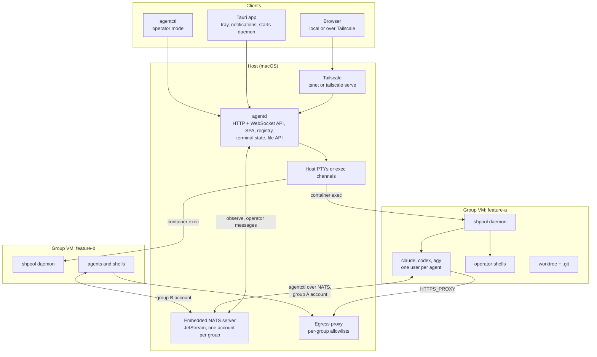

# Architecture

## Topology



## Components

**`agentd` (host daemon).** The single source of truth. It owns the group and session registry (SQLite), drives backends, holds per-session terminal state (ring buffer plus a headless VT emulator), relays terminal streams to clients, exposes the file API, hosts or connects to the embedded NATS server and relays bus traffic and operator messages, supervises the egress proxy and remote access, and serves the web UI. Its HTTP API binds loopback only; remote access comes through Tailscale. The NATS listener is the one exception: group VMs need to reach it, so it binds only to the host side of the groups' internal networks (to be worked out by experiment), with every connection authenticated by per-agent credentials. Language: Go or Rust, chosen after experiments (the operator has approved either). The bootstrap tooling is Go.

**Backends.** A backend provides a group's boundary and runs sessions inside it. Planned backends:

- Host tmux: used during the build (see [10-bootstrap-orchestration.md](10-bootstrap-orchestration.md)). No isolation beyond each harness's own sandbox.
- Apple Containers: one VM per group, shpool inside for persistent sessions. The PoC target.
- Local processes without tmux: useful for tests and debugging hooks.

A sketch of the interface:

```go
type Backend interface {
    CreateGroup(ctx context.Context, spec GroupSpec) (Boundary, error)
    DestroyGroup(ctx context.Context, b Boundary) error
    Spawn(ctx context.Context, b Boundary, s SessionSpec) (Session, error)
    Attach(ctx context.Context, s Session) (TermStream, error) // bytes in, bytes out
    Resize(ctx context.Context, s Session, cols, rows uint16) error
    List(ctx context.Context, b Boundary) ([]SessionInfo, error) // reconcile after restart
}
```

**Embedded NATS server.** The messaging system. `nats-server` runs in-process (Go library) with JetStream for durable streams, consumers, and key-value buckets. The starting proposal is one server embedded in the daemon, with one NATS account per group; the alternative is a server per group VM connected to a hub in the daemon as a leaf node. During the bootstrap, a host broker process embeds it. See [04-messaging-and-shared-context.md](04-messaging-and-shared-context.md).

**`agentctl`.** One CLI for agents and the operator: send, receive, status, memory, claims. Agents use it as a NATS client with credentials scoped to their group and their own name. In operator mode it talks to `agentd` or connects with operator credentials.

**`agentd-guest` (optional).** An in-VM supervisor that could own guest PTYs, a per-group NATS leaf server (if that topology wins), and a guest-side terminal state mirror, reached by the host over one exec stdio channel per group. The PoC can start with shpool alone and grow into this if it earns its place. See the persistence options in [05-terminal-data-path.md](05-terminal-data-path.md).

**Web UI.** TypeScript, React, Radix UI, React Router, Vite; tested with Vitest and Playwright. One build, served by `agentd` and loaded by the Tauri shell.

**Tauri shell.** A thin native wrapper: starts or connects to `agentd`, tray icon, native notifications, global shortcut, window management. It uses the same WebSocket transport as the browser so there's only one client code path.

**Egress proxy.** Group VMs sit on internal networks with no direct route out, apart from the path to the NATS listener. An allowlisting HTTP(S) proxy on the host lets through model APIs, package registries the operator allows, and GitHub. Policy is per group.

## Daemon API shape

- One HTTP server bound to `127.0.0.1` (and to the tailnet interface through whatever Tailscale integration wins).
- REST or RPC endpoints for groups, sessions, files, memory, and settings.
- One multiplexed WebSocket per client: binary frames for terminal data (`[u8 type][u32 session][payload]`), JSON text frames for control, status events, and bus events.
- A language-neutral schema (JSON Schema, protobuf, or TypeSpec; to be decided) as the source for Go or Rust and TypeScript types, so the protocol can't drift between the daemon and the UI.

## Where state lives

| State | Location |
| --- | --- |
| Registry (groups, sessions, policy) | SQLite in the operator state directory on the host |
| Messages, cursors, live coordination state | JetStream streams, consumers, and key-value buckets in the embedded NATS server's storage (on the host in the starting proposal) |
| Checked-in memory | In the repository, in the worktree |
| Worktree-local memory | In the worktree, gitignored |
| Harness credentials and config | Per-agent volumes inside the group VM |
| Terminal state | In memory in `agentd`, periodically snapshotted to disk; screen restore also available from shpool |
| Tailscale state | Operator state directory |
