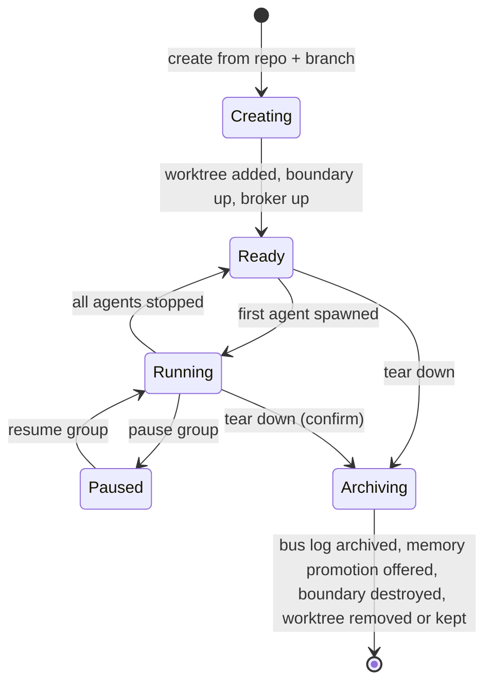
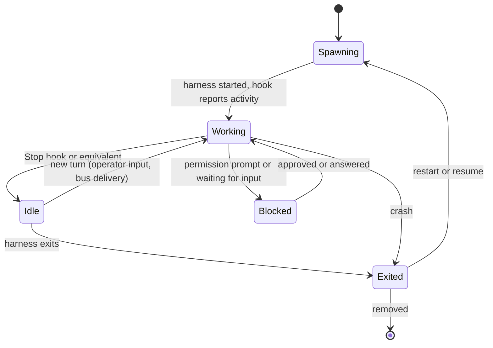

# Groups and sessions

## Groups are the core unit

A group is a set of sessions scoped to one git worktree. It carries:

- a repository and a worktree path, with a branch,
- a backend and the boundary that backend created (a VM, or nothing for host tmux),
- a bus: a NATS account with the group's JetStream stream, consumers, and key-value buckets,
- shared context (memory tiers, decisions, claims),
- members (agent sessions) and operator shells,
- policy: egress allowlist, allowed mounts, remote access rules, concurrency limits.

The group is the trust boundary in the container backend. Agents in one group share a worktree and a VM and are assumed able to read each other's state. Groups are isolated from each other by separate VMs.

## Group lifecycle



Creating a group:

1. Resolve the repository and branch; create the git worktree (location to be decided, likely a per-repo worktrees directory outside the repository or under a dedicated root).
2. Create the boundary through the backend (boot the VM, mount the worktree and the main repository's `.git` at identical paths, attach the group's internal network).
3. Create the group's NATS account, stream, buckets, and per-agent credentials, and start shpool inside the boundary.
4. Record the group in the registry and announce it to clients.

Tearing down a group archives the group's stream and buckets to the operator state directory, deletes its NATS account and credentials, offers to promote worktree-local memory into checked-in memory, stops sessions, destroys the boundary, and optionally removes the worktree. Worktree removal needs an explicit confirmation if the branch has unpushed commits.

## Session kinds

| | Agent session | Operator shell |
| --- | --- | --- |
| What runs | `claude`, `codex`, or `agy` | bash, fish, or zsh |
| User inside the VM | One Linux user per agent (proposed) | `operator`, with sudo |
| Bus addressable | Yes, as `@group/agent` | No |
| Receives injected messages | Yes | Never |
| Hooks and status | Yes | Attached or detached only |
| Persistence | shpool, always | shpool (named shell) or scratch (dies on close) |

Scratch shells are a plain `container exec -it <vm> <shell>` with no shpool. Named shells persist like agents.

## Session lifecycle



Status comes from harness hooks first (all three harnesses have hooks; see the session management research), from harness-native registries second (`claude agents --json`, the Codex app-server, `agy --remote-control`, still to be evaluated for use inside a VM), and from terminal screen scraping only as a fallback.

Resume uses each harness's native mechanism: `claude --resume <session-id>`, Codex thread resume, `agy --conversation <id>`. The registry records each harness's own session or thread ID, captured from hook payloads or the harness's environment variables (`CLAUDE_CODE_SESSION_ID`, `CODEX_THREAD_ID`, and the `agy` equivalent), so a session can be relaunched with its conversation intact when its process is gone.

## Addressing

- `@feature-a/claude` for one agent, `@feature-a/*` for the whole group, `@*/codex` across groups.
- Agents get stable names within a group (role names are better than harness names once there are two agents from one harness).
- Roles are exclusive within a group unless the operator allows duplicates, following the research design.

## Registry sketch

```sql
create table groups (
  id text primary key,
  name text not null unique,
  repo_path text not null,
  worktree_path text not null,
  branch text not null,
  backend text not null,             -- 'host-tmux' | 'apple-container' | 'local'
  boundary_ref text,                 -- VM name, tmux session, etc.
  state text not null,
  policy_json text not null,         -- egress allowlist, mounts, remote rules, limits
  created_at text not null,
  archived_at text
);

create table sessions (
  id text primary key,
  group_id text not null references groups(id),
  kind text not null,                -- 'agent' | 'shell'
  name text not null,                -- unique within group
  role text,
  harness text,                      -- 'claude' | 'codex' | 'agy' | null for shells
  harness_session_id text,           -- native ID for resume
  command_json text not null,
  guest_user text,
  persistence text not null,         -- 'shpool' | 'scratch' | 'tmux'
  state text not null,
  last_status_json text,
  created_at text not null,
  unique (group_id, name)
);
```

## Operations on groups

Broadcast a message, pause or resume every agent, snapshot state (bus position, memory, git status), stop all, and tear down. These are daemon API calls, exposed in the UI and in `agentctl`.

## Coordination inside a group

Several agents share one worktree, so two of them can edit the same file at once. The runtime can't prevent that. The bus should carry claims or advisory locks on paths, and group roles should make ownership explicit (for example, one writer per area with others reviewing). The design of claims belongs with the bus and should be settled before the PoC puts more than one writing agent in a group.
