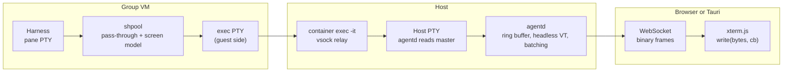

# Terminal data path

How bytes get from an agent running in a group VM to xterm.js in a browser or the Tauri app, and back.

## Persistence layer: shpool

Sessions need to outlive the connection that started them, so something inside the VM has to keep each harness alive and reattachable. The conversation settled on shpool over tmux:

- tmux is a full terminal emulator that re-renders the screen for each client. Clients get tmux's redraw stream, not the harness's bytes, so xterm.js scrollback fills with repaint fragments, and tmux's capabilities cap colors, key encodings, and hyperlinks.
- shpool passes bytes through untouched in normal operation and keeps its own terminal emulator only to restore the screen on reattach. That gives raw bytes to xterm.js and a correct screen after reconnecting.

Operator shells are shpool's default case (a named session running the user's shell), and agent sessions are the same mechanism with a command (`shpool attach -c 'claude …' <name>`). Both flags, `-c` and `-f` (force attach when a stale client is still registered), need confirming against the current shpool release. shpool allows one client per session, which fits: `agentd` is always the single client and fans out to every viewer.

Alternatives considered, in case shpool doesn't hold up: tmux attach per agent (free repaint on attach, re-rendered stream), tmux control mode per group (raw pane bytes, structured events, more parsing), dtach or abduco (raw bytes, no screen restore), an in-VM supervisor that owns PTYs directly (`agentd-guest`), and no persistence at all with harness-native resume. The trade-offs are in the conversation summary in [12-experiments-and-open-questions.md](12-experiments-and-open-questions.md).

## Output path

1. The harness writes to the PTY shpool gave it.
2. shpool updates its screen model and passes the bytes to its attached client.
3. The client, started by `agentd` through `container exec -it <vm> shpool attach …`, writes to a guest-side PTY. The exec tooling relays it over vsock to the host (mechanism inferred, not read in source).
4. `container exec` on the host writes to the slave side of a PTY `agentd` opened. The CLI puts that PTY into raw mode itself because it believes a terminal is attached.
5. `agentd` reads the master on a dedicated blocking thread or goroutine. Each chunk goes to a ring buffer, a headless VT emulator that mirrors the session's screen, and a per-session broadcast.
6. Output is coalesced for 8 to 16 ms or about 32 KB, then sent as a binary WebSocket frame: `[u8 type][u32 session][payload]`.
7. xterm.js calls `term.write(bytes, callback)` with watermark flow control. When a client falls behind, `agentd` pauses that subscription but keeps draining the PTY, because a stalled reader eventually blocks the agent.

Bytes stay bytes end to end. Nothing decodes to strings in the daemon or the browser, since a chunk boundary can split a UTF-8 sequence and xterm.js handles partial sequences when given `Uint8Array`.

## Input path

xterm.js `onData` and `onBinary` produce frames to `agentd`, which writes them to the host PTY master; they then flow through `container exec`, vsock, the guest PTY, and shpool to the harness. Things to test: bracketed paste of multi-line text, modified keys such as Shift+Enter (extended key reporting has to work in every layer), and shpool's detach key binding colliding with anything a harness uses.

## Resize path

FitAddon computes columns and rows, the client sends a resize control frame, `agentd` applies its size policy (last active client wins), sets the host PTY size with `TIOCSWINSZ` and resizes its headless VT to match, `container exec` should forward SIGWINCH to the guest PTY, shpool resizes the session, and the harness redraws. Whether `container exec` forwards resizes is unverified and is one of the first experiments. If it doesn't, a fallback runs a resize command inside the VM out of band, or the design moves to an in-VM supervisor.

## Reattach and snapshots

- A browser tab attaching to a live session gets a snapshot serialized from `agentd`'s headless VT, then the live stream.
- If `agentd` restarts, it re-runs `container exec … shpool attach -f`, and shpool restores the screen according to its restore mode.
- `agentd` periodically writes VT snapshots to disk so a restart doesn't depend on shpool alone.
- Because nothing re-renders in the middle, xterm.js scrollback accumulates real history. Keep a sensible scrollback limit in xterm.js and offer a history view backed by `agentd`'s ring buffer.

## Terminal settings to carry through

- `TERM=xterm-256color` and `COLORTERM=truecolor` on the exec, so harnesses see xterm.js's actual capabilities.
- Load the xterm.js addons for fit, WebGL rendering, Unicode 11 widths, web links, search, and clipboard (OSC 52).
- Only mount xterm.js instances for visible sessions. Browser engines cap live WebGL contexts (the exact limit in WKWebView is unverified), and a grid of eight or more agents will hit it. Dispose hidden terminals and restore them from `agentd` snapshots when they come back into view.

## Many exec channels or one per group

The simplest version opens one `container exec` per attached session. That's a host PTY and a CLI process per session. If that becomes a problem, one exec channel per group carrying a multiplexed protocol (the `agentd-guest` design) replaces them. Measure first.
