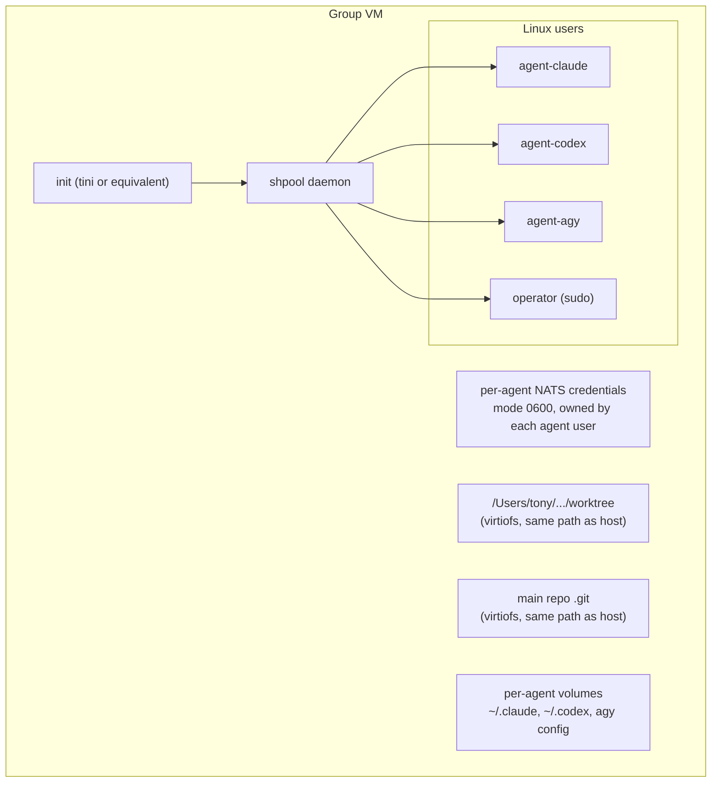

# Containers

## Why Apple Containers

Apple's `container` tool runs each container as its own lightweight VM on Apple silicon. Web research during the design conversation found a 1.0.0 release on June 9, 2026, a `container machine` feature announced at WWDC 2026, and 1.3-line releases since (all unverified on this machine). One VM per group makes the group a real kernel boundary: a compromised group can't reach another group's files without a hypervisor escape.

Docker Desktop was considered. It runs all containers in one shared Linux VM, so groups would be separated by namespaces rather than kernels, but it has a mature Engine API (exec with TTY, resize, reattachable container attach), cheap containers, runtime portability (OrbStack, Colima, Linux), and mature networking. Docker Sandboxes (microVM per agent, launched in 2026) isolates per agent rather than per group, which fights the group model. The PoC targets Apple Containers because groups are the defining feature. The backend interface should keep Docker possible later.

## Group VM layout

- The VM's main process starts shpool, so "VM is up" means "sessions are available." In the starting NATS topology the bus lives on the host; if the leaf-node topology wins, the VM also runs an embedded NATS leaf server.
- Each agent runs as its own Linux user with no sudo. The operator user has sudo. All of them share a group that owns the worktree, with umask `002`, so files stay writable by everyone who should write them.
- Per-agent volumes hold harness configuration and credentials so they persist across VM restarts.

## Mounts

- Mount the worktree and nothing else from the operator's files. Never mount the home directory. The July 2026 SharedRoot exploit reached host files through a broad virtiofs mount without breaking the hypervisor, which is the failure to avoid.
- A git worktree's `.git` is a file pointing at `<main repo>/.git/worktrees/<name>`, so mounting only the worktree breaks git inside the VM. Either also mount the main repository's `.git` directory, or give each group a real clone. The mount keeps cheap worktrees but gives the group write access to the shared object store and every branch's refs. A clone isolates properly and costs disk and a push-and-fetch step. This needs an experiment and a decision.
- Mount at identical absolute paths inside and outside the VM, so paths in hook payloads, transcripts, and messages mean the same thing everywhere.
- A small read-only `operator-config` mount can carry shell configuration for operator shells.

## Image

One agent image, versioned in the repository, containing:

- Node (for Claude Code) and the three harness CLIs, if all three have Linux arm64 builds. Whether `agy` runs on Linux arm64 at all is unknown and is a critical early experiment. If it doesn't, the group model needs a hybrid: `agy` sessions run on the host and join their group's NATS account from there.
- git, shpool, tini, fish, zsh, bash, common build toolchains, `ncurses-term`.
- `agentctl` (and `agentd-guest` if built).
- Hook configuration for each harness that calls `agentctl status` and the bus inbox check.

Community reports said Apple's builder lacked outbound network access at some point. The installed CLI (1.4.1) has `container build` backed by a builder VM (`container builder start`) with `--platform`, `--build-arg`, `--secret`, `--ssh`, and DNS options, plus `container image load` and `save` for OCI tar archives (help text, not tested). Try a real build of the agent image with it first. Docker Desktop is installed on the host and is the fallback for building and importing if the builder can't reach the network.

## Credentials

The operator wants to log in once per harness, not once per session, group, or VM. Whether and how sessions can share authentication is a research question the PoC has to answer for each harness.

### What makes this hard

- The operator's subscriptions (Claude Max, Codex Pro, Google AI Ultra) authenticate through OAuth state on the host, and Claude Code stores credentials in the macOS Keychain, which a Linux guest can't reach.
- **Refresh token rotation.** OAuth providers often issue a new refresh token on every refresh and invalidate the old one. If several sessions share one credentials file and each refreshes on its own schedule, the first refresh can log every other session out, or two sessions can race and corrupt the file. Find out whether each harness rotates refresh tokens and how it handles a credentials file changing underneath it.
- **Concurrent writers.** A credentials file shared read-write across VMs through virtiofs gets written by several processes, possibly without locking.
- **Plan terms.** Check each subscription's terms for limits on concurrent sessions or automated use before building something that multiplies sessions on one login.

### Options to evaluate, per harness

| Option | How it works | Watch for |
| --- | --- | --- |
| Long-lived token | The operator creates a token once (for example `claude setup-token`) and the daemon injects it into every session, typically through an environment variable | Whether each harness offers one for subscription auth; token lifetime and revocation; tokens in the environment of every agent process |
| Shared config directory | One harness config directory, logged in once, mounted into every group VM | Refresh rotation and concurrent writers; everything else in that directory (settings, history, transcripts) becoming shared too |
| Credential file only | Copy or mount only the credentials file, with the rest of the config per agent | Same refresh problem, smaller blast radius; depends on the harness keeping credentials in a separable file |
| Host credential broker | The daemon holds the real login, performs refreshes itself, and hands each session a short-lived access token or a fresh credentials file | Only works if the harness accepts externally supplied tokens or files; most robust against rotation if it does |
| Per-agent volume reused across groups | Log in once per agent identity and reuse that volume in every group | Fewer logins than one per group, but still more than one per harness |

The host-tmux bootstrap already shares auth, because every worker runs as the operator and reads the harness's normal user config. The question only gets hard inside VMs.

### Security

In every option, an agent can read the credentials its harness uses, and a compromised agent can exfiltrate them. A shared login widens the blast radius from one session to every session of that harness. Mitigations: egress control, short-lived tokens where possible (the broker option), keeping credentials out of anything mounted from the worktree, and a single place for the operator to revoke and re-issue. Record exactly how each harness authenticates inside the VM, since this is the most likely place for a harness to break.

## Egress

- Put each group VM on an internal network with no direct route out (`container network create --internal`, unverified on the installed version).
- Run an allowlisting HTTP(S) proxy on the host and point harnesses at it with `HTTPS_PROXY` and `HTTP_PROXY`. Model APIs, package registries, and GitHub are the starting allowlist; policy is per group.
- Confirm each harness honors the proxy variables, and check tools agents commonly run (npm, pip, go, curl, git).
- Apple's CLI had no built-in egress filtering as of mid-2026, with a `container system pf` command reportedly in design.

## Hooks and the bus across the VM boundary

Agents and hooks inside the VM reach the embedded NATS server as NATS clients. In the starting topology the server is on the host, so each group's internal network needs a path to one host port and nothing else besides the egress proxy. Which address the VM uses to reach the host, and how to bind the NATS listener only where VMs can reach it, need an experiment with Apple's networking. Each agent's credentials file is readable only by that agent's Linux user. In the leaf-node topology, agents connect to a server inside their own VM, and only that server's leaf connection crosses to the host. The daemon reaches shpool through exec channels either way. Unix sockets generally don't cross virtiofs, so no design should rely on sharing a socket through a mount.

## Resource budget

Each VM reserves memory and runs its own kernel. Measure a group VM with three harnesses running before deciding how many groups a Mac can hold. Whether Apple's VMs return unused memory to the host dynamically is unknown.

## Other backends

- **Host tmux.** The bootstrap backend. No isolation beyond harness sandboxes.
- **Local processes.** For tests.
- **Docker Engine API.** A later option: a group becomes an internal network plus shared mounts plus labels, with one container per agent. The shared kernel is the trade-off.
