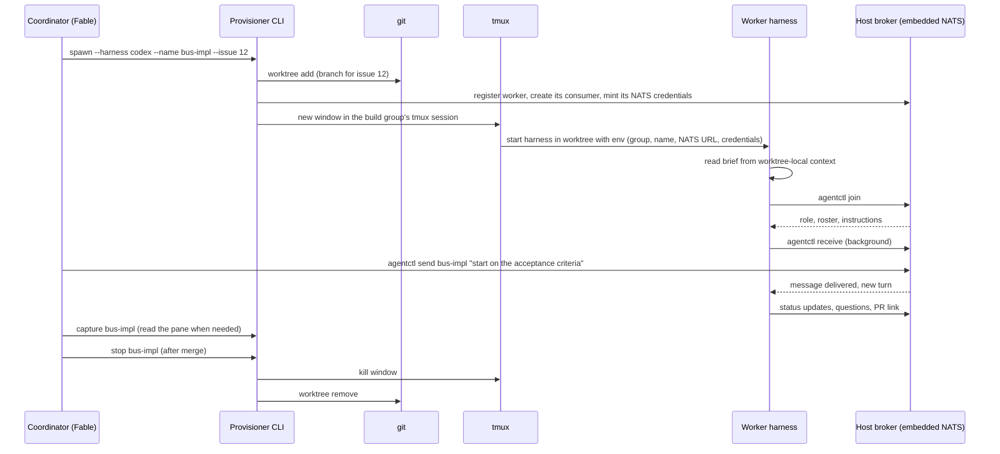

# Bootstrap orchestration

The PoC is built by a coordinating agent (a Fable session) that plans and dispatches work but never implements anything itself. Its own subagents and agent teams are Claude-only and live inside its session. To use Codex and `agy` workers too, and to run long-lived interactive workers the operator can watch and step into, it first needs a way to provision interactive sessions of all three harnesses on the host and coordinate them. That tooling is the first thing built, and it's deliberately the host-tmux backend of the same messaging and shared context system the PoC will run inside groups.

## Chicken and egg

1. The coordinator uses its own subagents to build a minimal provisioner and bus: enough to start a worker in tmux, give it a brief, and exchange messages with it.
2. The coordinator switches to provisioned workers for everything after that, including improving the provisioner and bus.
3. The same bus design later moves into group VMs with a different transport and identity resolver (see [04-messaging-and-shared-context.md](04-messaging-and-shared-context.md)).

## What the provisioner does



Minimum commands, names to be decided:

```text
provision spawn --harness claude|codex|agy --name <n> [--issue <n>] [--brief <file>] [--role <r>]
provision list
provision capture <name> [--lines N]
provision nudge <name>          # terminal pointer to pending messages, for idle workers
provision stop <name> [--keep-worktree]
provision group start|stop|status
```

## Worker startup details to pin down by experiment

- **Passing the first prompt.** Each harness can start interactively with an initial prompt (to be confirmed for each, especially `agy`). Keep the prompt short and point it at a brief file ("Read the brief at <path> and follow it.") rather than pasting instructions through the terminal.
- **Environment.** Inject the group name, worker name, the NATS URL (`nats://127.0.0.1:<port>`, IPv4 literal), and the worker's credentials. Don't put credentials in argv.
- **Sandbox and permissions.** Workers run under each harness's own sandbox with settings in user scope, as the research requires (`agent-peering-tests/DESIGN_V2.md`, deployment requirements). Direct loopback to the embedded NATS server needs `sandbox.network.allowLocalBinding: true` for Claude Code, a still-unconfirmed setting for Codex, and the localhost allowance for `agy`. Permission modes are negotiated with the operator before any workers start.
- **Hooks.** The personal machine allows hooks. Install user-scope hooks for each harness that report status (`agentctl status`) and check for pending messages when a turn ends.
- **Blocked workers.** A worker waiting on a permission prompt or asking to escape its sandbox is escalated to the operator. The coordinator doesn't approve sandbox escapes by typing into a worker's terminal.

## Coordinator conduct

- Plans, writes issues and briefs, dispatches, reviews, merges, and reports. It doesn't write code, docs, or experiment scripts; workers do. Only Codex workers write documentation and reports, so the build group always needs at least one Codex worker, and Claude Code and `agy` workers route their findings to Codex over the bus.
- Uses the bus as its primary channel and reads panes (`capture`) only to diagnose.
- Keeps a decisions log in shared context and mirrors durable decisions into GitHub issues and the docs site.
- Stays inside the concurrency limits the operator agreed to.
- Stops a worker cleanly (message, wait, then stop) rather than killing its window mid-change.

## Relationship to the PoC

The provisioner is the host-tmux backend. When the daemon exists, the provisioner's operations should become daemon API calls, so the coordinator can drive workers through the same system the operator uses, and the bootstrap build group can show up in the PoC UI as a group like any other.
