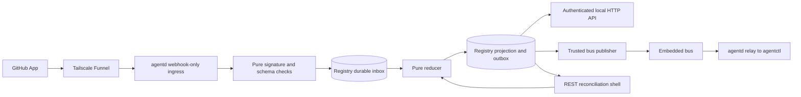
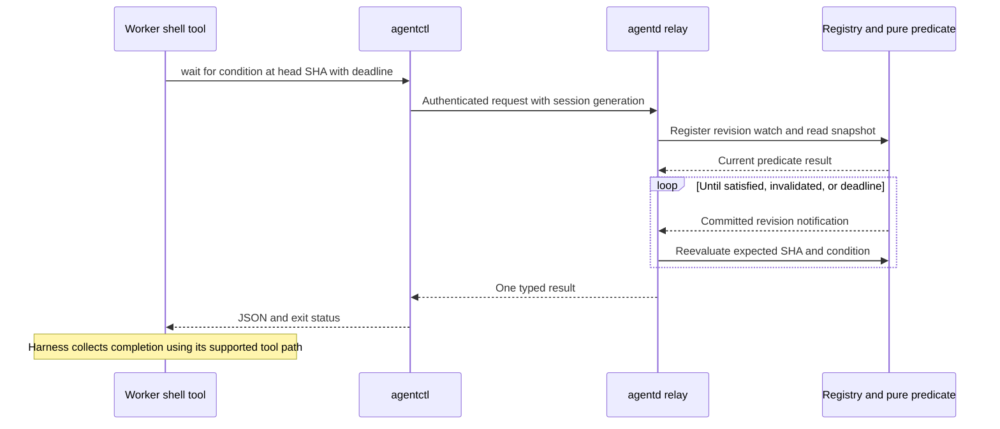

## Status and evidence

[untested] Proposed for [issue #98](https://github.com/tbhb/agent-orchestration-poc/issues/98), dated 2026-09-26. This page specifies proposed interfaces. Commands under Operator actions are instructions for a later deployment, not changes made by this work. [Decision 0006](/decisions/0006-github-event-monitor/) records the proposal.

[documented] Evidence identifiers below refer to the source manifest and raw notes in [`research/gates/github-events/`](https://github.com/tbhb/agent-orchestration-poc/tree/docs/98-github-event-monitor-design/research/gates/github-events). G1 is GitHub documentation and generated API schemas at `18945a31a4f2d97beb6c5c1a7479102e23c25727`, with REST API version `2026-03-10`. G2 is `cli/gh-webhook@115d4d6768b55c74ee7d7c61d4775d83fdc323d2`. T1 is Tailscale v1.102.4 source at `bbcd7d1fc2054b9189ebc1531acf74bd880ca0c8`. H1 is the repository's 2026-09-26 harness assessment. B1 is PR #82's reviews and issue #96. R1 is the retained REST command output. Each table or diagram inherits the evidence label in its introduction unless a row supplies another label.

## Problem and scope

[observed] The operator reported seven active Codex runs exhausting `tbhb`'s 5,000-point hourly GraphQL budget at about 20:21 America/New_York on 2026-09-26, with reset expected around 20:48. The operator's own `gh status` failed. Issue #98 preserves that report. This worker did not capture the original failure or measure each worker's share. The retained later `GET /rate_limit` response reports 4,999 GraphQL points remaining, so it does not independently establish the incident. Response headers from the conditional REST probe show a separate `core` budget. R1 records both without treating the later response as the incident measurement.

[inference] Repeated independent check watches turn one repository's state changes into requests from every worker and the coordinator. Centralizing those reads removes that multiplication. Giving the monitor installation credentials also separates its primary API budget from the operator's user budget. GitHub's secondary limits still apply. G1, REST rate limits and installation-token guidance.

[untested] Goals are one local snapshot per tracked PR or issue, a bounded wait for a condition at an explicit head SHA, a coordinator event stream, recovery from missed events, and no GitHub credentials in worker wait calls. Track configured repositories and open PRs, plus explicitly watched recently closed PRs and issues. Keep the monitor read-only toward repository content and workflow state.

[untested] The monitor does not merge or approve work. Thread resolution, work dispatch and Project updates remain with existing tools. Keep #89's merge preflight and #90's dispatch preflight. Terminal exposure through Funnel and changes to #83's reviewer identity policy are outside this scope. App token issuance is the one required API mutation in the monitor. Automatic webhook redelivery is deferred to an operator recovery procedure.

## Event delivery choices

[documented] G1 covers webhook types, events, failed deliveries, conditional REST requests, and CLI forwarding. G2's `create_webhook.go` creates a repository or organization development hook with POST and activates it with PATCH. The following costs and choices are [inference] from those contracts.

| Source | Cost and operator setup | Failure modes | Decision |
| --- | --- | --- | --- |
| GitHub App webhook | Register a private App, install on selected repositories, provision a private key and webhook secret, supply an HTTPS URL | Host sleep, receiver downtime, delivery loss, revoked installation, missing event coverage | Use for the durable monitor, with installation-token REST repair |
| Repository webhook | Repository administrator creates a hook and secret per repository, receiver still needs separate API credentials | Same inbound failures, per-repository setup drift, no API budget supplied by the hook | Viable small deployment, but an App joins subscriptions and reconciliation identity |
| `gh webhook forward` | Install `cli/gh-webhook` and authorize development-hook creation, keep an outbound WebSocket process alive | One forwarder per repository or organization, disconnection, extension availability, no App-webhook forwarding | Development only, not the production monitor or today's zero-setup stopgap |
| Conditional REST with ETags | Existing authorized `gh`, one polling owner, retained response bodies and validators | Poll latency, changing pages, cache loss, primary and secondary limits | Stopgap now and repair path later |

[documented] CLI forwarding is explicitly unsupported for production in G1. G2 forwards incoming headers and body to a local HTTP target. It retries some abnormal WebSocket closures three times. Without a target URL, it can print entire payloads. [observed] The installed `gh` 2.100.0 reports that the extension is absent. It was not installed or run. R1.

[documented] T1's `serve_v2.go` distinguishes tailnet-only Serve from public Funnel. The Tailscale Funnel documentation read on 2026-09-26 requires HTTPS, a permitted Funnel node, and supported ports, currently 443, 8443, or 10000. It describes bandwidth limits and public reachability. The following deployment assessment is [inference].

| Receiver route | Cost and operator setup | Failure modes | Decision |
| --- | --- | --- | --- |
| Funnel to a dedicated loopback ingress | Existing Tailscale host, HTTPS and Funnel policy approval, one public HTTPS port | Public request floods, host sleep, Funnel outage, certificate or policy failure | Proposed first deployment after ingress tests |
| Serve on the tailnet with a public relay | Operate a public HTTPS receiver and queue, join its relay to the tailnet, grant access to the host Serve port | Relay and queue outages, credential theft, replay, queue retention and additional operations | Use only if public ingress on the host is rejected or offline buffering becomes necessary |
| No inbound exposure | Conditional REST, or a development-only outbound forwarder | Poll delay or development-forwarder failure | Choose conditional REST for the immediate stopgap |

[inference] GitHub cannot directly call a tailnet-only Serve URL. The relay must preserve the original bytes and signature for verification in `agentd`. Authenticate its tailnet connection. Retain deliveries until the daemon acknowledges storage. Public Smee channels are unsuitable for private repository payloads. G1, using webhooks with Apps. This design does not settle #49 or #54's broader remote UI transport decision.

## Placement and event path

[untested] Put the monitor in `agentd`, beside the embedded bus and #28's SQLite registry. One registry projection is authoritative for local clients. HTTP snapshots, HTTP streaming, and bus replies serialize the same projection revision and use the same pure predicates. The bus carries notifications and replay cursors, not a separately reduced copy of PR state.

[inference] A separate process would need its own credentials and durable storage. It would also need a synchronization protocol without a demonstrated benefit. In-process placement follows the plan's Names, Build group, and Phase 2 sections. Keep a dedicated HTTP listener so public ingress cannot route to agent control, snapshots, the bus, health details, or credentials.

[untested] The event path includes a durable inbox and an outbox. Return 202 only after inbox commit. In one transaction, save the reduced projection with its outbox notification and mark the delivery processed. Bus failure leaves the outbox pending and does not lose the projection.



[documented] B1 records live broker-reply spoofing with nats-server v2.15.0. Agents must not have `$JS.API.>` or `$JS.ACK.>` access. Per-agent inbox prefixes alone do not fix that vulnerability. PR #82 also disables stream publish acknowledgments. A NATS flush does not confirm durable publication. Issue #96 defines the safe relay and confirmation contract.

[untested] Reserve `agentd` as a service identity that workers cannot acquire. Publish normalized notifications as `grp.<group>.evt.github.agentd`. Route requests on `grp.<group>.svc.github.<operation>.<agent>`, with the caller derived from the permitted subject suffix and group account. The relay validates the caller's repository scope and fixes its consumer. Permit replies only within that caller's private inbox prefix. Ignore identity, consumer name, and arbitrary reply destinations supplied in request bodies. Use #96's confirmed trusted publication path before retiring an outbox row. Do not enable stream acknowledgments on worker-writable subjects to make this work.

## State and conditions

[untested] Identify a repository by GitHub host and numeric repository ID, retaining its current owner/name for display. Key a PR by repository ID and number, and PR observations by head SHA and base SHA. Keep stable object IDs for reviews, comments, checks, and workflow runs. Store these values in the registry.

| Record | Fields and rules |
| --- | --- |
| PR snapshot | Open, closed, merged, draft, head and base SHA, merge commit SHA, mergeable true/false/unknown, current revision, provenance |
| Checks | Check-run ID, name, producing App ID, suite ID, SHA, status, conclusion, timestamps, workflow run ID and attempt when available |
| Legacy statuses | Status ID, context, SHA, state, timestamp, validated target URL |
| Reviews | Review ID, actor ID and type, commit ID, state, submitted time, dismissal state, provenance |
| Comments and threads | IDs, actor IDs, edit times, deletion tombstones, optional parsed review-verdict fields, thread-resolution observations with completeness flags |
| Issue snapshot | State, labels, exact body digest, latest effective verdict metadata, edited-verdict flag, revision and freshness |
| Collection metadata | Endpoint and page validators, start/end head and base, component completeness, last successful reconciliation, dirty generation, next retry, installation health |
| Delivery and publication | Delivery ID, body digest, event/action, received time, processed revision, outbox ID and publish state |

[untested] Separate `fresh`, `dirty`, `stale`, and `unavailable` from PR state. `fresh` means the required components passed a complete REST collection with unchanged head/base and no intervening invalidation. It does not mean GitHub cannot change immediately afterward. Default freshness lifetime is 120 seconds for an active wait. A new delivery invalidates affected components immediately. At restart all tracked records become stale until reconciled. Reads can return stale snapshots with their age, but condition success cannot use stale or incomplete components.

[untested] The request specifies the expected head SHA and one condition. On a different current head, return `head_changed` rather than silently retargeting. A waiter also records a baseline revision or review ID where an occurrence must be new. The following conditions report facts, not authorization to merge.

| Condition | Predicate |
| --- | --- |
| `checks_concluded` | Every member of an explicit, nonempty expected check set has a selected terminal result on the expected head or a proven corresponding merge ref. Missing, ambiguous, queued, and running members keep waiting. Return all conclusions, including failure, cancelled, skipped, and neutral |
| `review_posted` | A submitted review newer than the caller's baseline has `commit_id` equal to the expected SHA and, when supplied, the requested actor ID. Exclude pending reviews. Return the verdict without treating it as approval eligibility |
| `merged` | A reconciled PR has `merged=true` and its final source head equals the expected SHA. Return the separate merge commit SHA, which need not equal the source head |
| `conflict` | A reconciled open PR at the expected head/base has `mergeable=false`. A null mergeability value remains unknown. Base movement invalidates the result |

[untested] Reuse #72/PR #85's named-check selection semantics and fixtures, and let #89 decide whether conclusions satisfy its current required-check policy. Select latest attempts by stable run identity and attempt metadata, not arrival order or check name alone. Track expected producing Apps. A successful rerun may supersede a failed attempt. Preserve ambiguous duplicates as unknown. Read every result page and recheck head/base at the end. Record the head/base mapping for each result from a test merge. Empty `pull_requests` arrays on fork checks do not prove irrelevance. Index SHA-to-PR associations and reconcile ambiguous mappings. G1 event schemas document that fork arrays can be empty.

[untested] Issue readiness consumes #90's digest-bound, unedited latest reviewer verdict contract. Compute the body digest from exact API string bytes without newline normalization and cross-check REST/GraphQL body equivalence in its fixtures before replacing #90's collector. A comment notification alone cannot mark an issue Ready. Projects, last-pusher evidence, and complete review-thread resolution may require data not supplied by this REST projection. Return those components as unknown after a gap. Do not infer resolved threads from absent comments or claim this monitor is a complete merge/dispatch preflight.

## Agent interface and wait call

[untested] Choose a daemon-mediated bus receive through `agentctl` for worker waits. It reuses #96's authenticated identity rather than introducing a worker HTTP credential. The request subscribes a predicate to registry revisions through a separate consumer. Concurrent PR waits cannot steal chat messages. The CLI emits one bounded JSON result and exits.

| Transport | Assessment |
| --- | --- |
| HTTP long polling | Simple one-response protocol, but worker authentication and reconnect handling duplicate the relay. Retain the same wait contract in the local HTTP API for operator clients |
| Server-sent events | Appropriate for the coordinator's continuing timeline. Requires a parser, cursor, reconnect and backpressure behavior for a one-result worker wait |
| Bus receive through `agentctl` | Selected worker path. Existing credential and relay boundary, finite expiry, compact result. Still depends on #96 and a runtime wake test |

[untested] Proposed commands, not yet implemented, use the provisioned `AGENTCTL_CREDS_FILE` and the provisioned bus URL `nats://127.0.0.1:<bus-port>`. The launcher supplies that address and the credential path. Run through mise from the worker's shell tool.

```text
mise exec -- agentctl github snapshot --repo tbhb/agent-orchestration-poc --pr 82
mise exec -- agentctl github wait --repo tbhb/agent-orchestration-poc --pr 82 --head <sha> --condition checks_concluded --check check --timeout 900s
mise exec -- agentctl github wait --repo tbhb/agent-orchestration-poc --pr 82 --head <sha> --condition review_posted --after-review <id> --timeout 900s
mise exec -- agentctl github events --repo tbhb/agent-orchestration-poc --after <cursor> --timeout 900s
```

[untested] Local HTTP equivalents are `GET /v1/github/repos/{repository_id}/pulls/{number}`, `POST /v1/github/waits` with the same typed request, and `GET /v1/github/events?after={cursor}` as SSE. Bind this API separately to `127.0.0.1:8787`, require an operator read credential loaded from a file, reject browser cross-origin access, and allow only reads and ephemeral wait creation. Snapshot ETags are local projection revisions. Both listeners reject arbitrary GitHub proxy requests.

[untested] A wait accepts a client request ID, session generation, expected SHA, condition, baseline, and timeout in the range 1 second to 15 minutes. The daemon registers a revision watch and evaluates the current snapshot atomically relative to updates, then reevaluates after each revision. This prevents a change between reading and subscribing from being missed. Disconnect cancels the registration. A newer session generation cancels old waiters for that session. Reconnection uses the same predicate and remaining monotonic deadline, never extends the timeout, and reevaluates the snapshot before waiting again.

[untested] Result fields are `schema_version`, `request_id`, `outcome`, `repository_id`, `pr`, `expected_head`, `current_head`, `base_sha`, `revision`, `condition`, `satisfied`, `freshness`, `observed_at`, and structured reasons. Exit 0 means the requested condition holds. Exit 2 means timeout, 3 means head changed or PR closed without the requested merge, 4 means unavailable or stale at deadline, and 5 means invalid or unauthorized request. `checks_concluded` with failed checks still exits 0 and returns those failures. The caller must apply #72's success predicate before reporting green checks.



[untested] Coordinator SSE emits the same sanitized notification envelopes as the bus, with an opaque cursor containing store epoch and sequence. Support `Last-Event-ID`, finite retention of seven days, and a 15-second heartbeat. If the cursor expired or the store epoch changed, return `resync_required` and require snapshots before resuming. Bound each connection's queue to 256 notifications. Disconnect slow readers with their last cursor instead of dropping events silently. `agentctl github events` uses a separate relay observer cursor and finite batch size. The coordinator's ordinary inbox is independent.

## Harness and sandbox contract

[documented] H1 records Claude Code 2.1.283, Codex CLI 0.157.1, and agy 1.2.11. Its Codex section explicitly says unified exec is collected with `write_stdin` and does not establish automatic idle-turn wake on terminal exit. Its Claude and agy sections document background-task completion notices. The messaging sketch's claim that all three automatically start a turn is not an established common contract.

[untested] Use one blocking CLI process per wait in all three harnesses, but adapt how the harness collects the shell result. No shell `&`, detached daemon, hook, or sandbox bypass is required by this proposal.

| Harness | Shell-tool procedure | Loopback and remaining gate |
| --- | --- | --- |
| Claude Code 2.1.283 | Bash call with `run_in_background: true`, then consume its completion notification and result | [observed in H1] Approved `sandbox.network.allowLocalBinding: true` and literal `127.0.0.1` support the host path. Test the provisioned worker's actual settings and idle wake |
| Codex CLI 0.157.1 | `exec_command` starts the wait, retain its returned process session ID, use blocking `write_stdin` with empty input until it exits | [documented in H1] Launch with `sandbox_workspace_write.network_access=true` as approved in the plan. Explicitly pass `AGENTCTL_CREDS_FILE` through the launch environment policy. Do not end the agent turn expecting terminal exit to wake it |
| agy 1.2.11 | `run_command` starts a named background task, consume the completion notice, use `command_status` to collect output if needed | [untested] The terminal sandbox denies network by default. No proven loopback exception was found. Provisioning must test an operator-approved literal-loopback allowance and fail with `transport_unreachable` if it is denied |

[inference] Blocking tool-result collection removes GitHub polling even when a harness needs several local collection calls. It does not provide autonomous wake after a Codex run exits. H1 and the current source inspection in the notes support this narrower claim. The phase 2 wake item must test idle completion, timeout, compaction, restart, cancellation, and competing waiters with recorded launch settings. Keep agy undispatched for monitor-dependent work until its loopback gate passes. In a VM, `127.0.0.1` names the guest, so host reachability needs a separately tested guest-to-host route and credentials.

## Loss, ordering, and repair

[documented] G1 specifies HMAC-SHA256 over payload bytes in `X-Hub-Signature-256`, a delivery GUID in `X-GitHub-Delivery`, unchanged delivery IDs on redelivery, a 10-second GitHub.com response deadline, and no automatic retry of failed deliveries. Payloads above GitHub's 25 MB cap may never arrive. These properties require reconciliation even when intake works.

[untested] Verify the signature over the original bytes with constant-time comparison before parsing or storing the payload. Require POST and JSON, bound the body at 25 MiB and headers at 16 KiB, limit concurrent intake, and use short read deadlines. Reject malformed or missing signatures. After verification, validate event/action, repository ID, installation ID, and allowed schema. Unsupported signed actions are recorded as ignored and can schedule a bounded reconciliation, never execute instructions. Return 503 on durable-store failure. Duplicate accepted deliveries return 202 without repeating effects.

[untested] Deduplicate durably on webhook identity plus delivery GUID. Retain GUID/body-digest pairs for 30 days. A repeated GUID with different bytes is a security/error signal. The signature authenticates the body, not every delivery header, and supplies no signed freshness timestamp. A replay with a changed GUID must still be harmless because reduction is idempotent by object ID and stale events cannot promote state. Keep receipt time distinct from upstream object time. Do not sort deliveries by GUID or assume arrival order is GitHub order.

[untested] Reduce webhooks into observations and invalidations. They can make a component dirty immediately but cannot alone satisfy a wait. Coalesce invalidations per PR for two seconds, collect REST state once, and replace only completely collected components. Retain a generation counter before collection and compare it at commit. If a webhook or head/base change intervened, discard the candidate authoritative snapshot and retry within the shared budget. Delayed events may cause an extra repair but cannot roll a reconciled object backward. Restarts replay unprocessed inbox rows and pending outbox rows. Subscribers deduplicate by epoch/revision because outbox publication is at least once.

[untested] Repair at startup, on a relevant event, on a stale snapshot requested by a waiter, and every five minutes for tracked PRs, with a 120-second repair interval while waits are active. Coalesce all consumers' requests. Serialize REST calls per installation with a minimum one-second spacing, retain 20 percent of the primary budget for recovery, and defer lower-priority scans when that reserve is reached. Every request observes `Retry-After`, `X-RateLimit-Remaining`, `X-RateLimit-Reset`, and `X-Poll-Interval`. Secondary-limit retries back off exponentially with jitter and stop after three retries. Mark the snapshot stale and report the next retry time rather than retrying per waiter.

[untested] REST repair reads PR details, paginated check runs, legacy statuses, reviews, issue comments, issues, and workflow run attempts only as needed. Recheck PR head/base after collection. Use `Accept: application/vnd.github+json` and `X-GitHub-Api-Version: 2026-03-10`. Cache validators and bodies by installation identity, complete URL including pagination and query, API version, and media type. For 304, reuse only that exact cached body. On a cache miss, make an unconditional read. Replace body and validator together on 200. Track pagination completion and rebuild page sets when membership changes. Never interpret a 304 or an empty page as successful checks.

[untested] After a webhook gap, current REST state cannot reconstruct every intermediate event. Report current-state repair separately from event-history completeness. Retain a sticky gap marker for review-thread history and any component REST cannot rebuild. The operator can inspect App deliveries and request redelivery using App-authenticated delivery endpoints, then inspect the resulting projection. Do not grant repository Administration just to inspect App deliveries. After reinstall or repository removal, invalidate credentials and scope immediately and return unavailable for affected records.

[untested] If `agentd` is down, connection failure yields unavailable, never an empty successful snapshot. A running CLI may reconnect with bounded backoff inside its original deadline. If only the bus is down, HTTP snapshots remain readable with bus-health metadata and outbox lag. If GitHub is down or rate limited, local reads expose age and error while waits cannot satisfy from expired state. Report in the UI and coordinator stream the age of the last delivery, repair age, oldest outbox row, queue size, authentication failure counts, and API budget without payload bodies or secrets.

## Untrusted data and credentials

[untested] Webhook signatures establish transport provenance, not trustworthy prose. Treat titles, branch names, check names, logs, review bodies, and comments as hostile data. Default responses contain typed states, numeric IDs, SHAs, bounded sanitized names, validated GitHub links, and known reason codes. Strip terminal controls and bidirectional controls in display strings. Withhold raw bodies, diffs, check output, annotations, arbitrary URLs, tokens, signatures, private keys, and HTTP headers from bus events and default snapshots.

[untested] A separately authorized content read can return a size-limited body explicitly marked untrusted for a human or review task. Do not splice it into a shell command or a system instruction. #90 verdict parsing uses exact schema fields and actor IDs inside the pure core. Retain sensitive raw deliveries only in daemon-owned inbox storage for at most 24 hours after processing, retain minimal audit metadata for 30 days, and expire tracked closed objects after 30 days unless a current work item needs them. Document backup retention with #28. Host bootstrap workers share an OS user, so file mode alone does not isolate secrets from them. Before storing an App key, the operator must test harness read denials for the daemon secret directory. Running the daemon under a separate principal is an alternative.

## App budgets and identities

[documented] G1 gives an installation-token minimum REST budget of 5,000 requests per hour, scaling for larger installations, with a 15,000 minimum for qualifying Enterprise Cloud installations. User access tokens share the user's budget. Installation tokens expire after one hour. A second token for the same installation does not create a second installation budget. The proposed monitor uses its own App installation, not a user token or worker PAT.

[inference] Separate implementer and reviewer Apps could separate attribution and installation budgets, leaving `tbhb` actions attributable to the operator. Evaluate this in an independent #83 follow-up. The monitor App has read-only permissions. A prospective implementer App would need narrowly reviewed Contents and Pull requests writes, and issue writes if assigned issue work. A reviewer App needs Pull requests write to submit reviews and Issues write to post issue verdicts. Projects compatibility and its permissions need a separate test.

[schema] G1's `pulls.json` permits installation access tokens for creating reviews with Pull requests write and an `APPROVE` event. [documented] Its ruleset guide requires authorized reviewers and supports last-push and stale-review rules. [untested] Those sources do not establish that a custom App approval satisfies this repository's exact required-review rule. An accepted review object alone is insufficient evidence. Keep `tbhbbot` until an operator-owned fixture demonstrates that an App approval satisfies the required-review rule without bypass, cannot self-approve, becomes stale on a new push, and obeys last-pusher rules. Test implementer and reviewer Apps as distinct principals. Do not add either App to the bypass list to make the test pass.

[untested] That follow-up updates #83, #89, and #90's actor-ID allowlists, launch token selection, review-round attribution, thread-resolution policy, and audit records together. Do not switch the globally active `gh` account. Broker short-lived installation credentials only to the authorized role. Separate Apps improve process attribution but do not prove isolation if workers can read both keys. Operator-only merges remain operator-only.

## Operator actions

[untested] Every numbered item in this section is an **operator action** after the development and security review. None was performed by the designer. The supplied host inventory says Tailscale 1.102.4 has no Serve or Funnel configuration. [observed] The read-only repository-hooks request returned an empty list. The app-bundled Tailscale CLI aborted during the version probe in this sandbox, so current host configuration was not independently verified. R1.

1. **Operator action: create the monitor App.** Register a private App owned by `tbhb`, named with an available monitor-specific slug, with homepage `https://github.com/tbhb/agent-orchestration-poc`. Enable webhooks and SSL verification. Do not enable user authorization, device flow, or a callback URL. Install on only `tbhb/agent-orchestration-poc`. Record App ID, installation ID, repository ID, and the approved event list in daemon-owned configuration.
2. **Operator action: grant permissions and events.** Apply the exact read-only permissions in the table below, with all unlisted repository permissions and all organization/account permissions set to no access. No write permission, Administration, or ruleset bypass is requested.
3. **Operator action: provision secret files.** Create a daemon-owned `0700` directory at `$HOME/.local/state/agentd/secrets/github-monitor/`. Place the high-entropy webhook secret in `webhook-secret` and the downloaded App private key in `private-key.pem`, both `0600`. Configure the daemon with those absolute file paths. Provision the local operator read credential at `$HOME/.local/state/agentd/secrets/github-monitor/http-read-token`, also `0600`. Test that worker sandboxes cannot read these paths before activation. Do not put values in argv, worker environments, git, issue comments, or evidence. The daemon keeps short-lived JWTs and installation tokens in memory and refreshes before expiry. Rotate the webhook secret with a bounded overlap for old/new verification, then remove the old secret. Revoke a compromised App key in GitHub.
4. **Operator action: prepare ingress.** Bind the webhook-only listener at `127.0.0.1:8788` and local authenticated API at `127.0.0.1:8787`. Only `POST /github/events` accepts deliveries on 8788. Other paths and methods fail closed. Run valid-signature, invalid-signature, oversized-body, duplicate-delivery, unauthorized-repository, and API-path exposure tests before enabling public traffic.
5. **Operator action: enable Funnel.** Confirm MagicDNS and HTTPS certificate support in the tailnet admin console, and grant the `funnel` node attribute only to the intended host under the operator's tailnet policy. Review any enablement prompt as a policy change. Run the commands below using the installed app CLI. Port 443 belongs exclusively to webhook ingress in this proposal. Do not place Serve routes for the operator UI on that same Funnel port.
6. **Operator action: finish GitHub delivery setup.** Set the App webhook URL to `https://<node>.<tailnet>.ts.net/github/events`, using the exact hostname returned by Funnel. Enter the same secret from `webhook-secret` in the App webhook-secret field without retaining it in logs. Test a ping and one real PR/check delivery, redeliver it, and verify one logical state transition. Test restart and host-offline repair before calling the deployment ready.

[documented] The permission/event mapping is from G1's generated `src/webhooks/data/fpt/` schemas at the commit above. [untested] This is the proposed minimum for the stated projection and repair endpoints.

| Repository permission | Level | Subscribe to events | Purpose |
| --- | --- | --- | --- |
| Metadata | Read-only, automatic | No extra subscription | Repository identity |
| Pull requests | Read-only | `pull_request`, `pull_request_review`, `pull_request_review_comment`, `pull_request_review_thread` | Head changes, close/merge, reviews and thread invalidation |
| Issues | Read-only | `issues`, `issue_comment` | Issue state and issue/PR conversation changes |
| Checks | Read-only | `check_run`, `check_suite` | Check observations and completion invalidation |
| Commit statuses | Read-only | `status` | Legacy status contexts |
| Actions | Read-only | `workflow_run` | Workflow attempts and completion invalidation |
| Contents | Read-only | `push` | Base/head ref movement and SHA mapping |

[documented] `installation` and `installation_repositories` arrive automatically for Apps, not through a manual checkbox. Handle `ping` for setup. Checks read permission does not grant every requested/rerequested action, so reconciliation remains necessary. G1.

[untested] **Operator action: proposed commands**, backed by T1's flag definitions. The root proxy preserves `/github/events` and routes only to the dedicated ingress, avoiding `--set-path` prefix-stripping ambiguity.

```sh
/Applications/Tailscale.app/Contents/MacOS/Tailscale serve status --json
/Applications/Tailscale.app/Contents/MacOS/Tailscale funnel status --json
/Applications/Tailscale.app/Contents/MacOS/Tailscale funnel --bg --https=443 http://127.0.0.1:8788
/Applications/Tailscale.app/Contents/MacOS/Tailscale funnel status --json
```

[untested] **Operator action: rollback**, if this deployment owns port 443. First disable the App webhook in GitHub, then run the following command and confirm status. It does not revoke App credentials or tailnet policy grants, which the operator removes separately if retiring the monitor.

```sh
/Applications/Tailscale.app/Contents/MacOS/Tailscale funnel --https=443 off
/Applications/Tailscale.app/Contents/MacOS/Tailscale funnel status --json
```

[untested] **Operator action: alternative Serve route**, only if the operator chooses and provisions the public relay instead of Funnel. Grant only the relay node access to host TCP 8443. Keep HMAC verification at the daemon. Do not run this alternative as an extra step in the Funnel deployment.

```sh
/Applications/Tailscale.app/Contents/MacOS/Tailscale serve --bg --https=8443 http://127.0.0.1:8788
/Applications/Tailscale.app/Contents/MacOS/Tailscale serve status --json
```

## Stopgap within a day

[inference] The coordinator can stop independent watches today and own one serialized REST collection per active PR, with a two-minute minimum cadence and a finite deadline. Use the existing login and explicit repository paths. Workers report the PR number and head SHA, then await the coordinator's result through the current dispatch channel. This uses existing tools without an App or inbound listener. It does not require infrastructure or settings changes. Use this procedure now.

[untested] Keep a table of PR, expected head, expected check set, deadline, last response/ETag per endpoint, and next eligible request time. On each pass, collect PR details, check runs for that SHA, legacy statuses, and reviews only if needed. Follow pagination, retain the bodies, and re-read the PR before using results. Stop on changed head, partial data, timeout, or authentication errors. Apply #72's nonempty named-check success rule, and use #89's full preflight before any merge. Do not treat every concluded check as successful. Avoid Project/GraphQL refreshes while that budget is exhausted.

[untested] Example REST reads for one pass are below. Replace `<head-sha>` with the expected SHA. Retain headers and send the saved ETag on subsequent requests to the exact same URL. Do not use `--watch`. For a paginated conditional collector, retain validators per page rather than passing page one's ETag to every page.

```sh
gh api -i -H 'X-GitHub-Api-Version: 2026-03-10' repos/tbhb/agent-orchestration-poc/pulls/82
gh api --paginate -H 'X-GitHub-Api-Version: 2026-03-10' 'repos/tbhb/agent-orchestration-poc/commits/<head-sha>/check-runs?per_page=100&filter=latest'
gh api --paginate -H 'X-GitHub-Api-Version: 2026-03-10' 'repos/tbhb/agent-orchestration-poc/commits/<head-sha>/statuses?per_page=100'
gh api -i -H 'X-GitHub-Api-Version: 2026-03-10' -H 'If-None-Match: "<saved-etag>"' repos/tbhb/agent-orchestration-poc/pulls/82
```

[observed] R1's issue-98 probe returned HTTP 304 and `gh` exit 1. Handle 304 explicitly by reusing the corresponding saved response. Other nonzero results remain failures. [documented] G1 states that correctly authenticated 304 requests do not consume the primary budget. They still require pacing and do not promise exemption from secondary limits. `gh api --cache` uses a timed client cache. Check upstream freshness separately. CLI v2.100.0 `pkg/cmd/api/api.go` exposes a cache TTL.

[inference] Seven PRs with four requests every two minutes cost up to 840 requests per hour before additional costs from pagination and final reads or other callers. This is a planning bound for that simplified workload, not the measured incident cost. Pause or slow the shared collector if headers show insufficient reserve. On a rate-limit response, wait at least two minutes and any longer server-directed delay, then retry at most three times. If still blocked, report the expected reset and stop. A later development can automate this same collector without changing its state contract.

## Core and shell ownership

[untested] Follow [decision 0003](/decisions/0003-functional-core-imperative-shell/) and the plan's Names and Departures sections. Pure functions receive bytes, keys, recorded timestamps, policy values, and previous state. They return validated events, next state, effects, predicate results, and sanitized response values. They do not read clocks, files, databases, sockets, or process handles.

| Package | Responsibility |
| --- | --- |
| `internal/core/githubstate/` | Signature check over supplied bytes, schema checks, reduction, generation rules, freshness, check selection, wait predicates, sanitization, repair scheduling decisions |
| `internal/core/relay/` and `internal/core/perms/` | Extend #96's request/reply values, authorization predicates, service subjects and reply-prefix validation |
| `internal/github/` | New shell package for token issuance, GitHub REST reads, HTTP response decoding and executing repair effects |
| `internal/registry/` | Inbox, projection, validators, outbox, transaction boundaries and schema migration, coordinated with #28 |
| `internal/api/` | Webhook-only ingress, authenticated local reads, bounded HTTP waits and SSE |
| `internal/bus/` | #96 relay service, confirmed notifications, observer replay and fixed private replies |
| `cmd/agentd/` and `cmd/agentctl/` | Lifecycle, file-path options, CLI rendering, exit codes, cancellation |

[untested] Explicitly classify `internal/github/` as shell in the development's import policy before adding it. Reuse language-neutral fixtures for #72's Python predicates and the Go monitor rather than importing shell collectors into the core. Property tests cover replay idempotence, head isolation, order permutations that converge after repair, and unauthorized reply rejection. Shell integration tests cover transaction crashes, restarts, pagination, rate limits, and actual harness reachability. Run the required boundary and mutation gates when those packages are added.

## Work items and dependencies

[untested] These are proposed small work items for the coordinator to refine and file. They are not newly filed issues. Dependencies name existing issues and earlier rows. Each item includes its completion evidence and docs impact.

| Item | Dependencies | Deliverable and acceptance evidence |
| --- | --- | --- |
| A. Adopt the REST stopgap | None | Coordinator records one owner per PR, deadlines, request counts and a changed-head refusal. Update the coordinator procedure in its own item |
| B. Define state and predicate fixtures | #72/PR #85, #89 and #90 contracts | Pure Go values and fixture compatibility. Cover absent checks, reruns, statuses, merge-ref ambiguity, review baselines, head/base changes and unknown data. Update the API design |
| C. Persist inbox, projection and outbox | B, #28 | Registry migration and restart/crash tests before and after every commit/publication boundary. Prove duplicate repair and cursor replay. Document storage and retention |
| D. Add App REST reconciliation | B, C | Token expiry, serialized budget, ETag/page cache, incomplete response and head-change fixtures. Demonstrate failed-closed stale state. Document read-only scopes and endpoint matrix |
| E. Add verified webhook ingress | C, D | Signature vectors, altered bytes, unsigned headers, replay under a different GUID, body limits, repository scope, unsupported actions and restarts. Prove public listener cannot reach local API routes. Document operator setup |
| F. Add relay waits and coordinator stream | B, C, #26/PR #82, #27, #96 | Worker credentials must not grant JetStream control access. Test forged identity/reply/consumer, read-subscribe race, concurrent waits, outbox duplicates, deadline and expired cursor. Document `agentctl` examples |
| G. Prove harness completion and loopback | F, #28, #33 | Exact launch and shell-tool transcripts for all three harnesses, idle completion, compaction, restart and denial cases. Resolve agy reachability and Codex wake limits before dispatch depends on them. Update launch guidance |
| H. Deploy and exercise recovery | D, E, F, G, operator approval | Operator creates App and Funnel route. Record real signed delivery, duplicate redelivery, offline recovery, budget counts, secret-read denial and rollback. Keep broader #49/#54 UI experiment separate |
| I. Evaluate App implementer/reviewer identities | #83, operator-owned fixture | Prove or reject custom App required-review counting without bypass, distinct actors, stale dismissal and last-push behavior. Update #83/#89/#90 contracts only after the result |
