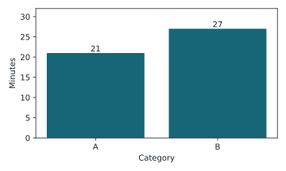
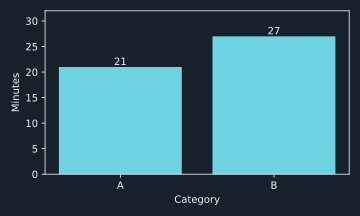

## Question and method

The [synthetic input](https://github.com/tbhb/agent-orchestration-poc/blob/main/research/gates/data-analysis/example-data.csv) has twelve invented event rows. The [Quarto notebook](https://github.com/tbhb/agent-orchestration-poc/blob/main/research/gates/data-analysis/example.qmd) uses a typed DuckDB CSV query to write the [result table](https://github.com/tbhb/agent-orchestration-poc/blob/main/research/gates/data-analysis/example-results.csv). Python's CSV reader separately recomputes the total and category values. The [claim ledger](https://github.com/tbhb/agent-orchestration-poc/blob/main/research/gates/data-analysis/example-claims.csv) links the published numbers to their result rows. All values are synthetic and say nothing about actual agent sessions.

## Claims

| Claim | Result row | Value | Independent method |
| --- | --- | ---: | --- |
| N-01, verified total | `TOTAL` | 48 minutes across 12 rows | Python CSV sum |
| N-02, verified category A | `G-A` | 21 minutes | Python CSV group |
| N-03, verified category B | `G-B` | 27 minutes | Python CSV group |
| Q-01, documented JSON column typing | DuckDB 1.5.5 source | Not numerical | [Versioned source inventory](https://github.com/tbhb/agent-orchestration-poc/blob/main/research/gates/data-analysis/versions.md) |

## Chart source and variants

The chart source is the `G-A` and `G-B` rows of `example-results.csv`. The bars are ordered A then B, and the data labels show 21 and 27 minutes. The light and dark variants use the same source rows and units.

| Chart | Source rows | Values | Variant |
| --- | --- | --- | --- |
| Category duration | `G-A`, `G-B` | A = 21 minutes, B = 27 minutes | [Light SVG](https://github.com/tbhb/agent-orchestration-poc/blob/main/research/gates/data-analysis/example-chart-light.svg) |
| Category duration | `G-A`, `G-B` | A = 21 minutes, B = 27 minutes | [Dark SVG](https://github.com/tbhb/agent-orchestration-poc/blob/main/research/gates/data-analysis/example-chart-dark.svg) |

## Limits and rerun

The small invented population only tests the gate and its presentation. It does not assess transcript quality, timing, or privacy of future inputs. The [review record](https://github.com/tbhb/agent-orchestration-poc/blob/main/research/gates/data-analysis/example-review.md) records the independent model's commands, deterministic row sample, numerical differences, and both chart comparisons.

From the repository root, run `mise run notebooks:lint`, `mise run notebooks:render -- research/gates/data-analysis/example.qmd`, `mise run notebooks:verify -- research/gates/data-analysis/example.qmd`, and `mise run docs:build`.
