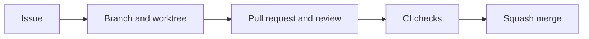

Work starts with an issue in [Project 9](https://github.com/users/tbhb/projects/9). The coordinator dispatches a worker into its own branch and worktree. Review and green CI precede a squash merge.

Use [process incident management](/workflow/process-incidents/) to declare, contain, and review coordination failures. The [first tracking incident](/workflow/incidents/2026-09-27-001/) retains its historical evidence gaps.



## Project fields and views

The fields configured on 2026-09-26 are recorded in [Project configuration evidence](https://github.com/tbhb/agent-orchestration-poc/blob/main/reports/inputs/project-configuration-2026-09-26.md).

| Field | Type | Values |
| --- | --- | --- |
| Status | Single select | Backlog, Ready, In progress, In review, Blocked, Done |
| Phase | Single select | 0, 1, 2, 3, 4, 5, 6 |
| Area | Single select | bus, daemon, containers, terminal, ui, desktop, remote, docs, tooling, experiment, research, workflow, security |
| Harness | Single select | claude, codex, agy, any |
| Worker | Text | Assigned worker, such as `build/codex-docs` |
| Priority | Single select | P0 (critical path), P1, P2 |
| Size | Single select | S, M, L |

| View | Configured layout and filter | Operator setting |
| --- | --- | --- |
| Default | Board with Status columns | Check all six statuses are visible |
| Phase | Table, no filter | Group by Phase |
| Ready to dispatch | Table, `status:Ready` | Sort by Priority ascending |
| Blocked | Table, `status:Blocked` | None |
| Experiments | Table, `area:experiment` | None |

PR #56 left the Phase grouping and Ready sorting for the operator because the API inputs do not support them. It also requested a Workflows UI check that new items target Backlog and closed issues or merged PRs target Done. The auto-add workflow added the phase 2 and 3 issues during configuration. Do not infer the remaining UI settings from the presence of the views.

## Issues and labels

Use one issue per work item with the following body template. There is no checked-in issue form yet.

```markdown
## Goal

## Context and links

## Acceptance criteria

- [ ] Observable outcome

## Evidence required

## Docs impact

## Out of scope
```

Use exactly one label in each of `area/`, `type/`, `phase/`, and `harness/`. The checked [workflow reference](/guides/workflow-reference/) lists the names, descriptions, colors, title types, scopes, and type mapping. Add `blocked` or `needs-operator` when applicable. Use blocked-by relationships for dependencies and sub-issues to split larger work. Decision issues close with a [decision record](/decisions/).

For a dependency, state the blocking issue number in Dependencies and paths and record the matching native GitHub blocked-by relationship. [Decision 0015](/decisions/0015-sub-issues/) proposes native edges as the script-readable source and assigns body-to-edge checks and open-blocker dispatch refusal to #158. Until that check exists, the coordinator verifies both directions before a fresh #90 verdict and immediately before dispatch, treating an incomplete read or mismatch as a refusal. Parent-child links group work and do not satisfy dependency gates. Each executable child requires a separate issue review and PR. Project 9 parent grouping remains proposed pending the reversible trial, and closing links follow #124's separate decision.

## Branches and commits

Use the branch type and form in the [workflow reference](/guides/workflow-reference/). The Project setup used the now retired `workflow/12-project-config` type. Worktrees belong under `.worktrees/<type>-<issue>-<slug>/`. Workers have separate checkouts and never work on `main`.

Commit with a Conventional Commit subject, a body explaining why, and `Refs: #<n>` as a trailer. Do not add attribution or co-author trailers. The commit-msg hook checks prose with `ai-tells` and `ai-tells-commits`. Record the harness and model in the Project Worker field and PR evidence section.

The commit-msg hook rejects attribution and missing `Refs:` trailers except for subject `wip`, and PR-body CI applies the same trailer rules to the squash commit body.

The shared stash stack requires explicit ownership. Merge `main` into a pushed branch, and rebase only unpublished history with `git rebase --autostash` or the throwaway work-in-progress procedure in [AGENTS.md](https://github.com/tbhb/agent-orchestration-poc/blob/main/AGENTS.md). Never force push a pushed branch or run bare `git stash pop` or `git stash apply`. A real commit must pass hooks. A clean update from `main` retains approval, while a hand-resolved merge dismisses it and needs re-review.

## Pull requests, review, and merges

Open one small PR per issue. Its conventional title and body become the squash commit. Include What, Why, Evidence, Docs, and Checklist sections and end with `Refs: #<n>`. For `feat` and `exp`, the Evidence section needs a link to committed output or a test run. Check green CI, docs updated or an issue filed, no secrets, and evidence committed.

The PR template also has Size justification and Gate justifications sections. Several final `Refs:` trailers may name open issues when one PR edits shared files. The [workflow reference](/guides/workflow-reference/) defines the 400-unit target, 800-unit limit, exclusions, and Project Size bands.

The `check` job compares registered quality gates with the PR merge base on pushes and body edits. Each finding has an ID built from its kind, path, key or location, and change type. Put `- <finding-id>: <reason>` on its own line under `Gate justifications`. Missing, empty, duplicate, and orphan reasons fail. Reviewers judge the reasons. A changed workflow or `prek.toml` needs a reason even when semantic weakening is uncertain. Unknown gate syntax blocks until the supported registry is updated.

The PR form check uses the PR's `created_at` and the validator PR's retained merge time. It reports pre-cutoff PRs for coordinator repair and blocks newer PRs, including those from older branches. Missing creation metadata fails closed. Local-only refs appear in a separate report and do not block CI.

Before review, the coordinator runs `mise run review:preflight -- <pr>` to verify that workflow revisions added on `main` are present at the PR head. Before merge or a completion report, run `mise run pr:wait-check -- <pr> <check-name> <timeout-seconds>`. The waiter succeeds only when the requested check concludes success on the head SHA recorded when waiting began. Its timeout includes GitHub calls, and zero seconds expires immediately. Both tasks address failures in the [phase 1 retrospective](/retros/2026-09-26-phase-1/).

Workers open PRs for coordinator review and do not merge them. A different harness reviews first where practical. The default implementer account is `tbhb`. Reviewers run each review command through `scripts/reviewer-gh.sh`, which resolves the `tbhbbot` token and checks the effective account without changing the default. Never print, log, or write a token. `tbhbbot` posts request-changes and approvals as PR reviews with inline threads. State the harness, model, and effort on the verdict's first line. Implementers reply in threads, push fixes, and receive another review. One round is one verdict by `tbhbbot`. After three changes-requested verdicts, stop until a newer coordinator `tbhb` comment has the exact body `Arbitration: authorize another round`. The coordinator never approves through `tbhbbot`.

Every agent, including the coordinator and auditors, must not drop, narrow, weaken, stub, or defer an acceptance criterion, test, check, or brief step on their own judgment. Stop at an item blocked by permission, sandbox, approval, credential, tool refusal, or resource limits and report the exact command block needed to unblock it to the coordinator, who raises an operator request. Do not work around or weaken it. Before a PR merges, link an issue from the PR or review thread for every follow-up, non-blocking finding, or item described as out of scope for the PR. Resolve a thread with a non-blocking finding only after it has a linked issue or an explicit answer in the thread. Only the operator may drop planned work, and the drop must be recorded as a decision.

The operator completed reviewer login on 2026-09-26 after the coordinator stopped dispatch and waited for active workers to finish. The operator restored `tbhb` as the default account. Before dispatch resumed, the coordinator checked the default account, the explicit `tbhbbot` token lookup without revealing its value, and the git credential helper's implementer identity. Workers never run `gh auth switch`.

Reviewer identity records the project review process. It does not protect credentials from workers on the same machine. The coordinator merges ordinary product code, including code that handles credentials, after review and green CI. The operator merges changes to project credential issuance, storage, grants, or repository secrets, security policy, egress rules, and host setup or installations.

The active [main ruleset](https://github.com/tbhb/agent-orchestration-poc/rules/24053242), read through REST on 2026-09-27, requires a PR, one approving review, stale approval dismissal on push, resolved conversations, and approval of the latest push by someone other than its pusher. It also requires an up-to-date branch and successful `check`, `docs`, `pr-body`, `imported-research`, and `mutation` checks. Extra approval is required for unattributed changes. Only squash merges are permitted. Deletion and force pushes are blocked, and the bypass list is empty. The active [all-branches ruleset](https://github.com/tbhb/agent-orchestration-poc/rules/24056095) blocks force pushes on every branch. Repository settings disable merge commits and rebase merges for PRs, while feature branches may receive merge commits from `main`. GitHub enforces the rulesets. Review by `tbhbbot` and the round limit are project policy. The provisioner will remove matching worktrees once implemented.

## Dependency proposals

[Decision 0011](/decisions/0011-dependency-update-proposals/) proposes Renovate as an advisory source after operator-owned setup and the #92 and #93 workflow gates. The coordinator selects or creates an open issue with compliant labels and allowed paths, then dispatches a worker on an issue-number branch. The worker reads versioned release notes and source. The worker records exact pins and lockfiles, updates the owning stack rules and conventions, then opens a coordinator-owned PR whose Evidence section links the committed research note. A generated service PR remains advisory under the current author and branch rules. A different-model `tbhbbot` review and all five required checks remain necessary. The [research comparison](https://github.com/tbhb/agent-orchestration-poc/blob/research/91-dependency-updates/reports/inputs/dependency-update-research.md) records the manual owner and procedure where a manager cannot handle a pin.

The proposed service budget is two routine proposals and one security proposal open at a time. Routine patch and minor updates group by ecosystem and update class. Security fixes use their own group, and a major migration does not share a proposal with unrelated updates. The coordinator counts proposals from other sources before dispatch. Configuration, a live proposal, and a full worker PR gate remain untested, so dependency automation is inactive.

## CI jobs

| Job | Trigger | Checks |
| --- | --- | --- |
| `check` | PRs and pushes to `main` | `mise run check`, including Go build, vet, tests and lint, Ruff and pytest, formatting, prose, secrets, experiment layout, Mermaid, and workflow syntax |
| `handoff` | Pushes to `main` | Verify that PRs described as open in the handoff are open on GitHub |
| `mutation` | PRs and pushes to `main` | Always reports a result. Runs `mise run check:mutation` when Go or Python core code or their tests change, and succeeds without running the tools otherwise. |
| `property-nightly` | Nightly schedule and manual dispatch | Runs Go and Python tests with random seeds and files an issue containing the seeds and output on failure. |
| `docs` | PRs and pushes to `main` | Chromium setup and `mise run docs:check-links`, which builds the site and checks internal links and hashes |
| `pr-body` | PR opened, edited, synchronized, or reopened | No attribution trailers, a `Refs:` trailer, and an Evidence link for `feat` or `exp` |
| `imported-research` | PR opened, edited, synchronized, or reopened | No modification, rename, or deletion under `research/imported/`. Additions need a `research(import)` title. |
| `closure-audit` | Weekly schedule or manual dispatch | Read-only audit of closed work-item issues without a linked merged PR or an explicit `Non-code closure:` reason. |

These jobs currently run on `ubuntu-latest`. The `check` and `docs` jobs install mise 2026.8.6 with the pinned action. macOS jobs are planned when code needs Apple frameworks or Containers. See [tooling](/workflow/tooling/) for the task and hook inventory.

At a checkpoint, the coordinator also runs `mise run checkpoint:closure-audit`. To record a non-code closure, put `Non-code closure: <reason and evidence>` on its own line in the issue body. The audit only reports issues for review and never changes issue state. Codex documentation dispatches use the [brief template](https://github.com/tbhb/agent-orchestration-poc/blob/main/docs/briefs/documentation-brief-template.md) and require a local Vale pass.

## Reporting

Commit and push before reporting completion. Once the bus exists, push whenever reporting status there. Keep raw evidence in the repository after secret scanning and any necessary redaction. A pane capture does not replace a pushed branch. The coordinator schedules a check-in for dispatches expected to exceed fifteen minutes until bus status monitoring exists.
