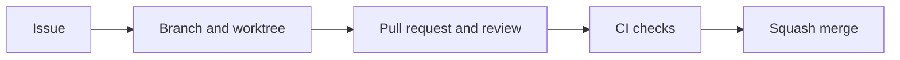

Work starts with an issue in [Project 9](https://github.com/users/tbhb/projects/9). The coordinator dispatches a worker into its own branch and worktree. Review and green CI precede a squash merge.



## Project fields and views

The fields configured on 2026-09-26 are recorded in [Project configuration evidence](https://github.com/tbhb/agent-orchestration-poc/blob/main/reports/inputs/project-configuration-2026-09-26.md).

| Field | Type | Values |
| --- | --- | --- |
| Status | Single select | Backlog, Ready, In progress, In review, Blocked, Done |
| Phase | Single select | 0, 1, 2, 3, 4, 5, 6 |
| Area | Single select | bus, daemon, containers, terminal, ui, desktop, remote, docs, tooling, experiment, research, workflow, security |
| Harness | Single select | claude, codex, agy, any |
| Worker | Text | Assigned worker, such as `build/codex-docs` |
| Priority | Single select | P0 (critical path), P1, P2 |
| Size | Single select | S, M, L |

| View | Configured layout and filter | Operator setting |
| --- | --- | --- |
| Default | Board with Status columns | Check all six statuses are visible |
| Phase | Table, no filter | Group by Phase |
| Ready to dispatch | Table, `status:Ready` | Sort by Priority ascending |
| Blocked | Table, `status:Blocked` | None |
| Experiments | Table, `area:experiment` | None |

PR #56 left the Phase grouping and Ready sorting for the operator because the API inputs do not support them. It also requested a Workflows UI check that new items target Backlog and closed issues or merged PRs target Done. The auto-add workflow added the phase 2 and 3 issues during configuration. Do not infer the remaining UI settings from the presence of the views.

## Issues and labels

Use one issue per work item with the following body template. There is no checked-in issue form yet.

```markdown
## Goal

## Context and links

## Acceptance criteria

- [ ] Observable outcome

## Evidence required

## Docs impact

## Out of scope
```

Use `area/<area>`, `phase/<n>`, and `harness/<claude|codex|agy|any>`. Type labels are `type/feature`, `type/experiment`, `type/research`, `type/docs`, `type/tooling`, `type/process`, `type/bug`, and `type/decision`. Add `blocked` or `needs-operator` when applicable. Use blocked-by relationships for dependencies and sub-issues to split larger work. Decision issues close with a [decision record](/decisions/).

## Branches and commits

Use `<type>/<issue>-<slug>` branches, normally `feat`, `fix`, `docs`, `exp`, `chore`, or `research`. The Project setup used `workflow/12-project-config`. Worktrees belong under `.worktrees/<type>-<issue>-<slug>/`. Workers have separate checkouts and never work on `main`.

Commit with a Conventional Commit subject, a body explaining why, and `Refs: #<n>` as a trailer. Do not add attribution or co-author trailers. The commit-msg hook checks prose with `ai-tells` and `ai-tells-commits`. Record the harness and model in the Project Worker field and PR evidence section.

The shared stash stack requires explicit ownership. Prefer `git rebase --autostash` or the throwaway work-in-progress procedure in [AGENTS.md](https://github.com/tbhb/agent-orchestration-poc/blob/main/AGENTS.md). Never run bare `git stash pop` or `git stash apply`. A real commit must pass hooks.

## Pull requests, review, and merges

Open one small PR per issue. Its conventional title and body become the squash commit. Include What, Why, Evidence, Docs, and Checklist sections and end with `Refs: #<n>`. For `feat` and `exp`, the Evidence section needs a link to committed output or a test run. Check green CI, docs updated or an issue filed, no secrets, and evidence committed.

Workers open PRs for coordinator review and do not merge them. A different harness reviews first where practical. The coordinator merges after review and green CI. Changes to security policy or credentials need an operator merge. Egress rules or installations outside the repository also need an operator merge.

The active [main ruleset](https://github.com/tbhb/agent-orchestration-poc/rules/24053242), read back on 2026-09-26, requires a PR and the `check` job and blocks force pushes and branch deletion. It permits squash merges only and has no bypass actors. Its required approving-review count is zero, so coordinator review remains a process requirement. Repository settings disable merge commits and rebase merges and delete head branches after merge. The provisioner will remove matching worktrees once implemented.

## CI jobs

| Job | Trigger | Checks |
| --- | --- | --- |
| `check` | PRs and pushes to `main` | `mise run check`, including Go build, vet, tests and lint, Ruff and pytest, formatting, prose, secrets, experiment layout, Mermaid, and workflow syntax |
| `mutation` | PRs and pushes to `main` | Always reports a result. Runs `mise run check:mutation` when Go or Python core code or their tests change, and succeeds without running the tools otherwise. |
| `property-nightly` | Nightly schedule and manual dispatch | Runs Go and Python tests with random seeds and files an issue containing the seeds and output on failure. |
| `docs` | PRs and pushes to `main` | Chromium setup and `mise run docs:check-links`, which builds the site and checks internal links and hashes |
| `pr-body` | PR opened, edited, synchronized, or reopened | No attribution trailers, a `Refs:` trailer, and an Evidence link for `feat` or `exp` |
| `imported-research` | PR opened, edited, synchronized, or reopened | No modification, rename, or deletion under `research/imported/`. Additions need a `research(import)` title. |

These jobs currently run on `ubuntu-latest`. The `check` and `docs` jobs install mise 2026.8.6 with the pinned action. macOS jobs are planned when code needs Apple frameworks or Containers. See [tooling](/workflow/tooling/) for the task and hook inventory.

## Reporting

Commit and push before reporting completion. Once the bus exists, push whenever reporting status there. Keep raw evidence in the repository after secret scanning and any necessary redaction. A pane capture does not replace a pushed branch. The coordinator schedules a check-in for dispatches expected to exceed fifteen minutes until bus status monitoring exists.
