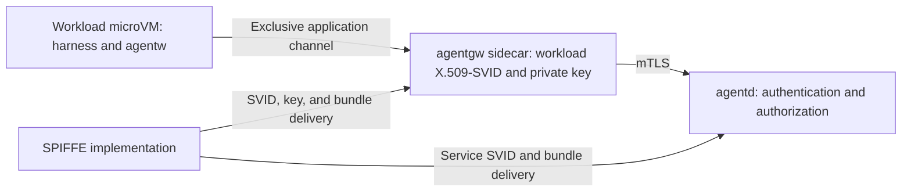

This page retains the earlier bespoke microVM/sidecar profile as a deferred design reference. It is superseded as the product baseline by [host mode and sbx](spiffe-mtls-authentication.md#initial-backend-scope). Its requirements apply only to that deferred alternative, not the current initial-backend contract. No runtime guarantee below is experimentally verified.

**Scope update, 2026-09-27:** The accepted [initial backend scope](spiffe-mtls-authentication.md#initial-backend-scope) is host mode and Docker Sandboxes (`sbx`), reusing existing sandboxing. The bespoke microVM/sidecar deployment described below is deferred and is not an initial product requirement. Its intended isolation properties remain design requirements, not verified guarantees. The newer authentication design defines wrapper mTLS and runtime-mediated JWT paths with shared agentd authorization.

## Deferred topology

Agentd manages logical Groups and provisions workloads outside their isolation boundaries. Each Session or Task runs its harness and agentw inside a dedicated microVM, paired with a separate trusted agentgw sidecar. Sessions are interactive workloads; Tasks are headless workloads.

Each workload receives a Workspace filesystem view, private harness state, trusted launch configuration, and an exclusive channel to its gateway. Workloads may share Workspace storage. Their private harness homes, gateway credentials, and administrative endpoints remain separate. Group membership is assigned explicitly and is not inferred from storage or network access.

Each Codex workload runs its own app server inside its workload microVM. The harness and its subprocesses act under one workload identity and role. App-server integration and resource overhead require validation.

## Certificates and private-key custody

Agentgw holds the represented workload's X.509-SVID and its corresponding private key. The X.509-SVID is a verifiable identity document; the private key is separate secret material. Agentw has access only to the application proxy endpoint. The harness cannot fetch SVID credentials, export keys, change gateway configuration, or access gateway management interfaces.

Agentd registers the workload's identity, Group, immutable role, and lifecycle state. Native harness conversation IDs identify conversation history and support resume; they do not confer authorization. Requests cannot select their authenticated identity through a caller-supplied ID or header.

Protecting the private key does not prevent a workload from using its permitted API access on someone else's behalf. Authorization bounds that workload's authority. It does not establish the intent of code running inside the microVM.

## Per-workload credential sidecar

The runtime enforces exclusive access from a workload to its paired gateway. A different workload cannot use that endpoint through shared mounts, network access, or runtime management APIs. The gateway's private storage, process state, configuration, and identity-delivery interface remain inaccessible to the harness.

The sidecar authenticates to agentd using the represented workload's X.509-SVID and validates agentd's expected service SPIFFE ID. Agentd authenticates the workload SPIFFE ID and checks its active incarnation, Group, role, and operation. Trusting an issuing authority is not sufficient authorization for every identity it issues.

Workload and gateway form one managed lifecycle unit while retaining separate isolation boundaries. The paired channel, identity, and policy must be ready before harness launch. Stop and replacement operations invalidate obsolete authority and connections. Credential rotation preserves workload identity; incarnation replacement requires explicit lifecycle fencing.

A runtime that implements each container as a microVM uses a separate microVM for the gateway. Pair-local transport, memory consumption, startup cost, and recovery behavior are runtime acceptance criteria.

## Combined identity and egress sidecar

Agentgw uses an Envoy-based proxy configuration for both authenticated orchestration requests and workload network egress. Separate listeners and routes handle the fixed agentw path to agentd, policy-controlled external traffic, and application-aware service integrations. Agentd assigns policy; agentgw enforces it.

The runtime blocks direct workload egress that bypasses agentgw. The enforcement contract covers DNS, direct IP access, IPv6, UDP/QUIC, SSH, host/private-network destinations, and inter-workload connections. Unsupported paths are denied. Workload code cannot change those controls. Proxy environment variables configure cooperative clients but are not the isolation mechanism.

General egress cannot reach gateway administration, credential delivery, internal management services, or another workload's sidecar. Workload mTLS credentials are configured only for trusted internal upstreams. Destination checks cover requested names and ports as well as resolved addresses and DNS changes.

HTTPS destination filtering and operation-level authorization require different processing. A CONNECT tunnel can enforce destination policy while preserving encrypted traffic. GitHub credential substitution, request authorization, caching, and provenance require an application-aware route with access to the request. The precise integration and credential placement remain open; these functions are not supplied by generic forward-proxy configuration alone.

Gateway failure must not enable direct egress. Policy updates require an explicit rule for existing connections. Combining credential custody and general traffic handling in one trusted process requires restricted configuration, administrative access, and workload-scoped upstream credentials.

Envoy integration references: [SDS](https://www.envoyproxy.io/docs/envoy/v1.37.0/configuration/security/secret), [dynamic forward proxy](https://www.envoyproxy.io/docs/envoy/v1.36.1/configuration/http/http_filters/dynamic_forward_proxy_filter), and [CONNECT support](https://www.envoyproxy.io/docs/envoy/latest/intro/arch_overview/http/upgrades.html). Features must be checked against the selected release.

## SPIFFE as the identity foundation

A SPIFFE ID names an identity within a trust domain. A trust domain is an identity namespace backed by an issuing authority and its cryptographic keys; it is distinct from a Group, microVM, or host. A SPIFFE Verifiable Identity Document (SVID) asserts a SPIFFE ID in a cryptographically verifiable form. This design uses X.509-SVIDs for mTLS.

A SPIFFE bundle contains a trust domain's public verification material and must remain associated with that trust domain. The SPIFFE bundle exchange format is a JWK Set; the X.509 profile of the SPIFFE Workload API delivers X.509 bundles as DER-encoded CA certificates. A bundle is not a workload's private key or its SVID certificate chain. Peers validate an SVID using the bundle corresponding to its trust domain, then separately authorize the authenticated SPIFFE ID.

The SPIFFE Workload Endpoint exposes identity services, including the Workload API. Its X.509 profile delivers the SVID certificate chain, corresponding private key, and X.509 bundles. Identity delivery is accessible to the trusted gateway, not the harness. Agentw's application endpoint is a separate interface. Envoy SDS is another credential-delivery interface and is not the SPIFFE Workload API.

The selected implementation must establish the gateway's entitlement to represent its paired workload using trusted registration and attestation. The gateway's infrastructure identity, when needed for management or enrollment, is distinct from the workload identity it presents to agentd. The separate microVM placement requires an explicit enrollment design; the term sidecar does not itself establish identity binding.

SPIRE is a SPIFFE implementation. Selection of implementation, deployment topology, and credential-delivery integration remains open. The SPIFFE Broker API is marked Incubating and is not an assumed dependency. Federation distributes SPIFFE bundles across trust domains to enable authentication; it does not assign Group membership or permissions.

Normative terminology: [SPIFFE ID](https://github.com/spiffe/spiffe/blob/f97c46dfd0ff0d4e412cce5c73846a9ca32a99a2/standards/SPIFFE-ID.md), [X.509-SVID](https://github.com/spiffe/spiffe/blob/f97c46dfd0ff0d4e412cce5c73846a9ca32a99a2/standards/X509-SVID.md), [trust domains and bundles](https://github.com/spiffe/spiffe/blob/f97c46dfd0ff0d4e412cce5c73846a9ca32a99a2/standards/SPIFFE_Trust_Domain_and_Bundle.md), [Workload API](https://github.com/spiffe/spiffe/blob/f97c46dfd0ff0d4e412cce5c73846a9ca32a99a2/standards/SPIFFE_Workload_API.md), and [Broker Endpoint](https://github.com/spiffe/spiffe/blob/f97c46dfd0ff0d4e412cce5c73846a9ca32a99a2/standards/SPIFFE_Broker_Endpoint.md).

## Driver evidence

**Documented/source-inspected:** Apple Container supplies Linux microVMs, shared host-directory mounts, named disk-image volumes, and Unix-socket relays. These are integration building blocks, not proof of exclusive workload/gateway channels or non-bypassable egress. Concurrent writable attachment of a named disk image to separate guest kernels is not established. [Runtime overview](https://github.com/apple/container/blob/4a7d8615241b8ddecfd3bf225cd7c44f4b2ccf7c/README.md), [volumes](https://github.com/apple/container/blob/4a7d8615241b8ddecfd3bf225cd7c44f4b2ccf7c/docs/volumes.md), [socket handling](https://github.com/apple/container/blob/4a7d8615241b8ddecfd3bf225cd7c44f4b2ccf7c/Sources/Services/RuntimeLinux/Server/RuntimeService.swift#L1153).

Additional drivers must declare their actual isolation, storage, channel, and network-enforcement capabilities. Docker's volume and host-networking interfaces require their own integration checks; Docker Desktop's shared Linux VM is not a per-workload microVM guarantee. [Docker volumes](https://docs.docker.com/engine/storage/volumes/), [Docker Desktop networking](https://docs.docker.com/desktop/features/networking/).

The [local sandbox runtime survey](local-sandbox-runtimes.md) explores backends that provide credential mediation without our own sidecar container, separates launcher behavior from sandbox lifecycle, and defines qualification checks. Host mode and sbx have since been selected as initial targets; their integration remains unverified.

## Persistent state and resume

Agentd retains private harness state separately from a running workload instance and reattaches it only to an authorized successor. Native conversation resume restores harness history; it does not preserve process memory, terminal jobs, or in-flight tools. The complete required state set must be tested for each harness.

Durable workload records and live incarnations need distinct lifecycle tracking. Before admitting a successor, agentd fences the old workload and gateway authority. Persisted state cannot reactivate revoked credentials or permit conflicting live owners. Gateway private keys remain outside harness-state volumes. Exact workload-ID and incarnation semantics remain open.

## Shared workspace limitations

Workspace access intentionally exposes shared files. A workload may change a script, dependency, hook, or project configuration that another workload executes. Private microVMs and credentials do not prevent that influence. Group policy and trusted launch configuration must account for execution of shared mutable content.

## Native macOS capabilities and possible host workloads

Containerized workloads may invoke authorized macOS capabilities through a host tool adapter. The adapter scopes workspace access, operations, devices, output, and artifacts to the requesting workload. Build scripts and tests execute code on that service, so its privileges and isolation require an explicit contract. Native-host harness execution is now an initial target under the separate wrapper design.

**Decided host-mode trust boundary, operator discussion on 2026-09-27:** The initial host backend trusts the OS user and excludes arbitrary same-UID tampering with its wrapper, gateway, or launch binding from its threat model. It may provide external credential custody and kernel-derived process attribution under that assumption, without claiming hostile same-user workload isolation. This defines the host threat model; it does not establish a verified implementation. See the [runtime survey](local-sandbox-runtimes.md#contract-implications).

### Remote invocation of Apple development tools

Apple's `xcodebuild`, `simctl`, and `devicectl` belong to the macOS Xcode environment. Xcode MCP access through `xcrun mcpbridge` and LLDB remote debugging are integration surfaces to evaluate. Tool coverage, authenticated transport, path mapping, cancellation, and per-platform compatibility require validation. [Apple CLI reference](https://developer.apple.com/documentation/xcode/xcode-command-line-tool-reference), [external-agent access](https://developer.apple.com/documentation/xcode/giving-external-agents-access-to-xcode), [LLDB remote debugging](https://lldb.llvm.org/use/remote.html).

## Remote placement contract

[Workload placement contracts](mental-model.md#workload-placement-extensibility) cover provisioning, storage, identity custody, connectivity, and policy enforcement. Remote backends advertise supported capabilities and protection guarantees. They cannot claim private-key secrecy or nontransferable authentication without a mechanism that enforces it. A local mount or sidecar is not a universal remote-backend prerequisite.

## Deferred-profile validation path

Validate two workload/gateway pairs for cross-pair access denial, key secrecy, direct-egress denial, protected-destination filtering, and authenticated agentw operations. Test sidecar failure, credential rotation, policy updates, restart fencing, native conversation recovery, and shared-file interference. Verify terminal attachment against the [UI contract](mental-model.md#terminal-attachment-and-ui-streaming).

Open implementation decisions include driver pairing, SPIFFE enrollment and trust-domain layout, workload incarnation semantics, policy changes on established connections, application-aware gateway processing, and terminal ownership. No runtime security guarantees on this page have been experimentally verified.
