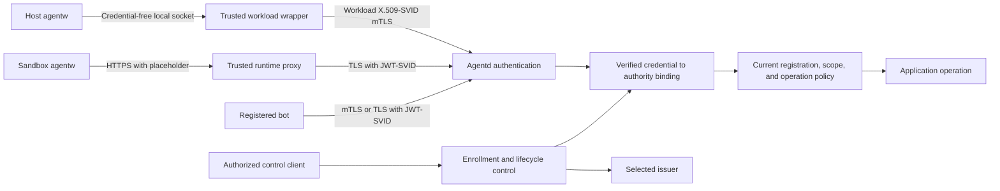

**Proposed initial sketch, 2026-09-27:** This page expands the decided authentication paths in [SPIFFE authentication](spiffe-mtls-authentication.md), without claiming the backends are qualified. It uses the [identity schema](identity-schema.md); route and CLI sketches live in [API](identity-api.md) and [commands](identity-commands.md). The [threat model](identity-threat-model.md) defines the assumptions these flows need.

## Common authority path

The diagram separates application and control authority even if implemented in one daemon. A valid SVID establishes a credential identity; registration and an authenticated generation binding connect it to current authority. Agentd derives the actor rather than accepting sender, kind, role, or incarnation headers. Resource policy still decides the operation; [messaging membership and containment](participants-and-permissions.md#installation-membership-and-containment) remain additional checks.

## Host launch and first request

1. An authenticated, authorized control client requests a workload in a Group with an allowed role. Agentd reserves an incarnation in `preparing` state and an enrollment restricted to its wrapper/controller.
2. The wrapper proves its entitlement through the still-open bootstrap protocol. Agentd brokers issuance or validates the selected issuer integration, establishing the authenticated authority binding under the selected mechanism. Credentials permit preparation, not application activity yet.
3. The wrapper protects its credentials, management configuration, and application socket; it launches the harness under the qualified sandbox profile and records trusted process-instance evidence. Agentw receives endpoint configuration only.
4. The backend reports readiness for that exact incarnation. Agentd conditionally activates it. A failed or uncertain launch leaves application authority disabled while the controller reconciles or fences the preparation.
5. On a local connection, the wrapper validates kernel peer evidence and membership in its launch binding, rejecting stale or ambiguous callers. A relay or descriptor transfer requires its own qualified rule. It forwards only allowed application operations to a fixed agentd destination.
6. The wrapper validates agentd's expected service identity, presents its workload SVID, and agentd validates both the credential and current authority. Mutation acceptance rechecks the fence/policy revision at the commit boundary. Reads and streams follow the same visibility checks.

Steps 2–4 need implementation-specific attestation and readiness evidence. Activation accepts a report only from the enrolled controller for that incarnation, with backend-observed facts such as an established process binding or running sandbox. The trusted controller report supports readiness; it does not independently prove sandbox integrity, which depends on profile qualification. [Local caller authentication](spiffe-mtls-authentication.md#local-caller-authentication) and BV-01/BV-02 own the qualification questions.

## Sandbox launch and first request

1. Authorized provisioning reserves a workload incarnation and binds the runtime adapter/resolver to it, independently of a reusable sandbox name.
2. The adapter configures the sandbox-scoped credential mapping, fixed agentd destination, placeholder, and candidate public-CA kit. Guest-to-proxy trust and proxy-to-agentd CA/name verification are separately checked. A kit alone is not yet proven sufficient. On resume, remove the predecessor’s secret/resolver binding and install one for the new immutable incarnation before activation; reject old-binding calls rather than resolving a workload ID to its latest incarnation.
3. After runtime binding and readiness are established, agentd activates that incarnation. Agentw sends an HTTPS application request with a placeholder. The runtime proxy resolves the real token through the trusted host resolver.
4. The resolver authenticates on the control interface and requests an audience-bound JWT-SVID for its enrolled active incarnation. It emits only the token to the runtime's private capture path. Errors produce no usable token. The selected mechanism establishes the authenticated binding; candidate A durably registers its digest before credential delivery.
5. The proxy injects the token only for the intended upstream. Agentd verifies signature, subject, audience, time validity, registered kind, authenticated incarnation, and current operation policy. Tokens, Authorization headers, and resolver output cannot be reflected into guest-visible responses or logs.

This flow depends on BV-05/BV-06 proving attribution, trust, destination restrictions, refresh behavior, and failure handling. Wrapping a VM attach command supplies no guest process identity. A cached token, copied placeholder, or recreated sandbox name must not select another incarnation.

## Renewal, fencing, and recovery

| Event | Proposed authority transition and request behavior |
| --- | --- |
| Normal credential renewal | Issue for the same active binding; allow bounded overlap. Replace credentials on new connections; the old credential cannot authorize activity past its validity deadline. |
| Suspend or workload exit | Conditionally fence the expected incarnation, stop new admissions, and invalidate its streams. A delayed predecessor exit cannot clear a successor's active pointer. |
| Resume | Follow the [canonical state table](identity-schema.md#lifecycle-and-policy-records): ensure predecessors are fenced, then activate a newly prepared incarnation. For sbx, replace the old resolver binding before activation. Restore native harness state separately; terminal reattachment does not create authority. |
| Wrapper/runtime loss | Stop admissions locally where possible; agentd uses qualified liveness and reconciliation. The [liveness alternatives](identity-schema.md#control-bootstrap-and-liveness-choices), sleep/wake behavior, and maximum stale-authority window remain undecided; no lease mechanism is assumed. |
| Issuer/resolver outage | Retry within remaining valid authority, then deny on expiry. Never extend validity or downgrade authentication; do not assume Docker discards cached values. |
| Agentd restart | Load durable revocations and authority state before serving; reconcile execution bindings before trusting uncertain activity. Do not turn every surviving certificate into a new active incarnation. |
| Bot credential cutoff | Propose advancing the bot generation and invalidating old enrollments, requiring authorized re-attestation before fresh issuance. Reject old-generation requests/streams and cancel pending callbacks; normal renewal preserves generation and enrollment. Registration revocation blocks every installation. |
| Installation revocation | Remove only that installation's grants and reauthorize affected streams; another valid installation may still permit an operation. |

**Proposed concurrency rule:** Fencing and application acceptance share the [proposed transaction domain](identity-schema.md#lifecycle-and-policy-records); checking identity in a separate store before a messaging commit is insufficient. Work committed before a fence remains accepted; work reaching acceptance after it is denied. External effects already dispatched cannot be undone by credential revocation. Recheck authority before each new stream emission or privileged dispatch; transport closure follows invalidation. Exact timing, buffered-byte behavior, distributed issuer races, and recovery after an unknown outcome remain BV-07 questions, not an instantaneous-revocation claim.

## Bot and operator paths

Bots enroll separately from workload launch and may hold their own credentials under [bot custody](spiffe-mtls-authentication.md#participant-classes-and-bot-authentication). Both authenticators converge on the registered bot and its generation. A bridge's verified external author remains an assertion by the bot; inbound bridging and outbound relay require distinct grants. Bot compromise exposes that bot's current authority, not an automatic workload or management identity.

Local operator clients need an authorized operator binding; same-user placement does not supply a caller-selected operator ID. For browser access, the UI backend authenticates the human, maps the session to that human's operator permissions, and authorizes each operation and stream. The browser receives no SVID. Session expiry/revocation stops that session's authority without conflating it with workload fencing. Human login, backend delegation, and operator credential enrollment remain undesigned; no arbitrary forwarded identity header is sufficient. See [operator authentication](spiffe-mtls-authentication.md#operator-surface-authentication-proposal).

## Provenance and open gates

These sequences synthesize the source authentication, participant, and [backend validation](backend-validation-spikes.md) pages. Activation ordering, commit-time checks, and stream revalidation are proposed mechanics. Issuer selection, bootstrap authentication, credential binding, liveness bounds, and sbx trust remain blockers to implementation acceptance. This sketch introduces no new PoC scope and reports no executed probes.

**Review integration, 2026-09-28:** Revised against [Claude’s preliminary review and Codex disposition](identity-preliminary-review-claude.md#codex-reconciliation). Corrections and new recommendations remain proposed; no issuer, bootstrap, liveness policy, or operator installation model is selected.
