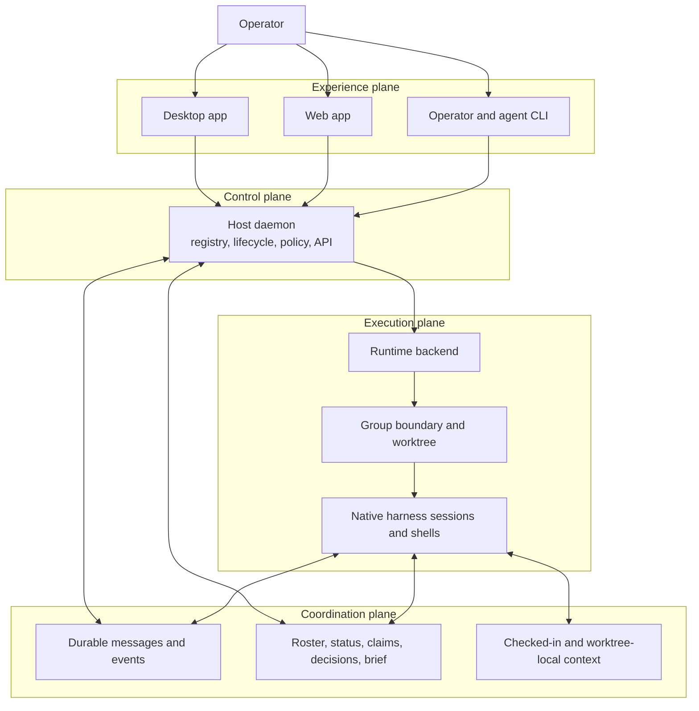

Claim status: proposed synthesis from the PoC, not an accepted destination-state design.

Source snapshot: [`agent-orchestration-poc` at `d3d3755`](https://github.com/tbhb/agent-orchestration-poc/tree/d3d3755cc52e55e85fc446cd3f0efa35ab4acf09), 2026-09-26.

This page extracts the organizing model behind the PoC so that destination design can begin from a shared picture without inheriting every PoC choice. The [destination mental model](mental-model.md) now develops Sessions, Tasks, and Workspaces for laptop-focused orchestration; this page retains the earlier PoC vocabulary and assumptions.

## The product in one sentence

The product is a durable control and coordination layer around native coding-agent harnesses: it organizes sessions into work-scoped groups, gives them a common message and context system, preserves their interactive terminals, and gives an operator one place to create, observe, guide, and retire the work.

It coordinates harnesses rather than replacing them.

## The group is the center of the model

The PoC's primary aggregate is a **group**, not an individual agent or chat.

A group binds together:

- a goal and brief;
- a repository worktree and branch;
- a runtime boundary supplied by a backend;
- agent sessions and operator shells;
- addressing, message history, delivery cursors, status, claims, and decisions;
- policy for mounts, network access, remote access, and resource limits;
- a lifecycle that begins with provisioning and ends with archival or teardown.

This is an important distinction: a group is the unit of work, coordination, policy, isolation, and operator navigation, while a session is one participant inside it.

The PoC assumes group members can collaborate through the same worktree and does not promise confidentiality among them. Isolation is primarily between groups.

## The system has four planes

The current design is easiest to understand as four connected planes.

### Control plane

The proposed host daemon, `agentd`, is the system authority for group and session identity, lifecycle, policy, and reconciliation.

Clients request operations and render state; they do not independently own it. Backends execute lifecycle operations, but the daemon gives those operations stable product meaning.

### Coordination plane

Agents coordinate outside their terminal streams through durable messages and explicitly shared context.

The PoC proposes embedded NATS with JetStream for ordered history, per-recipient delivery cursors, acknowledgments, redelivery, status, roster, claims, decisions, and the group brief. Repository memory remains in files when it should travel with the code, while live coordination state belongs in the bus.

Terminal injection is only a wake-up fallback. It is not the message transport or durable record.

### Execution plane

A backend creates a boundary and runs sessions in it. The initial backends are host tmux for bootstrap work and an Apple Containers VM per group for the PoC target.

Sessions remain native Claude Code, Codex, or `agy` processes, plus operator shells. The orchestration layer supplies identity, lifecycle, coordination, persistence, and observation without flattening the harnesses into a lowest-common-denominator agent API.

### Experience plane

The desktop app, browser UI, and CLI are different views of the same daemon-owned system.

The operator can move between group overview, agent status, durable message history, shared context, files and diffs, and live terminal attachment. The desktop shell adds native integration, but the web and desktop experiences share the same frontend and daemon protocol.

## Entities and identities

| Concept | Meaning in the current model | Important distinction |
| --- | --- | --- |
| Operator | The human responsible for the system and its consequential decisions | Trusted principal, not merely another group member |
| Coordinator | A role that plans, dispatches, reviews, and closes work | May be played by an agent; it is not yet a separate infrastructure primitive |
| Group | Work-scoped aggregate for sessions, context, policy, and lifecycle | Primary product and isolation unit |
| Session | A running agent harness or operator shell | Process lifetime is separate from conversation lifetime |
| Harness | Claude Code, Codex, `agy`, or another shell-capable agent environment | Keeps its native TUI, tools, sandbox, and resume mechanism |
| Backend | Provider of a runtime boundary and session operations | Must not redefine group, session, bus, or client semantics |
| Daemon | Trusted host authority and client API | Owns registry state and reconciles runtime state |
| Bus | Durable, addressable coordination substrate | Carries messages and live coordination, not terminal bytes |
| Shared context | Briefs, memory, decisions, claims, status, and roster | Some state belongs in the bus; code-adjacent memory belongs in files |

An authenticated agent identity identifies the session process tree, including its tools, subagents, and executed code. It does not prove which prompt, model decision, or child process caused an action.

## Lifecycle and recovery

The intended product loop is:

1. The operator creates a group from a repository, branch, goal, member set, and policy.
2. The daemon creates the worktree, runtime boundary, bus namespace, credentials, and registry records.
3. Sessions join with stable names and native harness conversation identifiers.
4. Agents work in their native interfaces while exchanging durable messages, status, claims, and decisions through the coordination plane.
5. The operator observes the group, attaches to terminals, sends messages, answers blockers, and changes lifecycle state through daemon clients.
6. A disconnected client reattaches to daemon state; a restarted session resumes through its harness; a restarted daemon reconciles its registry with the backend.
7. Teardown archives coordination history, offers to promote useful local context, destroys the runtime boundary, and handles the worktree according to operator policy.

Three kinds of persistence must stay separate:

- **Process persistence** keeps a running TUI alive when no client is attached.
- **Conversation persistence** uses each harness's native thread or session identity to resume after a process exits.
- **Coordination persistence** retains messages, cursors, decisions, claims, and relevant context independently of either process or conversation lifetime.

Conflating these would make recovery behavior accidental.

## State has explicit owners

| State | Proposed authority | Why it lives there |
| --- | --- | --- |
| Groups, sessions, policy, and backend references | Daemon registry | Canonical control-plane identity and reconciliation |
| Messages, delivery state, events, roster, status, and claims | Durable bus storage | Independent consumers, history, redelivery, and live coordination |
| Source, checked-in memory, and promoted decisions | Git worktree | Reviewable and portable with the code |
| Temporary group notes and handoffs | Worktree-local files | Shared inside the group without premature publication |
| Harness transcript and conversation identity | Harness-native storage plus a registry reference | Preserves native resume semantics |
| Terminal screen and recent byte history | Session persistence layer and daemon snapshots | Fast reattachment without treating the terminal as truth |
| Harness credentials | Per-agent runtime storage or a future credential broker | Must not be mixed into the worktree or coordination log |

The model favors one authority for each kind of state, with derived views elsewhere. Reconciliation should repair drift; competing authorities should not silently resolve it.

## Protocols should outlive backends

The PoC proposes one group, session, messaging, terminal, and client model across several execution backends.

That creates a useful architectural seam:

- the host-tmux backend can bootstrap the build before VM support exists;
- an Apple Containers backend can later provide a stronger group boundary;
- local-process or future remote backends can implement the same product operations;
- the UI and agent-facing CLI do not need to know how a session is hosted.

This is stronger than a common interface in code. It implies that addressing, lifecycle states, delivery semantics, terminal framing, and recovery behavior are product contracts and should not vary casually by backend.

## The bootstrap is a recursive proof

The build-group design uses the product's own abstractions to construct the product.

A coordinator provisions long-lived workers in separate worktrees through the host-tmux backend, gives them durable identities and briefs, and coordinates them over the same bus intended for VM groups. As the daemon grows, those bootstrap operations become normal daemon API calls and the build group becomes observable through the same clients as any other group.

This is not only a bootstrapping convenience. It exercises whether the abstractions work for real multi-agent production work before the container and UI layers are complete.

## Trust follows capabilities, not prose roles

The working threat model has three primary principals: the trusted operator, the trusted host daemon, and each agent session process tree.

The main proposed boundaries are:

- a runtime boundary between a group and the host;
- separate runtime boundaries and bus namespaces between groups;
- per-agent operating-system users and bus credentials within a group;
- an allowlisted network path between a group and the internet;
- authenticated local or tailnet access between operator clients and the daemon.

Messages, files, terminal output, and shared context remain untrusted even when their author is authenticated. Authentication supports attribution and authorization; it does not make agent-produced content safe or correct.

The group is a collaboration boundary, not a confidentiality boundary. Any destination design that needs mutually distrusting members inside one group would require a different worktree and credential model.

## Working assumptions inherited from the PoC

These ideas are coherent enough to use as the initial lens for destination design, but remain **proposed** here until the user accepts them:

- groups are the primary aggregate;
- native harness sessions remain first-class and interactive;
- one daemon owns control-plane state and all clients are views of it;
- durable coordination is separate from terminal transport;
- protocol semantics are stable across execution backends;
- process, conversation, coordination, and terminal persistence are separate concerns;
- shared state is attributable but untrusted;
- operator intervention is part of the normal control loop, not an exceptional escape hatch;
- the system should be able to orchestrate its own development.

## PoC choices that are not destination decisions

The following constrain the foundational build but should not be assumed to constrain the complete product:

- one operator on one Mac;
- macOS hosts and Linux guests;
- Apple Containers as the target isolated backend;
- one VM and one git worktree per group;
- embedded NATS and JetStream as the coordination implementation;
- shpool as the in-guest process persistence layer;
- Tailscale as the remote-access path;
- SQLite as the daemon registry;
- a React web frontend inside a thin Tauri shell;
- host tmux as the bootstrap backend;
- the current `agentd`, `agentctl`, and `agentd-guest` component boundaries.

These are valuable concrete hypotheses. Destination work may retain them, generalize them, or replace them after separating the capability from the PoC mechanism.

## Questions the destination design must reopen

The later [SPIFFE workload authentication design](spiffe-mtls-authentication.md) defines destination identity across host and sbx backends. The intervening PID-only design is [obsolete](peer-authentication.md). Neither changes the historical PoC snapshot recorded here.

- Is a group always one worktree and one runtime boundary, or is that only the first useful shape?
- Is coordination always scoped to a group, or do projects, programs, and organizations need higher-level durable context and messaging?
- Should the coordinator remain a role that any session can play, or become a durable domain entity with plans, delegation, and completion semantics?
- Which lifecycle and recovery guarantees are product promises rather than best-effort backend behavior?
- What should happen when registry, bus, runtime, harness, git, and terminal observations disagree?
- How should credentials be brokered, rotated, revoked, and scoped across many groups without making each agent a bearer of the operator's full account authority?
- How do group membership and policy evolve for multiple operators, remote workers, and multiple machines?
- When do advisory file claims suffice, and when must the product provide stronger work partitioning or merge coordination?
- Which records must be auditable, exportable, or retained after a group is gone?
- Which capabilities require a headless agent protocol in addition to interactive terminal sessions?

## Provenance and confidence

This synthesis draws primarily from the PoC's [overview](https://github.com/tbhb/agent-orchestration-poc/blob/d3d3755cc52e55e85fc446cd3f0efa35ab4acf09/design-sketch/01-overview.md), [architecture](https://github.com/tbhb/agent-orchestration-poc/blob/d3d3755cc52e55e85fc446cd3f0efa35ab4acf09/design-sketch/02-architecture.md), [groups and sessions](https://github.com/tbhb/agent-orchestration-poc/blob/d3d3755cc52e55e85fc446cd3f0efa35ab4acf09/design-sketch/03-groups-and-sessions.md), [messaging and shared context](https://github.com/tbhb/agent-orchestration-poc/blob/d3d3755cc52e55e85fc446cd3f0efa35ab4acf09/design-sketch/04-messaging-and-shared-context.md), [terminal path](https://github.com/tbhb/agent-orchestration-poc/blob/d3d3755cc52e55e85fc446cd3f0efa35ab4acf09/design-sketch/05-terminal-data-path.md), [container model](https://github.com/tbhb/agent-orchestration-poc/blob/d3d3755cc52e55e85fc446cd3f0efa35ab4acf09/design-sketch/06-containers.md), [operator UI](https://github.com/tbhb/agent-orchestration-poc/blob/d3d3755cc52e55e85fc446cd3f0efa35ab4acf09/design-sketch/07-ui.md), [security model](https://github.com/tbhb/agent-orchestration-poc/blob/d3d3755cc52e55e85fc446cd3f0efa35ab4acf09/design-sketch/09-security.md), and [bootstrap design](https://github.com/tbhb/agent-orchestration-poc/blob/d3d3755cc52e55e85fc446cd3f0efa35ab4acf09/design-sketch/10-bootstrap-orchestration.md).

The sketch predates implementation and explicitly describes itself as provisional. Therefore the architecture above is labeled **proposed**, even where it is internally consistent or operator-directed in the PoC.

The [phase 1 checkpoint](https://github.com/tbhb/agent-orchestration-poc/blob/d3d3755cc52e55e85fc446cd3f0efa35ab4acf09/docs/src/content/docs/project/phase-1-checkpoint.md) verifies only the repository, documentation, research, workflow, toolchain, quality-gate foundation, and skeleton binaries at this snapshot. It states that the bus, worker provisioning, group lifecycle, terminal control, and product UI are not yet built. Nothing on this page treats those proposed runtime behaviors as implemented or experimentally verified.
