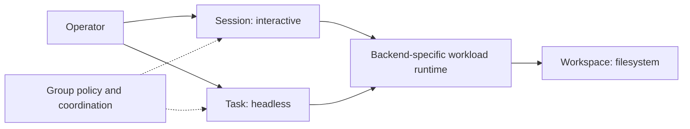

Claim status: **decided direction** from the operator on 2026-09-27: focus on agent orchestration on the laptop, support native interactive and headless harness execution, and use Session, Task, and Workspace as the primitives defined below. Their detailed relationships, lifecycle contracts, and backend integrations remain **proposed** or **unknown**. This page starts the destination model; the [PoC-derived model](mental-model-poc.md) remains a historical bridge rather than being rewritten as destination decisions.

**Current backend direction, 2026-09-27:** Start with [host mode and Docker Sandboxes](spiffe-mtls-authentication.md#initial-backend-scope), reusing existing sandboxing. Agentd authenticates workloads with SPIFFE credentials and may manage multiple logical Groups. The bespoke microVM/sidecar design is deferred; runtime integration remains unverified.

## The product focus

Coordinate interactive and headless agent work on the operator's laptop, with visible execution, usable files, and attributable collaboration. Use backend-specific isolation with trusted credential custody: a host wrapper or Docker credential proxy. See the [current identity design](spiffe-mtls-authentication.md) and [validation scope](backend-validation-spikes.md).

**Proposed product implications:** The operator should be able to work directly with a session, delegate a task, inspect its output, and continue working with the resulting files. Local startup and recovery should be understandable without requiring a cluster deployment. Laptop sleep/wake, interrupted connectivity, finite memory and disk, and reconnection to surviving work deserve explicit lifecycle design. “On your laptop” describes the orchestration experience and execution focus; it does not assert offline model inference or rule out optional external backends.

## Three primitives

| Primitive | Accepted meaning | Design distinction |
| --- | --- | --- |
| Session | An interactive harness session | A native interactive experience whose lifecycle and identity the product manages |
| Task | A headless execution of a harness | An execution requested and observed through a programmatic interface, with other execution backends possible over time |
| Workspace | The filesystem in which an execution boundary runs | The files and filesystem view available to execution; its representation and lifecycle need further design |

Support headless modes where the harness provides them. An AX integration or another executor could later supply a Task backend; this is an extension direction, not a selected dependency or a claim that an adapter exists.

Interactive versus headless is the distinction between Session and Task. A detached interactive session remains a Session. A Task can run for a long time or wait for input without thereby becoming a Session. Attaching an interactive view to a Task, or converting between the two modes, requires a later explicit design.

“Task” here means a product execution primitive, not a GitHub issue or planning work item. A work item may motivate several executions. Likewise, a harness's native use of “session” does not decide our primitive: a headless Task may still have a native conversation ID and resumable history.

**Decided terminology, 2026-09-27:** Use “workload” for the managed principal underlying a Session or Task. The [authentication design](spiffe-mtls-authentication.md) uses this principal across both initial backends; its incarnation and recovery mechanics remain to be qualified.

## Keep execution, filesystem, and policy separate

**Proposed:** A Session or Task uses a Workspace through an execution runtime. The initial choices are host execution and Docker Sandboxes, with explicit protection profiles. Workspace answers which files are present and how they persist; runtime answers where execution occurs and which isolation controls apply. A repository worktree is a useful workspace implementation, not the definition of Workspace.

**Decided current direction:** A Group is a logical authority and policy scope, not an isolation boundary or conversation space. One agentd per host serves its Groups; a Group does not require its own daemon or VM. Workloads have backend-specific protection boundaries and may share Workspace storage. Group/Workspace cardinalities remain open.

[Group peering](group-peering.md) lets separate groups coordinate: for example, groups on worktrees A and B can exchange messages with a third group handling merges on the clone's main worktree. Federated daemon identity versus control-plane identity remains an open decision.



This diagram is a proposed relationship sketch, not an ownership or cardinality specification. Alternate Task backends may execute elsewhere and will need an explicit workspace-access contract.

**Workspace questions:** Is the primitive an existing filesystem instance, a preparation specification, or an instance with a reusable specification? Which paths are shared, private, or read-only? What survives termination of a task or destruction of its runtime? How are concurrent writers, worktrees, snapshots, imports, and cleanup represented? These are open design opportunities, not promised features.

## Conversations within the authority model

**Decided direction — operator discussion on 2026-09-27, recorded in Claude's handoff:** Start an experiment with DMs (every participant gets every message), ambient channels (posts are readable without wakes; mentions enter inboxes), and threads inside either. A channel-like construct supplies standing conversation space that may align with a Group but is not welded to its membership. “Channel” is provisional: room, topic, space, or a qualified channel naming scheme remain open; the harness transport is called Claude MCP channels.

```text
one agentd per host
  -> Groups: authority, roles, delegation, policy
       -> authorize conversation membership and actions
  -> conversations
       -> DM: participant audience (proposed unique immutable set)
       -> channel: ambient space (proposed one owning Group, independent members)
            either parent -> thread rooted in a message (proposed)
```

The sketch's policy ownership, participant-set identity, structured mentions, dynamic role members, read cursors, and rooted-thread mechanics come from Claude's proposals; Codex recommends immutable DM sets and inherited/implicit thread participation for comparison. They are not additional decisions. See [messaging schema](messaging-schema.md) and [experiment design](messaging-experiments.md). One Group can authorize several spaces; a proposed DM can span Groups without gaining a new authority scope. No experiment scope has been transferred to the PoC.

## Participants, capabilities, and permissions

**Decided — operator discussion on 2026-09-27, recorded in Claude's handoff:** Bots connect other systems to messaging as participants distinct from agent workloads, with their own SPIFFE identities and either mTLS X.509-SVID or JWT-SVID over TLS. They can be installed into a Group or host-wide; a bridge is a bot installation with bridging permissions. Projects and collections may later provide scopes but remain undesigned.

**Proposed abstraction:** Workload, bot, and operator are participant kinds. Sessions/Tasks remain workload execution primitives; an operator can participate in a conversation without its messages acquiring management authority. Installation grants, conversation membership, and resource containment are separate. [Participants and permissions](participants-and-permissions.md) is canonical; unifying workload role grants and operator host grants under installations is a conditional recommendation, not a decision.

**Decided distinction:** Capabilities are what a participant can actually do; permissions are what policy allows. Trusted, versioned harness/backend/bot qualification supplies intrinsic capabilities and enforced restrictions. Shell-disabled or read-only execution narrows capability; an agentd prohibition on channel-wide mentions is permission. Effective operations require both. Under visibility policy a coordinator can inspect shell, tool, image, or delivery capabilities when delegating, without gaining permission to use them. Bots have delivery/thread/relay capabilities but require separate grants. Participant assertions cannot qualify abilities.

Admission must check backend capability to enforce the requested protection profile, independently of permission to launch. A missing protection capability is not repaired by a wider grant. Presence and delivery expose missing activity evidence or pull-only support as capability limitations rather than implying every reachable recipient can be woken. Operator-installed bot custody can be looser than workload custody; all bot message bodies remain untrusted peer content.

## What the supervisor needs to support

The [authentication design](spiffe-mtls-authentication.md) gives agentd responsibility for authorized provisioning, workload records, and shared authorization. Agentctl is the management client and host wrapper; agentw reaches agentd through the wrapper's local gateway in host mode or Docker's credential proxy in sbx. A dedicated sidecar, Envoy, and a shared Codex app server are not requirements of these initial backends.

Sessions and Tasks use the same workload identity, immutable-role, Group-policy, and messaging model. Headlessness does not imply anonymous execution or inherited coordinator authority. A coordinator may request a workload only within its Group's delegation policy. The exact binding, incarnation, and retry mechanics remain proposed and require validation.

Product workload identity, native harness conversation identity, and live execution incarnation are separate. The earlier `(pid, session_id, role)` authority tuple is obsolete. Native conversation changes cannot confer another workload's authority; managed resume must establish an authorized incarnation and fence obsolete authority. Local process evidence is used only to qualify access to the host wrapper.

For a backend such as AX, the local adapter's PID cannot authenticate each remote workload. Such an integration would need backend-provided execution identity and appropriately scoped service trust. Until verified, it cannot claim the same local process-attribution guarantee.

The [supported sandbox configuration caveat](supervisor-protection.md#accepted-configuration-caveat) continues to apply. Headless execution must be evaluated under its actual permission and sandbox configuration rather than assumed equivalent to interactive execution.

## Task lifecycle and backend contracts

**Proposed:** Define task readiness, execution outcome, and retained artifacts separately. A prepared workspace or healthy executor does not establish successful completion of the requested work. Preserve enough backend evidence to distinguish success, failure, cancellation, and an unknown outcome after disconnection.

A small backend contract should cover launch, observation, cancellation, output/result retrieval, and workspace access. Resume, interactive attachment, snapshots, and human-input handling should be explicit capabilities where supported. Do not promise them uniformly or hide an unsupported operation behind a generic “agent” interface.

Retry is another open contract: an execution that wrote files or called an external service may already have had effects when observation was lost. A Task's durable record and any execution attempts should not be conflated with its current PID. No automatic replay guarantee is decided here.

## Operator oversight versus participation

**Proposed by Claude, integrated by Codex on 2026-09-27:** Talking as an operator participant and observing/intervening through the UI are separate authorities. [Operator oversight](operator-oversight.md) proposes scoped reads without joining conversations or producing receipts, attention routing, quiet/hold/mute/pause/freeze controls, and logical redaction. The shared desktop/browser frontend can expose these management actions under explicit permissions; it must not turn conversation membership into management authority. The authority of messages the operator sends remains unresolved. All these mechanics remain draft proposals, including operator installation unification and browser authentication choices.

## Terminal attachment and UI streaming

**Decided UI goals, operator direction on 2026-09-27:** At minimum, stream read-only Session output into one frontend usable both in a Tauri desktop app and in a browser. The browser-served frontend should be deployable behind an operator-selected remote-access mechanism, such as Tailscale or Cloudflare. The target experience is a full terminal attachment rendered through xterm.js, allowing the operator to interact with the existing Session directly. Interactive attachment is a target beyond the minimum read-only milestone, not a claim of current implementation.

**Proposed UI architecture:** Use the same terminal component and application attachment protocol in both environments. The frontend connects to an authenticated attachment service over a browser-compatible transport, such as WebSocket; the service connects through the backend terminal adapter to the Session's existing PTY. Desktop packaging should not make essential terminal behavior depend on Tauri-only IPC. Local endpoint discovery and remote deployment details remain open. Forwarding the web endpoint does not replace application authentication or per-workload attachment authorization; workload SVIDs remain in trusted infrastructure, not in the browser.

**Proposed incremental contract:** Begin with an observation attachment carrying terminal output, authoritative terminal dimensions, lifecycle status, and initial screen/history state sufficient for a newly opened viewer. Render terminal control sequences rather than treating a harness TUI as append-only log lines. Add an independently authorized control attachment carrying input and resize requests. Enforce read-only status on the server, including rejection of input, resize, signals, or terminal-generated responses that would alter the session; disabling keyboard input in the UI alone is insufficient. Backend ownership of any necessary terminal query responses remains an implementation question.

**Proposed control policy:** Allow multiple observers, with one active input/resize controller at a time and explicit handoff. Observers render the existing terminal size rather than resizing it independently. UI disconnection detaches the viewer without ending the harness; a slow viewer must not stall the harness, and dropped output requires explicit resynchronization. Define bounded retention and snapshot/replay behavior so reconnecting an xterm.js view produces a coherent terminal state. This terminal replay is separate from a durable conversation transcript. Controller handoff, transport details, and replay implementation remain proposals to validate.

**Open implementation choice, 2026-09-27:** A container does not by itself replace shpool. Isolation, process lifetime, ownership of a pseudoterminal (PTY), reconnectable terminal state, and UI streaming are separate responsibilities. The proposed attachment contract requires the behaviors below without yet requiring shpool in every backend.

For interactive Sessions, a terminal owner must keep the harness and PTY alive when the UI disconnects. The attachment contract should cover input, output, terminal resize, disconnect without termination, process exit, and restoration of enough screen/history state on reconnect. Multiple viewers and who owns input/terminal dimensions need explicit policy. Agentd can authorize a UI connection and route it through a backend adapter; the UI should never receive the container-management socket or workload private keys. A terminal renderer is still required in the UI. Envoy can carry an authorized stream but does not own the PTY or reconstruct terminal state.

**Documented:** shpool owns persistent shell sessions and allows reattachment after a connection drops; its configuration includes screen/history restoration modes. It is a candidate in-container terminal owner, with an adapter attaching to the existing session. It does not preserve a running process across destruction of the container, nor establish supervisor-restart recovery by itself. [Pinned README](https://github.com/shell-pool/shpool/blob/3c41df9a610428b6c1766d78d36d3fefd5685c3b/README.md), [restore configuration](https://github.com/shell-pool/shpool/blob/3c41df9a610428b6c1766d78d36d3fefd5685c3b/CONFIG.md).

**Prior art, not an sbx capability claim:** Docker Engine supports attaching to a running container's standard streams. This may supply the live-stream and PTY lifetime primitive when the harness is launched appropriately as the main container process; UI reconnect/replay semantics remain product responsibilities to verify. An exec operation that launches a new process is not reattachment to the original harness. [Docker attach](https://docs.docker.com/reference/cli/docker/container/attach/).

The local Apple Container command reference documents interactive/TTY launch and attachment when starting a stopped container. This reading did not establish an equivalent reattach-to-running-PTY contract; absence of a CLI command is not proof the underlying runtime cannot provide it. This belongs to the deferred Apple Container profile, not the initial sbx qualification. [Pinned command reference](https://github.com/apple/container/blob/4a7d8615241b8ddecfd3bf225cd7c44f4b2ccf7c/docs/command-reference.md).

Headless Tasks should normally stream structured harness events where available, or stdout/stderr and exit status, without requiring a terminal or shpool. If a particular backend needs a PTY, advertise that capability explicitly. A conversation view and a faithful terminal view are different UI contracts; do not reconstruct authoritative task completion solely from terminal output.

**Proposed integration:** UI connects to an authorized agentd attachment service; the selected backend supplies a qualified terminal owner (for example tmux, runtime facilities, or shpool) for Sessions, and structured events or logs for Tasks. A backend may use a separate streaming route through the trusted gateway, but terminal control must remain scoped to that workload. Select the terminal owner through BV-08/BV-09; none of these candidates is mandatory. Test UI disconnect/reconnect, agentd restart, resize, output while detached, slow viewers, and actual harness redraw behavior before deciding it is unnecessary.

This is documentation/source inspection, not a live terminal experiment. Shpool was read locally at `3c41df9a610428b6c1766d78d36d3fefd5685c3b`; runtime documentation was checked on 2026-09-27.

## Workload placement extensibility

**Decided direction, operator discussion on 2026-09-27:** Workload placement must be extensible from the start. Session and Task describe workload behavior; the backend describes where and how it runs. Remote workloads should eventually peer with local workloads. Cloudflare, remote Docker deployments, and Modal remain possible remote targets, not selected integrations or verified capability claims. The initial targets are local host mode and Docker Sandboxes; remote implementations are deferred.

**Proposed contract boundaries:** Preserve a small set of responsibilities without committing to a generic cloud framework or API schema before testing the local implementation.

| Contract | Required meaning | Backend-dependent mechanisms |
| --- | --- | --- |
| Provisioning and lifecycle | Authorized workload specification, backend handle, readiness, observation, cancellation, cleanup, and reconciliation after uncertain outcomes | Container/VM/sandbox creation, terminal attachment, restart and resume capabilities |
| Workspace and private state | How source and artifacts arrive, persist, and return; which state is private to this workload | Local mount, synchronized checkout, snapshot, upload/download; no assumption of shared POSIX storage |
| Identity enrollment and custody | Trusted binding of provider instance and generation to assigned workload identity; who can obtain/use/export credentials; revocation | Host wrapper, runtime credential proxy, external broker, provider attestation, or another explicitly supported protection mechanism |
| Connectivity and peering | An authenticated application channel with explicit disconnect, reconnect, and delivery behavior | Unix socket, network connection, outbound tunnel, or relay; no assumption that the laptop is publicly reachable |
| Policy enforcement | Which requested filesystem, network, identity, and runtime restrictions the backend actually enforces | Driver controls and trusted gateway placement; unsupported requirements must be reported before admission |

These are separate responsibilities, not necessarily five services or interfaces. Agentd should admit a workload only after its backend can satisfy the requested protection profile and bind the live instance to the authorized identity. Distinguish resource creation, identity readiness, application readiness, and task completion. Reconciliation must avoid duplicating a workload or reviving an obsolete identity when a provisioning response is lost.

The local sidecar is one implementation of credential custody and connectivity, not the definition of a workload. Keep `agentw`'s application protocol independent of endpoint transport and do not require it to receive an SVID or know its SPIFFE ID. A backend must not claim the local profile's private-key secrecy merely because it uses short-lived credentials.

**Identity constraint:** An external broker can hold the SVID key, but still needs a trustworthy way to distinguish the requesting remote workload. Moving the key does not remove authentication bootstrap. If a backend offers neither protected identity/channel evidence nor an isolated trusted component, no contract alone can promise that arbitrary code in the workload cannot copy its authentication material. An exportable token passed to a key-holding broker is still an exportable credential. Such a backend would need a separately accepted weaker profile or remain unsupported; there is no silent fallback.

**Connectivity option, not a decision:** A stable relay with outbound connections from the laptop and remote side could avoid requiring inbound laptop access. Define where workload authentication terminates and whether a relay merely carries encrypted traffic or is trusted to assert sender identity. Laptop sleep/offline behavior, queued messages, cancellation, and workload lifetime during disconnection remain open; the contract should not promise continuous availability or exactly-once delivery.

Do not equate remote placement with a new Group, agentd, or SPIFFE trust domain. Those are separate authority and policy choices. Record identity scope and instance generation explicitly so changing provider placement cannot change role or introduce conflicting live owners.

This extension requirement and the decision to defer provider implementations come from the operator discussion. Contract boundaries, admission behavior, and relay options above are proposed synthesis. No remote provider documentation or runtime was evaluated for this section.

## Lessons from AX and Agent Substrate

These are **documented designs**, not behavior tested by this wiki. Sources were read on 2026-09-27.

**AX:** Its concepts separate Task execution from reusable Workspace preparation. Its Workspace also includes tool and skill setup, which is broader than the filesystem definition adopted here. Its Task is a general sandboxed execution unit, not an exact equivalent of our headless harness primitive. The useful input is separating reusable environment preparation from the execution that consumes it. [AX concepts](https://github.com/google/ax/blob/9edb7b1b0ca55f71670da02674b5cd6adeb49b7e/docs/concepts.md).

AX defines a replaceable runner contract between the control plane and workload. Its current runner documentation distinguishes readiness from command execution and states that the control plane does not read back command exit status. **Inference for our design:** Task completion needs an explicit result contract; a ready runtime is insufficient. This is a source-specific documented limitation, not an experiment we ran. [AX runners](https://github.com/google/ax/blob/9edb7b1b0ca55f71670da02674b5cd6adeb49b7e/docs/runner.md).

**Agent Substrate:** Its glossary distinguishes durable Actors, physical Workers, a control-plane API, node-level supervision, and sandbox lifecycle services. It also separates snapshots of application data from snapshots including process memory. **Inference for our design:** Keep execution identity, active compute, filesystem persistence, and process persistence separate, even when the first implementation puts them on one laptop. [Pinned glossary](https://github.com/agent-substrate/substrate/blob/ed6d2a1fc8ae8337eb055d51b0b767b023cb3b5c/docs/glossary.md).

Substrate's threat model is especially relevant to the supervisor investigation: it discusses actor access to local services, self-modification through management APIs, policy installation before execution, stale state when workers are reused, and limits on child creation. These are mitigation proposals, not evidence that Substrate implements every defense. Its architecture document explicitly warns that portions are aspirational. [Pinned threat model](https://github.com/agent-substrate/substrate/blob/ed6d2a1fc8ae8337eb055d51b0b767b023cb3b5c/docs/threat-model.md), [pinned architecture](https://github.com/agent-substrate/substrate/blob/ed6d2a1fc8ae8337eb055d51b0b767b023cb3b5c/docs/architecture.md).

AX and Substrate document cluster-scale goals and infrastructure. The transferable lessons are lifecycle separation, explicit interfaces, and trust boundaries. Kubernetes, Redis, distributed scheduling, and snapshot infrastructure are not destination dependencies merely because these projects use them. [AX architecture](https://github.com/google/ax/blob/9edb7b1b0ca55f71670da02674b5cd6adeb49b7e/DESIGN.md), [Substrate overview](https://github.com/agent-substrate/substrate/blob/ed6d2a1fc8ae8337eb055d51b0b767b023cb3b5c/README.md).

## Source and decision provenance

The primitive definitions, headless support direction, possible future backends, and laptop focus come from the operator's 2026-09-27 discussion and are preserved above. Relationship sketches and lifecycle recommendations are this wiki's proposals.

The local Substrate checkout was found at `/Users/tony/Code/github.com/agent-substrate/substrate`, with origin `https://github.com/agent-substrate/substrate.git`, HEAD `ed6d2a1fc8ae8337eb055d51b0b767b023cb3b5c`, and no changes reported by `git status --porcelain`. The supplied name `agent-substrate/agent-substrate` resolves to this differently named checkout for this reading.

The local AX checkout is `/Users/tony/Code/github.com/google/ax`, with origin `https://github.com/google/ax.git`, HEAD `9edb7b1b0ca55f71670da02674b5cd6adeb49b7e`, and no changes reported by `git status --porcelain`. Its concepts, runner contract, and architecture were read locally after the operator cloned it; they support the earlier documentation synthesis above. AX links now pin that revision. Neither repository was modified or executed. This reading does not constitute an implementation or security audit.

The operator's 2026-09-27 participant/authority discussion, handed off by Claude, decided bots as distinct messaging participants, both SPIFFE authentication mechanisms, Group/host installation scopes with future scopes possible, bridges as bot installations with bridging permissions, and capabilities distinct from permissions. The participant/installation mechanics are Claude proposals; Codex's kind-specific lifecycle, containment, and evidence qualifications are linked from [Participants and permissions](participants-and-permissions.md). Issuer/enrollment, first bot delivery paths, ambient membership, workload installation unification, and host-wide federation meaning remain open.

The 2026-09-27 pre-review integration carries Claude's loop/budget, oversight, request, and envelope proposals into this page with labeled Codex synthesis. All new mechanics remain proposed. Operator message authority, request inclusion in the first experiment, every control threshold, and earlier messaging/participant open decisions remain unresolved; see the four source pages linked from [the index](README.md). No implementation or new harness probe was performed.
