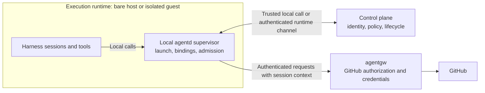

**Historical archive, obsolete as an authentication architecture:** This preserves the PID/native-session design and its source evidence as of 2026-09-27. All “decided,” “current,” and “next” labels below belong to that historical snapshot. Do not seed implementation or validation work from them. The current contract is [SPIFFE workload authentication](spiffe-mtls-authentication.md), with [bounded initial-backend spikes](backend-validation-spikes.md).

The original PID-only service authentication, per-boundary local agentd, native-session authority tuple, and mandatory shared Codex app-server topology are superseded. Local kernel peer evidence may still be used by the host wrapper, but does not restore this architecture. The intervening custom microVM/sidecar deployment is also deferred; host mode and sbx are the initial targets.

## Starting point

The [destination mental model](mental-model.md) now distinguishes interactive Sessions from headless Tasks. The authentication discussion below began with interactive sessions; applying the same identity and role guarantees to headless Tasks is proposed, with backend-specific binding details still open.

The discussion covers several agent sessions running directly on a host or inside one isolation boundary, such as one Apple Container. A Group is the coordination and authorization scope of one `agentd` instance. Multiple groups can share a host trust boundary; group identity and isolation-boundary identity must therefore be distinct. See [group peering](group-peering.md) for the accepted topology and open identity-authority choice. The [PoC-derived mental model](mental-model-poc.md) supplies the surrounding group and lifecycle vocabulary.

**Inference:** Process-based authentication must be evaluated where the relevant processes and sockets are visible. A PID supplied across a VM boundary is a claim; it is not evidence obtained by the receiver's kernel. This suggests a trusted local service inside each boundary and a separate control plane that authorizes operations based on that service's authenticated reports.

The current proposal names the local supervisor `agentd`, on either a bare host or inside a guest. `agentctl` is its management client; a future control plane can call the same authorized launch API. This does not require every runtime to run a complete control plane, GitHub monitor, gateway, or durable message broker.

## Bare-host and isolated deployments

**Decided:** Bare-host operation is a supported deployment, including the initial development path. Identity, launching, messaging, and gateway development must be able to proceed before container provisioning and isolation are implemented.

**Proposed:** Use the same local-service and control-plane responsibilities in both deployments. Here, a runtime instance means an enrolled execution environment; its identity does not imply that it provides isolation.

| Deployment | Local service and sessions | Control plane and gateway | Isolation claim |
| --- | --- | --- | --- |
| Bare host | Run directly on the host; the local service observes host processes | Can run on that same host | No container boundary; guarantees depend on actual OS and harness restrictions |
| Isolated guest | Run inside the guest; the local service observes guest processes | Run outside the guest and authenticate its local service | Guest isolation plus the separately designed protections between sessions and their local service |

The local-service/control-plane split is a responsibility boundary. On the host, those responsibilities may initially share a process; a separate deployment or network hop is not required merely to preserve the design. Packaging remains open. Peer identity, enrollment, authorization, and revocation should retain the same meaning when the local service later moves into a guest, while process inspection and provisioning use deployment-specific implementations.

In the sections below, boundary identity and epoch apply to an isolated runtime. The host deployment needs corresponding runtime identity and lifecycle fencing without pretending that a logical runtime is a security boundary. Multiple groups on one host still need explicit membership and authorization; neither a worktree path nor a shared host identity proves group membership.

Host support does not claim protection against unrestricted same-UID processes that can modify the service or use its credentials. Record the actual protection available in each deployment. Validate the common session lifecycle and policy on the host first, then validate guest process visibility, service protection, and the cross-boundary channel when isolation is added.

## Supported operating systems

**Decided:** Peer authentication must support macOS and Linux. Linux support is part of the authentication requirement, not contingent on container provisioning. The deployment cases are macOS bare host, Linux bare host, and Linux inside an isolated guest such as an Apple Container.

**Proposed:** Keep one authentication contract for peer identity, enrollment, binding generations, authorization, and revocation, with operating-system-specific implementations of process and connection attribution. Neither the control plane nor the gateway should need to reinterpret a peer's identity according to its operating system. The concrete lookup APIs, required privileges, and supported sandbox and namespace configurations remain to be designed and verified separately on each OS.

Validate the common contract on both operating systems, including rejection of ambiguous origin, proxy misattribution, obsolete bindings, and unauthorized enrollment. Container integration adds tests for guest visibility and communication across the isolation boundary; it is not the first opportunity to test Linux authentication. Passing macOS tests does not establish Linux support, or vice versa.

## Sessions cannot impersonate one another

**Decided:** Sessions within the same runtime should generally be unable to impersonate one another, whether they run directly on a host or inside a container. Shared context and worktree access do not grant another session's identity or role. The operator established this requirement on 2026-09-27; the mechanisms that satisfy it remain proposed. The guarantee assumes the supported harness sandbox configuration: disabling it or granting access to supervisor resources falls outside the guarantee, as recorded in the [accepted configuration caveat](supervisor-protection.md#accepted-configuration-caveat).

A session must not acquire another peer's authority by naming its harness conversation ID, opening its transcript, invoking `agentctl`, or selecting a role in a request. Launch and rebind operations require management authorization enforced by `agentd`. Possession of the management CLI is not authorization. Group policy may delegate session creation to an authenticated role, such as coordinator, and must specify which sessions and roles it may create.

This requirement also reaches paths that let one session cause execution inside another: terminal attachment and input, shared app-server control endpoints, harness configuration, and writable launch dependencies. The local service and those control surfaces need protection from peer sessions. Bare-host support cannot claim the requirement is met if peers retain unrestricted same-UID access to these authorities. The exact OS and sandbox protections, and any explicitly weaker development mode, remain open design work. The [supervisor protection investigation](supervisor-protection.md) compares host and container mitigations across Claude Code, Codex, and agy, with a validation matrix and explicit residual caveats.

## Session authority and immutable role

**Decided, operator direction on 2026-09-27:** The authority of a session comes from its trusted `(pid, session_id, role)` binding. The launch request specifies the role, management authorization permits that assignment, and `agentd` records it permanently against the session ID. The session cannot change its role through `agentw`, a subsequent attach, or a resume request. A different role requires a new session ID and an authorized launch. Revoking authority does not erase the historical role assignment or permit reuse of that ID with another role.

`agentw` is a client running under the session's execution context. For each request, `agentd` must positively associate the calling process with the registered session and retrieve its role from the binding. Caller-supplied PIDs, session IDs, and roles cannot create or override that association. A claimed session ID may help locate a candidate binding, but must be independently checked against trusted origin evidence before it is used for authorization.

The tuple expresses the authority model; the implementation also needs process start time, boot/runtime identity, and binding generation to prevent PID reuse or stale-process confusion. The PID of an `agentw` invocation will normally differ from the registered harness execution PID, so the lookup must establish the relationship between them. For shared Codex execution, resolving only the app-server PID is insufficient: trusted per-thread execution evidence must distinguish the session component of the binding. The required mechanism remains open, without weakening the session-level authority requirement.

A supervisor-managed resume may replace the live process binding and increment its generation while preserving the session ID and its original role. A conflicting role on a resume request must be rejected. The role assignment's permanence does not make authority irrevocable: policy can deny an operation or revoke a binding without relabeling the session.

The `session_id` in this contract identifies the individual enrolled session. Harness adapters must explicitly map it to the appropriate native conversation/thread identity; an API field with a similar name must not be assumed to have that scope. The existing orchestration peer record can retain this association, but must not provide a way to assign the same session ID a different role.

### Direct native conversation changes

**Decided, operator direction on 2026-09-27:** Direct operator use of native conversation-changing commands, such as `/resume` or `/clear`, is outside the intended managed workflow. It need not automatically create or update an orchestration binding. If subsequent requests still resolve through trusted execution evidence to the original live binding, they may continue to authenticate as that original session with its original role. The current native conversation can therefore diverge from the conversation recorded at enrollment. This is an accepted attribution limitation, not permission to acquire another peer's identity.

Without a validated rebind, the binding's `session_id` remains the enrolled identity; it is not rewritten merely from the conversation currently displayed by the TUI or reported by a tool. Even if the operator selects an existing peer's conversation, that conversation ID must not cause the original execution context to acquire the selected peer's binding or role. If the native operation changes execution context so the original binding can no longer be positively established, reject peer requests until managed enrollment or recovery resolves the identity.

**Unknown:** The exact PID, ancestry, and conversation-identity effects of these commands in the selected Codex app-server configuration. The examples above specify acceptable authorization behavior if native state changes; they do not assert that every `/resume` or `/clear` creates a new ID or preserves a process. A bounded experiment should compare two enrolled sessions sharing one app server, record the tool-process ancestry before and after native conversation changes, and check that each request either retains its original binding or is rejected. Include switching to the other enrolled conversation: native selection alone must never transfer its authority.

### Automatic rebind after a reported identity change

**Accepted condition, operator direction on 2026-09-27:** Automatic rebinding is acceptable when `agentd` can independently establish the replacement native identity for the authenticated execution context, preserve its role, and avoid conflicting bindings. The mechanism and detailed validation rules remain **proposed**. An already authenticated request can report a native session ID, for example through `CLAUDE_CODE_SESSION_ID` or `CODEX_THREAD_ID`. A mismatch with the current binding triggers validation for a possible automatic rebind. This extends the accepted original-binding fallback above; it does not turn an environment variable into an authentication credential.

**Proposed validation rules:**

1. Authenticate the caller against its existing live binding independently of the reported replacement ID. An unknown caller cannot use this path to enroll itself.
2. Confirm through a trusted harness integration that the replacement ID exists and is the native conversation now associated with that authenticated execution context. Existence alone is insufficient: another real, unbound conversation may belong to a different execution context. A shared app server listing the ID establishes existence, not this association.
3. Check that the target has no conflicting binding or outstanding enrollment reservation. Retain historical ownership, immutable role, and revocation records: the absence of a live PID must not make another peer's retired identity available for automatic takeover. Recovery of previously enrolled identities needs an explicit continuity rule; it must not bypass a revocation.
4. Preserve the original peer, role, group, and authority scope. Assign the same role to a genuinely new target session ID; reject any conflict with a target ID's permanent role. This mechanism updates the conversation association without granting additional authority.
5. Commit the identity transition and generation increment atomically, rechecking the source generation and target availability so concurrent requests cannot claim the same target. Retire the old live association, retain its historical role and the transition record, and invalidate operations authenticated under the previous generation.

The resulting transition is conceptually `(process, old_session_id, role, generation)` to `(same authenticated execution context, new_session_id, same role, next_generation)`. Exact process evidence may be more detailed than a single PID, especially with the shared Codex server. Old session IDs remain historical records; retiring a live binding does not erase their role assignments.

If validation fails, do not rebind or authorize anything as the reported target. The earlier allowance to continue under the positively established original binding remains available; callers without such evidence are rejected. Whether the triggering operation proceeds under the old identity or returns a mismatch response is an open API choice. A successful rebind must be followed by authorization under the new generation before the triggering operation takes effect.

**Unknown:** Which harness interfaces can prove the execution-to-conversation association on macOS and Linux. Test genuine native changes, fabricated IDs, real but unrelated unbound IDs, active and retired peer IDs, role conflicts, revoked identities, concurrent claims, and stale requests after the transition. The automatic rebind implementation remains unverified until that association and the transition behavior are validated.

The operator reports that Claude updates its transcript atomically and closes the file descriptor, so a persistent open transcript descriptor is not a reliable discovery path. This is **reported behavior, unverified here**; the precise write mechanism and lifecycle need a targeted check. The normal Claude launch path can still use its supervisor-assigned `--session-id`. Do not make ordinary enrollment depend on solving automatic discovery after `/clear` or `/resume`; when independent discovery is unavailable, retain the accepted original-binding behavior or reject requests whose original identity is no longer established.

## Group authorization and messaging

**Decided direction, operator discussion on 2026-09-27:** The role in the authenticated binding is an input to authorization configured for the group. Identity establishes which enrolled session is acting; group policy determines what that session's role may do. A role name does not confer universal authority across groups, and the permanent role assignment does not freeze the group's authorization policy.

For example, a group can grant its coordinator role permission to request additional sessions. The coordinator makes that request through its authenticated session interface; `agentd` evaluates the group's policy and then runs the same supervised launch procedure used for an authorized operator request. The policy must bound the target group and requested child role. Permission to launch a worker does not implicitly permit creating another coordinator or changing the caller's own role. The exact policy representation remains **proposed**.

This clarifies the CLI boundary: `agentctl` is the management client, while `agentw` can expose operations delegated to authenticated sessions. An operation such as session creation is not inherently operator-only; access depends on the caller and group policy, enforced in `agentd` regardless of the client used.

Authenticated identity is also the basis of messaging. **Proposed enforcement:** `agentd` derives the sender identity, role, and group from the validated binding, stamps them into message metadata, and authorizes the destination. Caller-supplied sender fields cannot override that attribution. Receive, acknowledgment, and cursor updates are checked against the authenticated peer and the group's policy so a caller cannot act as another recipient. These checks apply before forwarding operations to the messaging backend.

Messages remain untrusted content even when their sender is authenticated. Preserve the identity and binding generation used when a message was accepted; a later resume or rebind must not relabel earlier messages. Delivery, acknowledgment, and replay semantics remain separate messaging design work.

## Supervisor-owned launch and binding

**Proposed, following the operator's alternative on 2026-09-27:** Make `agentd` the local lifecycle supervisor. `agentctl` remains a client that requests launch, attach, stop, and resume; the future control plane uses the same service operations. Move preregistration, process launch, harness identity discovery, and binding finalization into `agentd`. An internal launch helper may still be needed for a terminal backend, but it does not create a second enrollment authority or require a user-mediated join-token ceremony for supervisor-created sessions.

Keep three identifiers distinct:

| Identifier | Purpose | Authority |
| --- | --- | --- |
| Orchestration peer ID | Durable identity, role, and membership | Created under management policy before launch |
| Live process binding | Identifies the execution principal for this launch | `agentd` records runtime epoch, process identity including start time and boot identity, and binding generation |
| Harness conversation ID | Native history, resume, and correlation | Assigned at launch where supported, or discovered through a trusted harness adapter |

A proposed launch sequence is:

1. Authenticate and authorize the launch request. Reserve the peer record and launch attempt, with its requested and authorized role, worktree, and harness configuration. Preserve that role when the session ID is assigned or discovered.
2. Prepare the harness identity where supported. For a new Claude session, generate and record a UUID, then pass it with `--session-id`.
3. Start the harness through the supervised terminal backend, with `shpool` as the proposed persistence layer. For Codex, use the boundary's shared app server and attach the interactive client to the intended thread through a validated integration. Correlate the launch with its actual execution context; do not bind all sessions to a shared terminal daemon, the shared app-server PID, or merely the short-lived attach client.
4. Establish the process binding and obtain the native conversation ID. Correlate both with the reserved launch attempt and finalize the immutable session-to-role association; a supplied ID, a recently modified transcript, or a matching working directory alone cannot finalize enrollment.
5. Publish the session as active after the required binding checks succeed. Keep pending launches unauthorized for peer operations, and make retry and crash recovery resolve the original launch attempt rather than silently create a second session.

Process authentication and native identity discovery are separate checks even if the first implementation waits for both before activation. A delayed transcript does not change who owns a process, and learning a conversation ID does not establish request origin. The exact readiness gate should avoid depending on a transcript that appears only after the first turn; measure that behavior before choosing the launch protocol.

`agentd` owns lifecycle even when `shpool` owns the PTY and is the harness's immediate parent. The supervisor needs a trustworthy launch-to-process association through that backend, plus reconnect and exit handling. A shared `shpool` ancestor is not a peer identity. Session attachment must be authorized because terminal input can cause actions under the attached session's identity. The [shpool README](https://github.com/shell-pool/shpool), read 2026-09-27, documents persistence and macOS installation; the secure launch/binding integration proposed here has not been tested.

### Harness-specific discovery

**Documented and help-text:** Claude Code accepts `--session-id <uuid>` for a chosen conversation UUID. Confirmed in installed Claude Code 2.1.283 help on 2026-09-27 and the [official CLI reference](https://code.claude.com/docs/en/cli-reference). This lets the supervisor know the intended ID before launch; that ID is not a secret credential and does not replace process binding.

**Help-text:** Installed Codex CLI 0.157.1 exposes no new-session ID override in its top-level help. It does expose `--no-daemon` and remote app-server connections. This is a bounded help inspection, not proof that no other interface can supply identity.

**Decided:** Run one Codex app server per isolation boundary, shared by that boundary's Codex sessions, and use its supported interfaces where useful. In bare-host operation, the host is the relevant execution boundary; this does not confer container isolation. This choice replaces the earlier candidate of a dedicated app server per peer.

**Proposed:** Local `agentd` manages the boundary's Codex app-server lifecycle and uses a trusted management connection for thread creation, identity discovery, observation, and supported lifecycle operations. Its harness adapter maps orchestration peer IDs to native thread IDs within that app-server instance. `shpool` provides persistence for interactive clients; the app server owns the Codex execution runtime. These lifecycles must be reconciled separately.

**Documented mechanism:** Codex's [app-server protocol](https://learn.chatgpt.com/docs/app-server) returns a thread ID from `thread/start` and emits `thread/started`. Prefer that structured interface for identity discovery in the proposed integration. Connecting the native interactive TUI to the exact created thread remains an integration step to verify; an API response alone does not bind shell requests to that thread.

Transcript-fd discovery is retained only as a possible diagnostic or fallback, not the planned enrollment path. The operator identified the candidate before choosing the shared app server; persistent-fd ownership and timing have not been verified in this discussion. The imported [Codex session-management report](../agent-orchestration-poc/research/imported/agent-session-tests/CODEX_SESSION_MANAGEMENT.md), observed on macOS with 0.157.1, distinguishes clients from shared runtimes and records rollout-path replacement. Do not assume the launched TUI owns the transcript or tool processes. Opening another thread's transcript must never grant its identity.

**Unknown, required for authentication:** How can `agentd` reliably associate an individual tool process or request with its owning Codex thread inside the shared server? An ancestry walk ending at the common app-server PID proves only runtime membership. A thread ID in an environment variable or request field is not sufficient because the caller can supply it. Investigate whether the app-server interfaces expose a trusted thread-to-execution mapping suitable for joining to local process evidence; if not, the integration needs an additional enforcement mechanism. No such mapping is established by this page.

Management access to the shared app server must also preserve session separation. `agentd` may need broad authority, while an interactive client should control only its authorized session. Native support for that restriction is **unknown** here; a mediated connection is a candidate if native scoping is insufficient. Test both direct control of another thread and attempts to claim its identity through tool execution. Knowing which thread exists and proving which thread originated a request are distinct requirements.

On supervisor-managed resume, preserve the durable peer only when management policy authorizes it, retain the session ID's permanently assigned role, and create a new live binding generation. Direct native conversation changes follow the accepted limitation above: they do not silently retarget the orchestration identity, and may retain the original binding only while trusted execution evidence still supports it. Supervisor restart must reconcile surviving terminal sessions before reactivation; uncertain ownership remains unauthorized until resolved.

## What the PID technique establishes

The imported [v2 design](../agent-orchestration-poc/research/imported/agent-peering-tests/DESIGN_V2.md) proposes identifying the client end of a local TCP connection, resolving its owning process or processes, and walking their ancestry to a registered harness. A live binding includes PID, process start time, boot identity, and a generation; a durable peer identity survives replacement of that process. In that older design, a trusted launcher establishes the binding. The destination proposal above moves that responsibility into `agentd`. Session IDs reported by a harness are additional claims, not credentials.

The principal is the registered process tree, including tools and code executed beneath it. Authentication cannot distinguish a deliberate model action from a test script making the same request. Nor does ancestry necessarily distinguish conversations sharing one harness runtime or app server. Before assigning different privileges to such conversations, we need a trusted distinction in their execution paths; otherwise the honest principal is the shared runtime.

**Evidence limit:** The imported Python programs are attribution probes, not an implementation of the proposed enrollment, TLS, persistence, and revocation protocol. The [Astra v2 review](../agent-orchestration-poc/research/imported/agent-peering-tests/DESIGN_REVIEW_ASTRA_V2.md) identifies unresolved proxy admission, socket-owner enumeration, enrollment, configuration protection, and lifecycle issues. The later [open items](../agent-orchestration-poc/research/imported/agent-peering-tests/OPEN_ITEMS.md) carries proposed corrections and explicitly leaves Linux out of scope. Its document inventory also conflicts with the imported files that are present, so it is a record of follow-up intent rather than proof of a completed replacement design.

That historical research scope does not limit the destination requirement: Linux authentication needs its own design and tests for bare-host and guest deployments. Reusing the process-binding concept does not establish that the macOS transport and sandbox assumptions transfer.

## Why an Apple Container changes the boundary

**Documented:** Apple's Containerization runs each container in a lightweight VM. Its guest init, `vminitd`, provides a gRPC API over vsock for runtime configuration and process operations. See the [Containerization design](https://github.com/apple/containerization#design), accessed 2026-09-27. This documents a host/guest transport and management service, not an application-level peer authentication guarantee.

**Inference:** The macOS control plane cannot apply its local socket-owner and ancestry lookup directly to a Linux process inside that VM. A network or vsock connection may identify a boundary or a forwarding service; it does not by itself identify which agent inside it originated the operation. Port forwarding does not preserve the original local process credential as host-kernel evidence.

This differs from Linux containers sharing their host's kernel: a process in an ancestor PID namespace can see processes in descendant namespaces, subject to access controls and namespace handling. See [Linux PID namespaces](https://man7.org/linux/man-pages/man7/pid_namespaces.7.html), accessed 2026-09-27. Even there, socket visibility, permissions, races, and relays need a concrete design. A portable product should not require global host PID visibility.

## Proposed responsibility split

The following diagram and table describe a **centralized control-plane variant**, not an accepted choice of identity authority. [Group peering](group-peering.md#identity-authority-options) also considers federation and centrally enrolled daemons with local peer enrollment. In every variant, each `agentd` serves its own group and authenticates local execution; the source of cross-group trust remains open.

| Responsibility | Proposed owner |
| --- | --- |
| Durable groups, peers, roles, and allowed operations | Control plane |
| Provisioning boundaries and authorizing launches | Control plane, executed through a trusted runtime service |
| Launch execution, local process observation, and live session bindings | Local `agentd` supervisor |
| Establishing which boundary a service represents | Control-plane provisioning and channel authentication |
| GitHub account selection, request policy, credential use, and attribution | `agentgw`, using authenticated session context and control-plane policy |
| GitHub event collection and cache repair | `agentgh`; placement remains separate from peer authentication |

**Centralized variant, proposed:** The control plane delegates authority to the local service only for an assigned group, runtime, and lifecycle epoch. The local service binds a launched process to a control-plane-authorized peer; it cannot invent a reviewer role or enroll a peer in a different boundary. The control plane owns durable identity and policy; the local service owns observations about current processes. These are complementary authorities, not competing registries.

The local service must be protected from the sessions whose identity it reports. Its executable, policy, state, management endpoint, and channel credentials cannot be writable or usable by those sessions. Running everything as unrestricted guest root would defeat that separation. The appropriate user, capability, and sandbox arrangement is still **unknown**; the same-UID rule in the old host prototype is not a destination requirement.

Compromise of the guest kernel or trusted local service defeats that boundary's per-session attribution. The control plane should still constrain the boundary's aggregate authority so it cannot claim identities or capabilities assigned elsewhere.

## Carrying identity to the gateway

**Proposed:** Authenticate locally, then carry the resulting identity over a protected service channel. Keep these three steps explicit:

1. The local service establishes which enrolled process principal originated a request.
2. The receiving service establishes which trusted `agentd` and group sent it, including its runtime and lifecycle epoch.
3. The receiving authority or gateway checks that this group, runtime, peer, binding generation, and requested operation are authorized under current policy.

A candidate context contains issuer/`agentd` identity, group ID, runtime or boundary ID and epoch, durable peer ID, binding generation, and request identity. Group identity cannot be inferred from boundary identity when multiple groups share a host. Role comes from the immutable session binding; current policy determines the permitted operation and GitHub account. Neither is selected by caller-supplied identity fields. Context must be bound to the actual operation forwarded, including its target and body where applicable; an agent-supplied identity header or PID is insufficient. The precise protocol is open: authenticated RPC may suffice without introducing standalone signed bearer assertions.

For `gh`, an in-boundary proxy could establish origin before forwarding to `agentgw`, while the external gateway retains GitHub credentials and applies policy. This is a candidate topology, not a tested compatibility claim. TLS termination, CONNECT behavior, HTTP connection reuse or multiplexing, and the relationship between proxy ingress and forwarded requests need experiments. A transparent byte relay cannot silently turn a boundary identity into a session identity.

For `agentw`, the local service can expose the peer API and forward authorized operations. NATS may remain behind the orchestration service without exposing broker credentials to agents or requiring a broker per boundary.

Revocation must span both layers. A replaced VM gets a new boundary epoch; a peer rebound through managed resume gets a new binding generation. Operations authenticated under an obsolete epoch or generation must not gain authority from a new binding. The design still needs a clear commit point for revocation and a rule for operations already sent to GitHub, which cannot be undone merely by suppressing their replies. On uncertain process identity or stale authorization, reject new privileged work and retain enough state to explain and recover it.

## Gateway direction carried forward from the PoC

**Later destination clarification:** The operator also defines `agentgw` as the workload egress sidecar, with network allow/denylists assigned by agentd. The [combined Envoy proposal](execution-isolation.md#combined-identity-and-egress-sidecar) considers using that same sidecar for SPIFFE-authenticated agentw calls. The GitHub-specific behavior below remains a requirement/design input whose processing and credential placement need reconciliation with this broader gateway role.

The operator's 2026-09-27 direction, as recorded in the sources below, provides these inputs. They are accepted direction for the PoC; retaining each choice in the destination remains **proposed** here.

- `agentd` serves orchestration; `agentctl` is the outside-session control and launch program; `agentw` is the inside-session program. Enforcement belongs at the service, not in whether an executable is on `PATH`.
- `agentgw` is the separate gateway program. `agentgh` handles monitoring. They share identity semantics with orchestration, without requiring the same deployment location.
- Gateway reads use the `tbhb-dev-agent-gateway` App or a sufficiently fresh cache. The placeholder-token direction maps authenticated peers and authorized roles to account credentials for writes; the placeholder itself authenticates nothing.
- Agent writes use `tbhb-agent`, with designated review operations using `tbhb-agent-reviewer`. The gateway adds visible `Assisted-by` provenance and a proposed signature on supported writes. The signature's precise claims and verification scheme remain open.
- `tbhb-dev-agent-monitor` receives webhooks through Cloudflare Tunnel at `gh.tbhb.dev/webhook`; `tbhb-dev-agent-projects` serves Actions. Actions owns work-model rules, while the gateway owns its request and attribution policies. Issue-type and field definitions remain operator-controlled.
- Session/identity state and the monitoring cache use separate SQLite databases in the current direction. This does not decide destination replication or shared-storage architecture.
- Repository events are prefiltered by the `agent_orchestrated` custom property. Organization/Project events need an explicit scope rule when no repository is present. This routing filter does not authenticate webhook deliveries; signature verification is a separate requirement.

The latest supplied timeline records a working capture path at 13:05 and explicitly says the probe does not verify webhook signatures. That is a reported prototype observation, not evidence that the planned monitor's verification requirement is implemented.

Host-only bootstrap deliberately deferred isolation and relies partly on account defaults and review. The destination now explicitly retains bare-host support alongside isolated execution. This extends the deployment requirement without changing ongoing work-model implementation.

## Questions to resolve next

The within-runtime trust requirement is now explicit: sessions should generally be unable to impersonate one another. Resolve the OS and harness protections needed to enforce it on macOS and Linux, including terminal control and shared execution runtimes. Define the precise limits of any development deployment that does not yet meet the requirement.

The current proposal gives local `agentd` responsibility for launch, binding, and supervised terminal lifecycle. Decide how much messaging and offline operation it also owns, and verify how `shpool` and each harness expose the process identity needed for enrollment. For Codex, work within the decided one-app-server-per-boundary topology and establish the per-thread execution mapping and client authorization it requires. This still does not require a full independent control plane per container.

Before calling the design verified, bounded experiments should cover rejection of role changes for an existing session ID, preservation of role across resume and supervisor restart, local origin through every supported harness, shared app-server behavior, rejection of another session's proxy route, PID reuse and process churn, bootstrap and restart recovery, stale-generation rejection, and forgery of boundary/session context at the gateway. Keep Linux namespace access and `gh` forwarding as separate feasibility tests so a successful happy path does not stand in for an authentication result.

## Source snapshot

Read on 2026-09-27. The synthesis above is kept here so collaborators do not depend on harness-private memory. The local direction and work-model files are mutable working material, not published architecture specifications.

- [Gateway direction timeline](/Users/tony/.claude/projects/-Users-tony-Code-github-com-tbhb-agent-orchestration-poc/memory/github-gateway-direction.md), through the 14:01 `agentgw` update. Later entries override earlier ones: Redis became SQLite, one App became three, `tbhb-sod` became `tbhb-agent-reviewer`, and proxy became gateway. The opening description is stale.
- [Hierarchy proposal](../agent-orchestration-poc/.holding/reorg/2026-09-27-direction-hierarchy-proposal.md) and [row changes](../agent-orchestration-poc/.holding/reorg/2026-09-27-direction-hierarchy-proposal.tsv), interpreted through the later operator answers rather than their original open questions.
- [Current parent definitions](../agent-orchestration-poc/.holding/reorg/2026-09-27-work-model-v3-r4-parents.tsv) and [work-model prose](../agent-orchestration-poc/.holding/reorg/2026-09-27-work-model-v3-r4.md). Review was still in progress when supplied. Phase is being removed; this page does not carry its planning taxonomy forward.
- Supporting notes: [work model](/Users/tony/.claude/projects/-Users-tony-Code-github-com-tbhb-agent-orchestration-poc/memory/work-model-2026-09-27.md), [organization move](/Users/tony/.claude/projects/-Users-tony-Code-github-com-tbhb-agent-orchestration-poc/memory/organization-move.md), [provenance and identity](/Users/tony/.claude/projects/-Users-tony-Code-github-com-tbhb-agent-orchestration-poc/memory/provenance-and-agent-identity.md), and [issue types and fields](/Users/tony/.claude/projects/-Users-tony-Code-github-com-tbhb-agent-orchestration-poc/memory/issue-types-and-fields.md). Account names and architecture direction are retained above; changing IDs and board state remain at their source.
- Imported research links above were read with PoC HEAD at `e2d9881e2936a4ada71e297a77f1af01552eef26`. The v2 design's SHA-256 is `eb3f8f214e3c13049009fefb2b869e5028881c75eba829a08389fdc1773aedf6`, matching the version identified by its Astra review. That match establishes which draft was reviewed, not that its findings were resolved.
