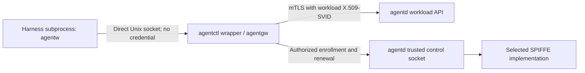
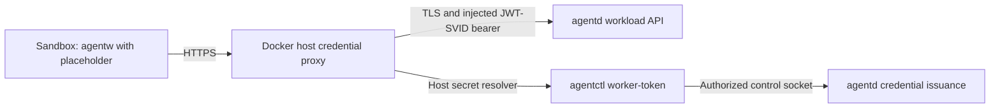

**Decided direction, operator discussion on 2026-09-27:** Make orchestration minimally intrusive across harnesses and execution backends. A trusted wrapper supplies the workload authentication gateway for host execution, keeps credentials outside the harness, and authenticates upstream requests to agentd with an X.509-SVID over mTLS. Backend-specific isolation guarantees and caveats remain explicit.

This extends the [workload architecture](workload-architecture.md) beyond its original mandatory microVM/sidecar shape. The [execution-isolation page](execution-isolation.md) preserves the deferred microVM deployment requirements; the gateway function can also live in the host wrapper or a sibling process. This page supersedes the intervening proposal to use Claude credential masking and JWT-SVID bearer tokens for this wrapper path. It does not assert that any host integration is implemented or verified.

**Proposed mechanics:** Direct Unix sockets, process binding, enrollment, renewal, and lifecycle rules below define the implementation to investigate. TLS on the local Unix-socket hop, TCP fallback, and exact harness configuration remain qualification questions rather than established guarantees.

The initial [identity schema](identity-schema.md), [data flow](identity-data-flow.md), [API](identity-api.md), [commands](identity-commands.md), and [threat model](identity-threat-model.md) expand these mechanics into reviewable sketches. Their record names, routes, commands, and credential-binding candidate are proposals; this page continues to own the accepted direction and backend scope.

## Operator surface authentication proposal

**Codex integration of Claude's 2026-09-27 [oversight proposal](operator-oversight.md#operator-authentication), not a decision:** Local `agentctl` and the desktop backend may hold an operator SPIFFE identity such as the proposed `/operators/<id>` namespace. Validate credentials and authoritative registration before deriving kind and applying scoped oversight grants; same-OS-user hosting is part of the stated threat model, not authority inferred from a caller's claimed name. Operator installation unification, enrollment, and issuer choice remain open in [Participants and permissions](participants-and-permissions.md).

For browser access, the UI backend authenticates the human and maps that session to the corresponding operator identity/permissions. The browser never receives an SVID or its private key. A backend identity alone must not collapse multiple human sessions into one unrestricted operator: preserve an authenticated, auditable per-human mapping, session revocation, and authorization on every operation and stream. Passkeys and OIDC are candidate human-auth mechanisms, not selected integrations. Local/remote transport reachability does not replace authentication. Oversight read/intervention permissions are distinct from conversation membership; the authority of operator-authored message content remains open and cannot approve harness permission prompts merely by arriving through this path.

## Initial backend scope

**Decided, operator discussion on 2026-09-27:** Start with host mode and Docker Sandboxes (`sbx`). Reuse harness sandboxing and the existing runtime rather than designing a custom sandbox for the initial product. The earlier bespoke microVM/sidecar profile is deferred; it is not a prerequisite for these backends.

- **Host mode:** A trusted wrapper authenticates local agentw callers and holds rotating X.509-SVID credentials for mTLS to agentd. Protection from managed workloads depends on the qualified harness sandbox configuration; arbitrary same-UID tampering remains outside the accepted threat model.
- **Docker Sandboxes:** A runtime adapter provisions workloads and configures Docker's credential proxy to inject JWT-SVID bearer tokens over TLS. The proposed generated local kit supplies agentd integration configuration and its public CA certificate.

This selects implementation targets, not verified integrations. Local caller attribution, harness confinement, certificate trust, credential refresh, and lifecycle fencing still need the qualification described below. In particular, whether the generated kit alone establishes the trust needed for the credential-injecting path remains untested; separate host trust configuration is a candidate, not an established requirement.

The sbx bootstrap should check that local kits are permitted. Docker currently documents `kit.allowLocalKits` as defaulting to `true`; `sbx settings set kit.allowLocalKits true` enables it when disabled. This is separate from the remote-source allowlist. [Kit source settings](https://docs.docker.com/ai/sandboxes/customize/use-kits/#restrict-kit-sources).

## Components and request path



In this profile, agentctl supplies the trusted wrapper; agentgw names its application-gateway function, embedded or separately packaged. It is not a requirement for a general-purpose egress proxy. Agentd retains authoritative workload records and authorizes provisioning; agentctl and backend adapters execute the authorized launch.

The wrapper launches the harness and retains the represented workload's certificate chain, private key, and trust material. Embedding the small application gateway in the wrapper is the initial packaging proposal; an independently managed companion process is an alternative if recovery or lifecycle requirements justify it. The authentication path does not require a general-purpose egress proxy or Envoy.

Agentw receives only endpoint configuration, typically `AGENTD_URL=unix:///absolute/path/to/peer.sock`. No orchestration token, private key, or masked credential placeholder enters the harness environment. This requirement concerns orchestration credentials, not unrelated environment variables needed by the harness. Agentw sends application operations; the gateway supplies upstream authentication.

The gateway forwards only the supported workload API to the configured agentd service. It must not expose credential retrieval, enrollment, management operations, arbitrary CONNECT tunneling, or caller-selected upstream destinations. Caller-provided identity headers cannot override the workload binding.

**Decided extension, operator discussion on 2026-09-27:** Agentd accepts two workload authentication mechanisms: X.509-SVID mTLS from a wrapper/gateway, and JWT-SVID bearer authentication over server-authenticated TLS from a runtime credential proxy. Both resolve to the same workload identity and authorization checks. Operator management and credential issuance remain separate authorized interfaces. The JWT path supports runtimes where we cannot establish a private socket or control the hypervisor; wrapping their attach CLI does not establish guest process identity. See the [runtime survey](local-sandbox-runtimes.md).

## Participant classes and bot authentication

**Decided — operator discussion on 2026-09-27, recorded in Claude's participant/authority handoff:** Bots are non-workload messaging participants with their own SPIFFE identities and either X.509-SVID mTLS or JWT-SVID bearer authentication over server-authenticated TLS. Add bots alongside the existing workload and operator-facing authority domains; this does not expose operator management through the application listener. The proposed common messaging abstraction has workload, bot, and operator kinds; operator credential enrollment remains open.

**Claude proposal:** Distinct validated SPIFFE paths identify kind: `/workloads/<id>`, `/bots/<id>`, and an operator path such as `/operators/<id>`. Trust-domain and exact namespace layout remain open. Parse the authenticated SVID subject with exact registered path rules; never accept participant kind from a body/header claim or a loose string prefix. Both authenticators return participant ID, kind, authentication method, and the current kind-specific authority binding. Shared authorization evaluates registration, grants, containment, and conversation policy; workload role policy can remain separate until installation unification is decided. [Canonical model](participants-and-permissions.md).

**Proposed custody:** An operator-installed bot may hold its own SVID/key and use the standard SPIFFE Workload API when provided by the selected issuer. The name of that API does not mean the bot becomes an agent workload. If agentd brokers issuance, bot registration/enrollment is separate from workload launch provisioning. No issuer or attestation method is chosen. The protected host wrapper and sbx proxy remain required by the workload profiles because managed agent code must not possess its orchestration credentials; looser bot custody does not weaken those rules.

Bots need registration revocation and credential cutoff, not fabricated suspend/resume incarnations. Rotation and cutoff must be distinguished, bound to the registered participant, and checked on requests and established streams. The [revised identity sketch](identity-schema.md#lifecycle-and-policy-records) proposes cutoff invalidating enrollment as well as advancing generation, with independent authorized re-attestation; ordinary renewal preserves generation. This stronger cutoff is a proposal awaiting acceptance. Inert-versus-removed conversation memberships after revocation remains open; historical identity must remain attributable. The SVID wire binding to registration/generation and revocation races require qualification. External services are proposed to connect through a local bridge bot that verifies their own authentication, rather than receiving this installation's SVIDs by default.

## Local caller authentication

**Scope distinction:** The [former PID-only authentication architecture](peer-authentication.md) is obsolete. Checks in this section authorize local use of a workload gateway; agentd authenticates the gateway through SPIFFE credentials. Native conversation IDs and process ancestry are not agentd workload credentials.

The wrapper creates a per-workload application socket and registers the harness execution root before admitting peer operations. On each accepted connection, it obtains kernel-provided peer identity and establishes membership in that workload's execution tree. Socket paths, workload names, claimed PIDs, and native conversation IDs are not authentication evidence.

**Documented:** macOS exposes `LOCAL_PEERTOKEN` for retrieving a peer audit token (`audit_token_t`). Linux exposes `SO_PEERCRED` for connected Unix sockets. These identify a peer process; neither by itself establishes membership in our workload. [Apple socket definitions](https://raw.githubusercontent.com/apple-oss-distributions/xnu/main/bsd/sys/un.h), [Linux Unix sockets](https://man7.org/linux/man-pages/man7/unix.7.html).

**Proposed:** Bind the authenticated process instance to the trusted launch record, with OS-specific handling of PID reuse, process exit, and ancestry. Reject an ambiguous or stale binding. A shared tmux server, terminal session, executable name, or same UID is insufficient to distinguish workloads. Detached children, reparenting, helper services, and descriptor transfer need explicit behavior and tests.

The connection must preserve the intended caller evidence. A relay can cause the gateway to observe the relay's identity rather than agentw's. An allowed socket path is not proof of a direct connection; relayed backends need a separately validated binding mechanism. A host PID cannot authenticate a process inside a different VM kernel.

## Confidentiality and transport choice

**Proposed initial host transport:** Application messages over a direct Unix socket without TLS. Unix sockets are local kernel IPC rather than traffic on a network interface. Discovering a pathname or opening a separate connection does not give a process access to the bytes of an existing connection. Endpoint replacement, process inspection, descriptor access, and endpoint compromise are separate threats to address through the supported host configuration. [Unix socket semantics](https://man7.org/linux/man-pages/man7/unix.7.html).

TLS can run over a Unix socket if a concrete confidentiality or server-authentication requirement warrants it, but it introduces trust provisioning and does not replace caller attribution. It cannot protect plaintext from a compromised endpoint. Local TLS is not required by the proposed baseline and has not been ruled out for other backends.

**Deferred:** TCP fallback needs its own client-to-workload binding. Server-authenticated TLS protects traffic and authenticates the gateway, but does not identify which local workload connected. The credential-free Unix-socket design cannot silently fall back to an unauthenticated TCP listener.

## Enrollment and credential custody

The wrapper registers or resumes a workload through agentd's trusted control interface. Agentd authorizes the launch and the wrapper's entitlement to represent that workload. The wrapper obtains an X.509-SVID, the corresponding private-key access, and verification bundles through that interface; agentd may broker issuance through the selected SPIFFE implementation. Whether keys are delivered or generated locally with certificate issuance remains an implementation choice.

A control socket is trusted because access and operations are authorized, not because its pathname is obscure. Enrollment must prevent a workload from claiming another identity or elevating its role. Renewal must remain scoped to the enrolled workload and active incarnation. The exact bootstrap authentication and renewal protocol are open.

The application socket is exposed to the harness; the control socket, credential storage, and wrapper management interfaces are not. Credentials must not be placed in the shared workspace, harness home, command-line arguments, or guest-visible environment. Do not assume a custom control socket implements the standardized SPIFFE Workload API merely because it delivers SVIDs. The selected issuer, enrollment mechanism, and trust-domain layout remain open. The [SPIFFE terminology reference](execution-isolation.md#spiffe-as-the-identity-foundation) is retained in the deferred-profile page; its sidecar topology is not inherited here.

## Upstream mTLS and authorization

The gateway presents the workload X.509-SVID and proves possession of its private key. It validates agentd's certificate and expected service SPIFFE ID against the appropriate trust bundle. Agentd validates the workload's certificate and SPIFFE ID, then checks active incarnation, Group, role, and requested operation. A role is assigned by authorized provisioning and is immutable for that workload identity; changing role requires a new authorized workload identity. Resume does not change that role. A trusted certificate issuer alone does not authorize every identity it issues. [X.509-SVID specification](https://github.com/spiffe/spiffe/blob/main/standards/X509-SVID.md).

The gateway represents the workload on application requests; any separate infrastructure identity used for enrollment must not accidentally become the application caller identity. The X.509-SVID is a certificate, not a bearer token. The corresponding private key stays with trusted infrastructure and is not transmitted as part of the application request.

## Launch, rotation, suspension, and resume

This lifecycle describes the wrapper backend. The runtime-mediated JWT backend below obtains fresh credentials through a host resolver and observes workload lifetime through its runtime adapter.

**Proposed lifecycle:**

1. Authorize registration or resume and reserve an execution incarnation.
2. Establish wrapper enrollment, obtain credentials, and prepare the application socket and harness-specific access configuration.
3. Launch the harness, establish its trusted process binding, and admit application requests once readiness is confirmed.
4. Renew credentials before expiry without changing the harness environment. Replace credentials for new upstream connections and define when existing connections are re-established.
5. On harness exit, report suspension for that incarnation; agentd conditionally fences it and clears its active pointer. Stop admitting requests and close its upstream connections.
6. On resume, ensure the previous incarnation is fenced (including after a lost exit report), reserve a new incarnation, obtain fresh authority, restore authorized harness state, and create a new process binding. The [proposed state table](identity-schema.md#lifecycle-and-policy-records) makes fencing terminal for each incarnation.

A wrapper crash or machine shutdown can prevent an exit notification. Agentd therefore needs liveness/reconciliation behavior; exact leases and timeouts remain open. A stale wrapper's suspend request must not suspend a successor. Resume of an orchestration workload also needs an adapter mapping to native conversation state; it is not equivalent to reattaching a terminal.

Certificate rotation preserves identity and does not by itself fence an obsolete incarnation. Agentd must associate authenticated connections with the authorized incarnation and enforce revocation independently of certificate expiry, including established streams. The wire representation of that association is open. Renewal failure must not cause fallback to an unauthenticated path; retry, draining, and expiry behavior need definition.

## Runtime-mediated JWT authentication

**Decided direction:** A backend for Docker Sandboxes can register a workload with agentd, configure sandbox-scoped credential injection, and let Docker's host proxy authenticate agentw requests without exposing the real token to the guest. There is no requirement to run our wrapper or supply a Unix socket inside the VM.



**Proposed setup sketch, not a tested recipe:** A custom kit declares an agentd service credential mapped to an Authorization bearer header. The backend installs the kit and required credential binding, registers the workload incarnation, then configures a host resolver and narrow network access. The CLI below illustrates the intended shape; `worker-token` is a proposed agentctl command, not an implemented interface.

```sh
sbx secret set agentd --sandbox <sandbox-name> \
  --command 'agentctl worker-token <workload-incarnation-id>' \
  --refresh on-demand
sbx policy allow network --sandbox <sandbox-name> localhost:<agentd-port>
```

**Documented:** Docker resolves `--command` on the host. Service secrets normally cache for 55 minutes; `--refresh on-demand` resolves at every credential use. Sandbox scope is explicit because service secrets default to global scope. [Credential configuration](https://docs.docker.com/ai/sandboxes/configuration/credentials/).

The resolver authenticates to the trusted agentd control socket and retrieves a fresh, audience-bound JWT-SVID only for the enrolled active incarnation. Possession of the agentctl executable is not management authorization. Bind the command to an immutable identity rather than a reusable display name, use trusted executable resolution and shell-safe arguments, and write only the token to resolver stdout. The guest must not reach that issuance interface. A failed or revoked resolver must not yield a usable stale token; runtime failure/cache behavior needs testing.

**Documented:** Docker's guest-facing hostname is `host.docker.internal`, not `host.internal.docker`. The proxy translates it to localhost, and the policy rule uses `localhost:<port>`. The proposed guest URL is `https://host.docker.internal:<agentd-port>`. Injection matching before/after translation and upstream TLS hostname handling must be qualified. [Host services](https://docs.docker.com/ai/sandboxes/workflows/development/).

Agentw sends its placeholder as a bearer value, which Docker replaces with the real JWT-SVID. Unlike the wrapper backend, this backend supplies a placeholder environment variable as well as AGENTD_URL. The trusted proxy's per-sandbox binding supplies attribution; the guest cannot choose an identity by supplying a workload name or copying another sandbox's placeholder.

Agentd verifies the JWT signature against the proper SPIFFE JWT bundle, the workload SPIFFE ID in `sub`, an audience restricted to agentd, and expiration. It then applies the same active-incarnation, Group, role, and operation checks used for mTLS. JWT verification material is distinct from X.509 CA verification material. [JWT-SVID specification](https://github.com/spiffe/spiffe/blob/main/standards/JWT-SVID.md).

**Proposed:** Start with on-demand resolution so short token lifetime does not depend on Docker's default cache. A bounded cache can follow if measurements justify it; any cache must preserve sufficient remaining validity. Suspension rejects already-issued tokens through agentd's live authorization state. Renewal cannot reactivate a suspended incarnation. Because a bearer token remains replayable if obtained, the proxy, issuance path, trusted destination, and logs must not disclose it to the guest.

## Shared TLS listener and server trust

**Proposed:** One shared HTTPS application listener for authenticated workload and bot participants requests a client certificate but permits its absence. If supplied, validate it as an X.509-SVID for a registered participant kind; otherwise require a valid JWT-SVID bearer token on every application request. Absence of both rejects the request. Invalid presented credentials must not silently fall back to another mechanism. Initially reject requests presenting both mechanisms to avoid identity ambiguity. The two authenticators produce a common internal principal carrying participant ID, kind, authentication method, and kind-specific authority binding before shared authorization. Workloads require active-incarnation checks; bots require registration/generation and cutoff checks. Operator participation requires a separately qualified identity path and explicit permissions, not automatic management authority.

Optional client-certificate validation is supported by TLS libraries; Go's `VerifyClientCertIfGiven` is one example, but chain validation alone does not supply SPIFFE identity and application authorization checks. TLS client-certificate negotiation is listener/connection behavior, not an HTTP-route decision. If optional certificates prove incompatible with the runtime proxy, separate listeners can still share the same application API and kind-aware authorization logic. [Go TLS](https://pkg.go.dev/crypto/tls#ClientAuthType).

A server certificate is not intrinsically mTLS-only: mTLS adds client authentication. For local deployment, prefer a private CA with a self-signed root and a server leaf certificate matching the hostname actually validated by the client. A directly pinned self-signed leaf was an earlier alternative; the initial bootstrap proposal uses a private CA. Server verification remains required. SPIFFE-aware wrappers validate the expected service SPIFFE ID; an ordinary HTTP proxy needs conventional hostname/SAN validation. A URI-only service SVID does not automatically satisfy that DNS check; server certificate issuance/selection must accommodate both clients.

Docker credential injection terminates guest TLS and opens a new upstream TLS connection. The guest trusts Docker's interception CA; Docker's host proxy must separately trust and authenticate agentd's server certificate. Whether the generated guest CA kit also establishes the upstream trust needed by this runtime remains untested. Docker documents different trust behavior across proxy paths, but the supported way to configure trust for this local private-CA upstream has not been established here. This is an integration gate, not a reason to disable TLS verification or bypass the credential proxy. [Docker certificate troubleshooting](https://docs.docker.com/ai/sandboxes/troubleshooting/).

### Docker upstream trust investigation

**Proposed bootstrap:** Generate and persist an installation-private server CA on first agentd setup, keeping its signing key outside workload-accessible storage. Reuse this root across server leaf renewals. The sbx backend can generate a local kit under `~/.agentd/backends/sbx/kits/agentd/` containing the public CA certificate and the agentd credential-injection declaration. Generating the CA and configuring each verifier to trust it are separate steps; the effect of guest installation on the host proxy's upstream verification must be measured.

**Documented at revision `75d1ee312280c2028be294e043edeaf35f2fe1bb`:** Docker's proxy certificate is already trusted in the sandbox on the credential-injecting `forward` path. `PROXY_CA_CERT_B64` supplies that certificate for nested Docker build images, which have independent trust stores. The internal-CA kit example uses schema version 2: `files/home/agentd-ca.crt` maps to `/home/agent/agentd-ca.crt`, and a root `setup.install` command can copy it to `/usr/local/share/ca-certificates/agentd-ca.crt` and run `update-ca-certificates`. That installs guest trust for paths where the guest sees the upstream certificate directly; its effect on host-proxy trust for credential injection has not been verified. Preserve Docker's existing trust bundle. The generated kit is the candidate trust-bootstrap solution; whether it suffices end to end is the BV-05 question. [Pinned troubleshooting](https://github.com/dvdksn/docs/blob/75d1ee312280c2028be294e043edeaf35f2fe1bb/content/manuals/ai/sandboxes/troubleshooting.md#api-calls-fail-with-a-certificate-error), [pinned kit example](https://github.com/dvdksn/docs/blob/75d1ee312280c2028be294e043edeaf35f2fe1bb/content/manuals/ai/sandboxes/customize/kit-examples.md#install-an-internal-ca-certificate).

**Observed metadata, 2026-09-27:** The installed macOS arm64 `sbx` reports v0.45.1, revision `9d79d90ee4c5d297fb3d36b75384e8cea7a4fbcb`. `go version -m` reports Go 1.27.0. CLI help exposes daemon start and restart, but no CA option on daemon start. No daemon was started/restarted, trust store changed, or sandbox launched during this investigation. Metadata and documentation inspection do not verify actual upstream certificate behavior.

**Documented:** Docker's settings reference has proxy routing controls and `tls.allowNegativeSerial`, but no dedicated upstream CA-bundle setting was found in that reference. The negative-serial option does not trust an unknown CA. Docker's troubleshooting guidance distinguishes the credential-injecting `forward` path, where the guest trusts Docker's certificate, from bypass paths where the guest validates the remote certificate. These documented path distinctions do not settle whether our generated kit suffices; test it before requiring additional host trust configuration. [Settings](https://docs.docker.com/ai/sandboxes/configuration/settings/), [troubleshooting](https://docs.docker.com/ai/sandboxes/troubleshooting/).

**Conditional follow-on probe if kit-only bootstrap fails: a daemon-specific CA bundle.** Go 1.27 documents that `SSL_CERT_FILE` and `SSL_CERT_DIR` can override platform certificate verification on macOS and Windows, unless `x509sslcertoverrideplatform=0` is set through GODEBUG. Earlier Go-version assumptions about macOS ignoring these variables do not apply universally. If sandboxd inherits this environment and its upstream transport uses the standard pool, a host PEM bundle containing the existing required roots plus our agentd CA could establish trust without a Keychain modification. This is an inference from the installed toolchain and Go documentation, not a documented Docker configuration guarantee. [Go SystemCertPool](https://pkg.go.dev/crypto/x509#SystemCertPool).

The bundle belongs in the host daemon environment, not the guest or kit environment. An override replaces a trust source rather than simply appending one certificate, so it must preserve public and enterprise roots required by other daemon/proxy traffic. Existing-daemon environment inheritance, GUI launches, restart persistence, custom transport pools, and CA reload behavior need testing. Go warns that subsequent pool calls may not reflect trust-store changes.

**Alternative: host OS trust.** If Docker uses standard platform verification, a private CA trusted in the macOS Keychain for SSL should be available to that verification path. Apple documents certificate trust settings, but this does not establish which trust context sandboxd uses. This option changes trust beyond our application and requires an explicit, reviewable installation/removal procedure. Prefer testing a process-scoped bundle first. [Apple certificate trust](https://support.apple.com/guide/keychain-access/change-the-trust-settings-of-a-certificate-kyca11871/mac).

**Alternative: a publicly trusted certificate.** A controlled DNS name can receive a certificate through ACME DNS-01 without exposing the server publicly. This would replace `host.docker.internal` as the URL hostname and require qualified local routing and Docker policy. It adds domain/issuance dependencies; each installation must retain its own private key rather than distributing one shared application key. It is a fallback design, not the default recommendation. [DNS-01](https://letsencrypt.org/docs/challenge-types/), [localhost certificate considerations](https://letsencrypt.org/docs/certificates-for-localhost/).

For every option, CA trust and name validation are independent. Determine whether Docker retains `host.docker.internal` for upstream SNI/verification while dialing localhost or also rewrites the TLS name. An agentd leaf may include the required local DNS SANs, but a successful hostname mismatch must never be interpreted as success. Keep server trust roots distinct from workload client-identity roots unless their relationship is explicitly designed.

**Next bounded test:** Use an isolated daemon/configuration if supported, a disposable private CA and HTTPS receiver, and a dummy injected credential. First require rejection of the untrusted certificate. Then apply the generated CA kit and test for success with the correct name, rejection of a wrong name and unrelated CA, and injection reaching the receiver while the guest sees only the placeholder. If kit-only bootstrap fails, identify the failing hop before testing the host bundle in a separate configuration. Confirm the receiver observes TLS and record SNI. Finally test an optional-client-certificate listener and daemon restart persistence. A successful guest curl alone cannot establish upstream verification. Do not use production tokens, disable verification, or change the existing daemon/trust configuration merely to complete this probe.

## Host-mode trust boundary

**Decided:** Arbitrary same-UID processes tampering with the wrapper, its memory, keys, or launch binding are outside the host-mode threat model. The OS user is trusted. This is not a guarantee of isolation from every process owned by that user.

For malicious code executing through managed harnesses, protection relies on the supported harness sandbox configuration. It must prevent access to enrollment and management authority and protect wrapper state. Shell restrictions alone do not automatically cover in-process tools, plugins, MCP servers, or unsandboxed execution paths. A mode that cannot establish those protections must declare the weaker guarantee. See [supervisor protection](supervisor-protection.md).

The gateway authenticates which workload exercises authority, not whose intent produced the request. An authorized workload can relay requests on behalf of another actor. Shared mutable workspace files can also influence another workload's execution; credential custody does not remove that exposure.

## Harness and launcher integration

In host mode, use the same wrapper path for Claude, Codex, and other supported harnesses. The sbx backend instead uses runtime-mediated JWT authentication; merely wrapping its attach CLI does not authenticate guest processes. Claude's built-in masking is not required, so orchestration no longer depends on refreshing a credential inside Claude's masking configuration or choosing an unusually long bearer-token lifetime.

**Documented integration lead, not verified:** Codex documentation retrieved on 2026-09-27 contains both `permissions.<name>.network.unix_sockets` and, on another reference surface, `features.network_proxy.unix_sockets`. Select configuration against the installed version. Documentation describes Unix-socket proxying, so test whether the configured path preserves direct peer identity. Do not publish either spelling as a validated launch recipe yet. [Permissions](https://learn.chatgpt.com/docs/permissions), [alternate reference surface](https://learn.chatgpt.com/docs/config-file/config-reference?translationFallback=es-419).

A Launcher may start the wrapper in the user's current terminal or a configured tmux pane/window. Terminal ownership, sandbox lifetime, native conversation persistence, and authentication lifetime remain separate responsibilities. This design does not require tmux, a particular sandbox product, or an outer macOS sandbox around the harness.

## Optional MCP interface alongside agentw

**Proposed optional extension, operator discussion on 2026-09-27:** The host wrapper could expose MCP tools alongside its agentw application gateway. A wrapped headless harness with its Bash or shell tool disabled could enable this interface and still perform authorized orchestration operations. Shell-callable agentw remains the foundation for pipes, scripts, batching, and composition; MCP does not replace that path or become an initial-backend prerequisite.

Both interfaces use the wrapper's existing workload identity, active incarnation, credential custody, renewal, and upstream mTLS connection policy. Agentd applies the same authorization regardless of the local interface. The MCP surface exposes scoped workload operations, not independent enrollment, role selection, credential retrieval, or an arbitrary management proxy. Any tool restrictions in the headless profile can narrow access but cannot broaden the workload's authority.

This supersedes the earlier exploration of an independently enrolling MCP process as a wrapper replacement. Transport and packaging remain open: a stdio adapter would need a protected, workload-bound connection to the wrapper, while another MCP transport would need its own authenticated connection design. Merely providing a workload ID or finding an endpoint is not authentication. MCP disconnect or restart must not independently suspend or recreate workload authority.

**Documented integration leads, not qualification:** MCP stdio specifies a client-launched subprocess, not a universal one-process-per-conversation or sandbox-placement guarantee. Claude documents MCP servers running outside its built-in command sandbox. Codex documents command-launched stdio servers, including a remote-executor option, but the page inspected does not establish per-workload instance isolation or sandbox placement. [MCP stdio](https://modelcontextprotocol.io/specification/2025-11-25/basic/transports#stdio), [Claude protected paths](https://code.claude.com/docs/en/sandboxing#protected-paths), [Codex MCP](https://learn.chatgpt.com/docs/extend/mcp?surface=cli).

If this optional interface is selected for implementation, qualify adapter-to-wrapper binding, cross-workload rejection, authorization parity, disabled-shell operation, and MCP restart against the existing BV-01/BV-02/BV-07 fixtures. This is conditional follow-on work, not an expansion of the initial ten-spike backlog. The sbx backend still uses runtime-mediated authentication; a child MCP process inside its VM is not automatically a trusted host component.

## Validation and open decisions

The bot extension needs separate tests for namespace confusion, unregistered IDs, wrong-kind records, both authenticators, revoked registration/generation on existing streams, and installation revocation without implicit host-wide grants. Bot provisioning must not impersonate workload enrollment. These are proposed checks, not additions to the existing PoC backlog by implication. Preserve all workload custody and wrong-incarnation checks below.

The [initial backend validation spikes](backend-validation-spikes.md) turn these questions into bounded PoC inputs with dependencies, fixtures, required cases, and completion criteria.

No integration or security guarantee on this page has been experimentally verified. Sources above were inspected during the 2026-09-27 discussion; unpinned upstream documentation can change. This is destination design, not an implementation claim or transfer of scope to the PoC.

The first qualification should run two managed workloads and test legitimate agentw descendants, foreign callers, forged identities, PID churn, relay attribution, and harness-specific socket access. Exercise attempts from every supported agent execution surface to reach the control socket or wrapper credentials. Test wrong-service and wrong-workload certificates, rotation during a long-running harness, suspension of existing streams, stale suspend events, wrapper failure, and resume fencing.

The Docker qualification additionally needs to demonstrate private-CA upstream trust, hostname translation and injection matching, cross-sandbox placeholder rejection, resolver refresh and failure behavior, and expiration/revocation during active use. Exercise the shared listener with valid and invalid client certificates, missing/expired/wrong-audience bearer tokens, both credentials together, and neither credential. Verify failures never downgrade authentication.

Open decisions are the issuer and enrollment protocol, key provisioning, process-membership algorithm, authenticated incarnation binding, renewal and connection policy, crash recovery, exact harness configurations, and TLS trust provisioning for runtime-mediated HTTP. The extended acceptance target is one application API with two explicitly validated authentication methods, kind-aware shared authorization, protected workload custody, and separately qualified bot custody/enrollment. Operator management remains separately authorized.

## Participant revision provenance

The operator's 2026-09-27 participant/authority discussion, handed off by Claude, decided bots as distinct messaging participants, both SPIFFE authentication mechanisms, Group/host installation scopes with future scopes possible, bridges as bot installations with bridging permissions, and capabilities distinct from permissions. The participant/installation mechanics are Claude proposals; Codex's kind-specific lifecycle, containment, and evidence qualifications are linked from [Participants and permissions](participants-and-permissions.md). Issuer/enrollment, first bot delivery paths, ambient membership, workload installation unification, and host-wide federation meaning remain open.

The 2026-09-27 pre-review integration carries Claude's loop/budget, oversight, request, and envelope proposals into this page with labeled Codex synthesis. All new mechanics remain proposed. Operator message authority, request inclusion in the first experiment, every control threshold, and earlier messaging/participant open decisions remain unresolved; see the four source pages linked from [the index](README.md). No implementation or new harness probe was performed.
