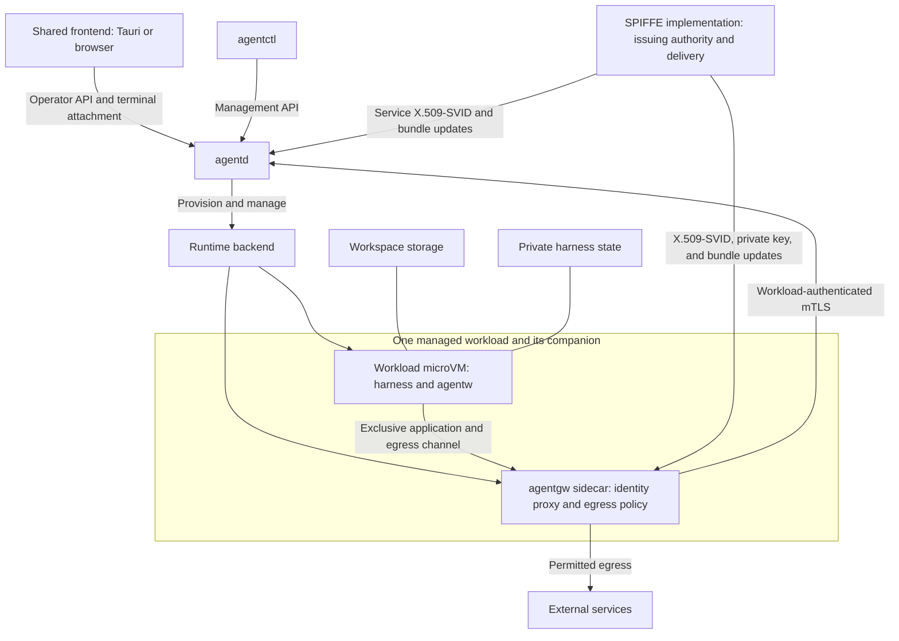

This page retains the earlier bespoke microVM/sidecar profile as a deferred design reference. It is superseded as the product baseline by [host mode and sbx](spiffe-mtls-authentication.md#initial-backend-scope). Its requirements apply only to that deferred alternative, not the current initial-backend contract. No runtime guarantee below is experimentally verified.

**Scope update, 2026-09-27:** The accepted [initial backend scope](spiffe-mtls-authentication.md#initial-backend-scope) is host mode and Docker Sandboxes (`sbx`), reusing existing sandboxing. The bespoke microVM/sidecar deployment described below is deferred and is not an initial product requirement. Its intended isolation properties remain design requirements, not verified guarantees. The newer authentication design defines wrapper mTLS and runtime-mediated JWT paths with shared agentd authorization.

## Deferred system shape

`agentd` manages workloads from outside their isolation boundaries. Each local workload runs its harness and `agentw` inside a dedicated microVM and has a separate trusted `agentgw` sidecar. The gateway holds the workload's credentials, authenticates its orchestration requests, and enforces its assigned network policy. The harness cannot access the gateway's private keys or administrative interfaces.

The gateway is outside the workload microVM's trust boundary. Its exact packaging is backend-specific; a driver that implements each container as a microVM runs a separate microVM for the sidecar. Provisioning and terminal attachment are trusted management paths, separate from the workload-facing proxy interface.

## Domain objects

| Object | Meaning |
| --- | --- |
| Workload | A managed unit of agent activity with an assigned identity, Group, role, policy, and lifecycle |
| Session | An interactive workload with a persistent terminal and native harness experience |
| Task | A headless workload with observable progress, results, and completion status |
| Group | A logical coordination and authorization scope containing workloads |
| Workspace | The filesystem view available to a workload, backed by storage supplied by its backend |

One agentd may manage multiple Groups. Workloads may share Workspace storage while retaining separate microVMs and private harness state. Group membership is explicit policy, not inferred from a mount path, repository, or network location.

Each Codex workload runs its own app server inside the workload microVM. The harness and its subprocesses act under one workload identity and role. App-server integration and resource overhead require validation.

## Component responsibilities

**Agentd** authorizes provisioning, assigns workload identities and roles, maintains authoritative workload and Group records, manages lifecycle, assigns gateway policy, and provides messaging and operator attachment services. A workload's role is assigned at authorized launch and is immutable for that workload identity. Current Group policy determines what that role may do, including whether it may request additional workloads and which child roles it may request.

**Agentctl** is the operator's management client. It uses agentd's authenticated API to request and manage workloads. Possession of the CLI does not grant management authority.

**Agentw** is the in-workload client for messaging and delegated orchestration operations. It calls the provisioned gateway endpoint. It does not need a private key, certificate, or knowledge of its SPIFFE ID to make a request.

**Agentgw** is the trusted per-workload gateway. The intended implementation uses Envoy for identity-bearing service connections and policy-controlled egress, with product-specific configuration and integration logic. Separate routes handle agentw calls, general network access, and application-aware service integrations.

**The runtime backend** provisions the workload and sidecar, storage, private communication paths, and isolation controls. It exposes lifecycle and observation capabilities to agentd and enforces restrictions that the workload cannot change.

## Identity and authorization

SPIFFE defines interoperable workload identity and the documents and interfaces used to obtain and verify it. SPIRE is an implementation of SPIFFE, not another name for the standard. The product's managed Workload is an application-level unit; SPIFFE's broader use of workload includes compute processes such as agentd and gateway services as well as harness processes. A microVM is an isolation mechanism, not a SPIFFE identity category. [SPIFFE overview](https://github.com/spiffe/spiffe/blob/f97c46dfd0ff0d4e412cce5c73846a9ca32a99a2/standards/SPIFFE.md).

| SPIFFE term | Meaning in this design |
| --- | --- |
| SPIFFE ID | A URI naming an identity, such as `spiffe://operator.example/workloads/abc123`; it is neither a credential nor a network endpoint. The namespace shown is illustrative. |
| Trust domain | An identity namespace backed by an issuing authority and its cryptographic keys. It is distinct from a Group, microVM, host, or network boundary. |
| SVID | A SPIFFE Verifiable Identity Document: a cryptographically verifiable document asserting a SPIFFE ID. |
| X.509-SVID | The X.509 form of SVID, used here for mTLS. The leaf certificate carries exactly one URI SAN, containing its SPIFFE ID. Its associated private key is separate from the SVID. |
| SPIFFE bundle | A trust domain's public verification material, kept associated with that trust domain and updated as its authoritative keys change. It does not contain workload private keys. |
| SPIFFE Workload Endpoint | The endpoint exposing identity services, including the SPIFFE Workload API, to eligible workloads. It is distinct from agentw's application endpoint. |
| SPIFFE Workload API | The API for obtaining SVIDs and associated material, including updates. Its X.509 profile supplies the SVID certificate chain, corresponding private key, and X.509 bundles. |
| Federation | Establishing and maintaining access to another trust domain's SPIFFE bundle so its SVIDs can be authenticated; application permissions remain separate. |

These definitions follow the [SPIFFE ID specification](https://github.com/spiffe/spiffe/blob/f97c46dfd0ff0d4e412cce5c73846a9ca32a99a2/standards/SPIFFE-ID.md), [X.509-SVID specification](https://github.com/spiffe/spiffe/blob/f97c46dfd0ff0d4e412cce5c73846a9ca32a99a2/standards/X509-SVID.md), [trust domain and bundle specification](https://github.com/spiffe/spiffe/blob/f97c46dfd0ff0d4e412cce5c73846a9ca32a99a2/standards/SPIFFE_Trust_Domain_and_Bundle.md), and [Workload API specification](https://github.com/spiffe/spiffe/blob/f97c46dfd0ff0d4e412cce5c73846a9ca32a99a2/standards/SPIFFE_Workload_API.md).

The SPIFFE bundle specification defines a JWK Set representation for exchanging a trust domain's verification material. The X.509 Workload API instead delivers X.509 bundles as DER-encoded CA certificates. These representations serve different interfaces; neither is the workload's SVID certificate chain or private key.

The selected SPIFFE implementation establishes the gateway's entitlement to represent a workload through trusted attestation and registration. Agentgw obtains and holds that workload's X.509-SVID and corresponding private key. The harness receives only the application proxy endpoint, with no access to the identity-delivery interface. Credential delivery to Envoy may use SDS; SDS is an Envoy interface, not the SPIFFE Workload API.

On its workload-facing connection to agentd, the gateway presents the represented workload's X.509-SVID and proves possession of its private key through mTLS. Agentd presents its own service X.509-SVID. Each side validates its peer using the X.509 bundle associated with the peer's trust domain and applies policy to the authenticated SPIFFE ID. Accepting any certificate from a known trust domain is not sufficient authorization. The gateway's own infrastructure identity, if needed for enrollment or management, is distinct from the identity it represents on this connection.

A dedicated per-workload sidecar is not automatically a SPIFFE Broker API deployment. That API addresses trusted components requesting identity material on behalf of referenced workloads and is marked Incubating in the specification reviewed here. The selected implementation must support the intended attestation and delegation across the separate microVMs; calling the component a sidecar does not establish that binding. [Broker Endpoint specification](https://github.com/spiffe/spiffe/blob/f97c46dfd0ff0d4e412cce5c73846a9ca32a99a2/standards/SPIFFE_Broker_Endpoint.md).

Agentd derives the caller's identity from the authenticated connection and checks its Group, role, active incarnation, and requested operation against authoritative state. Caller-supplied identifiers and headers cannot select a different principal. Native harness conversation IDs remain metadata for observability and conversation recovery; they do not confer orchestration authority.

The workload-to-gateway channel is accessible only to the paired workload. Protecting private keys is insufficient if another workload can submit requests through that gateway. Gateway configuration, management endpoints, identity-provider access, and process state are also outside the harness's access.

A workload identity covers the harness and code running inside its microVM. The gateway attributes their requests to that workload; it does not distinguish their intent. Shared writable files can influence another workload's behavior and require an appropriate execution and configuration policy.

## Network access

Agentd assigns each workload an egress policy. The runtime blocks direct network paths that bypass agentgw, and the gateway admits only permitted destinations and protocols. DNS, direct IP connections, IPv6, UDP, host services, and connections to other workloads must be covered by the backend's enforcement contract. Unsupported paths are denied.

Workload credentials are used only on configured trusted service routes. The general egress path cannot select another identity or reach internal management, credential, or proxy administration endpoints. Policy checks account for resolved destinations as well as requested names.

Destination filtering can preserve end-to-end HTTPS encryption. Operations requiring request inspection or modification, such as GitHub credential substitution or operation-level authorization, use a deliberately configured application-aware path. The placement of that processing and its credentials remains an implementation choice.

## Storage and lifecycle

The backend mounts or otherwise supplies the Workspace, commonly at `/workspace`. Each workload separately receives private harness state and trusted launch configuration. Workspace sharing does not share harness home directories, gateway credentials, or administrative sockets.

Provisioning follows an authorized request: allocate the workload record and runtime resources, establish private storage and channels, install policy, establish the gateway’s entitlement to the workload SPIFFE ID and provision its X.509-SVID, corresponding private key, and required X.509 bundles, and launch the harness only when the required protections are ready. Agentd distinguishes resource readiness, harness readiness, and workload completion.

UI detachment leaves a Session running. Stopping a workload fences its service authority and closes or invalidates obsolete channels. Recovery must prevent an old container or sidecar from acting as a replacement incarnation. X.509-SVID and private-key rotation do not themselves create a new workload or require a new SPIFFE ID. Bundle updates track issuing-authority trust material separately. Neither certificate expiry nor rotation replaces application-level incarnation fencing or a policy for existing authenticated connections.

Private harness state may be retained and reattached for native conversation resume. Filesystem persistence does not preserve process memory, shell jobs, or in-flight tools. Durable workload records and live incarnations require separate lifecycle tracking; the exact identifier and generation scheme remains open.

## Messaging and group peering

Agentw submits messages through its gateway. Agentd attaches authenticated sender identity and applies sending, receiving, and subscription policy. Message content does not become trusted instructions merely because its sender is authenticated.

Groups can coordinate within one agentd or across authenticated agentd peers. A remote Group's coordinator retains its original scope; it does not acquire the recipient Group's coordinator authority. Multiple Groups and agentd instances may share a trust domain. Where peers belong to different trust domains, federation distributes the corresponding SPIFFE bundles while preserving their trust-domain association; it does not grant permission to message or control another Group. [SPIFFE Federation](https://github.com/spiffe/spiffe/blob/f97c46dfd0ff0d4e412cce5c73846a9ca32a99a2/standards/SPIFFE_Federation.md).

## Operator interface and terminal attachment

One frontend serves both a Tauri desktop application and a browser. Its minimum Session experience is read-only terminal output; the target experience is full interaction through xterm.js. Operator-selected tunnels or forwarding services can make the browser endpoint remotely reachable while application authentication and workload-specific authorization remain enforced.

Agentd's attachment service connects the UI to the backend's terminal owner. That owner preserves the harness PTY across UI disconnections and supplies output, dimensions, lifecycle status, and screen/history restoration. Authorized interactive attachment additionally supplies input and resize operations. The server enforces read-only access. Multiple observers with one active input/resize controller is the proposed control policy.

A backend may use shpool or runtime-provided terminal facilities. Envoy transports streams but does not own terminal state. Tasks generally expose structured events or stdout/stderr and completion status without requiring a PTY. Slow viewers and reconnections require bounded buffering and explicit resynchronization.

## Backend extension contracts

Workload type and placement are independent. Remote backends implement the same responsibilities for provisioning, storage, identity, connectivity, and policy enforcement, while advertising which capabilities and protection guarantees they support.

A backend need not reproduce the local sidecar topology, but must establish trustworthy workload identity and disclose credential custody. It cannot silently replace protected credentials with workload-readable tokens while claiming the same guarantee. Remote connectivity must accommodate a laptop that is not publicly reachable and can disconnect or sleep; relay topology and offline behavior remain open.

## Deferred-profile design work

- Validate private workload/sidecar channels and non-bypassable egress for each local runtime.
- Select SPIFFE implementation, attestation and enrollment mechanisms, trust domains, and credential lifecycle.
- Specify workload incarnation fencing, resume semantics, and recovery after uncertain provisioning outcomes.
- Define Envoy configuration, application-aware gateway integration, and policy-update behavior for existing connections.
- Select the terminal owner and define attachment, replay, controller handoff, and operator authentication protocols.
- Specify cross-agentd peering and capability requirements for additional workload backends.

The component model reflects an earlier operator direction on 2026-09-27 and has been superseded as the initial topology. UI goals carried forward are maintained in the current mental model. Do not seed the deferred-profile backlog as initial backend work. Related specifications: [domain model](mental-model.md), [Group peering](group-peering.md), and [workload placement contracts](mental-model.md#workload-placement-extensibility).
